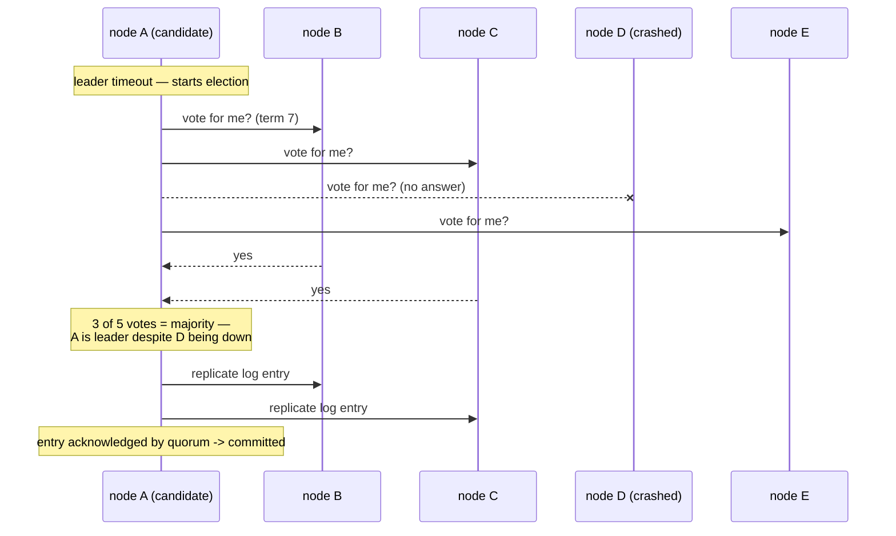

## In simple terms

When you have several machines that need to agree on something — which one is the leader, what the next entry in the log is, when to commit a transaction — and any of them can crash, slow down, or disconnect at any moment, you need a **consensus protocol**. Consensus is the formal solution to "how do we all agree, even when some of us are missing?"

## The Visual Map



## More detail

A consensus protocol guarantees:

- **Agreement** — all non-faulty nodes decide on the same value.
- **Validity** — that value was proposed by some node.
- **Termination** — every non-faulty node eventually decides.

The dominant algorithms in practice:

- **Paxos** (Lamport, 1989) — the original. Notoriously hard to understand and implement; many production systems use a variant.
- **Multi-Paxos / Raft** — extend single-value Paxos to a replicated log of commands.
- **Raft** (Ongaro & Ousterhout, 2014) — designed to be understandable. Used by etcd, Consul, CockroachDB, TiKV, and many more.
- **Byzantine fault tolerant (BFT)** — tolerates malicious nodes, not just crashes. Used in blockchains and high-stakes systems.

Most quorum-based consensus systems need a **majority** of nodes alive to make progress: 3-of-5, 5-of-7, etc. A 3-node cluster survives 1 failure; a 5-node cluster survives 2.

The **FLP impossibility result** (1985) proves that consensus with even one faulty process is impossible in a fully asynchronous network. Real systems get around this with timeouts and partial synchrony.

Consensus is what stops your distributed system from telling itself contradictory stories. Every replicated database that promises strong consistency has a consensus protocol at its core — usually for leader election, log replication, or both.

## Under the Hood

Why a *majority* specifically: any two majorities of the same cluster must overlap in at least one node — so two conflicting decisions can never both gather a quorum:

```python
from itertools import combinations

nodes = {"A", "B", "C", "D", "E"}
majority = len(nodes) // 2 + 1                  # 3 of 5

quorums = [set(q) for q in combinations(nodes, majority)]
print(f"{len(quorums)} possible quorums of {majority}")

# the safety property, checked exhaustively:
assert all(q1 & q2 for q1 in quorums for q2 in quorums)
print("every pair of quorums intersects -> no two leaders, no forked log")

# and the availability consequence:
print(f"cluster of {len(nodes)} survives {len(nodes) - majority} failures")
```

That intersection is the entire trick. The overlapping node has seen the earlier decision, and every protocol (Paxos's two phases, Raft's terms) is machinery for making that node's knowledge win.

## Engineering Trade-offs

- **Safety vs latency.** Every committed write waits for a quorum round-trip; cross-region clusters pay cross-region latency on *every* commit. Systems that can't afford it weaken the guarantee ([eventual consistency](/t/eventual-consistency)) or shrink the consensus domain (per-shard Raft groups).
- **Cluster size: fault tolerance vs throughput.** Five nodes survive two failures but every commit now needs three acknowledgements, and the leader fans out to four followers. Beyond 5–7 voting members, throughput falls while marginal safety barely rises — hence "witness" and non-voting learner roles.
- **Liveness depends on timing assumptions.** FLP says timeouts are load-bearing: too short and healthy clusters thrash through elections (a real outage mode), too long and failover is slow. Tuning election timers is operational, not theoretical, work.
- **Crash tolerance vs Byzantine tolerance.** Raft/Paxos assume nodes fail by stopping, which keeps them at 2f+1 nodes and fast. Tolerating *lying* nodes (BFT) costs 3f+1 nodes and extra message rounds — justified for blockchains, overkill inside one company's datacenter.

## Real-world examples

- **etcd** (the brain of Kubernetes) uses Raft.
- **ZooKeeper** uses ZAB (a Paxos relative) for the same job.
- **CockroachDB**, **TiDB**, **YugabyteDB** use Raft per shard for replicated SQL.
- A blockchain's "agreement on the next block" is a consensus problem with Byzantine guarantees.
- Cloudflare publicly attributed a 2020 outage to a Raft leader election bug in their internal routing system — consensus protocols are difficult enough that even experts ship subtle bugs.

## Common misconceptions

- **"Consensus needs all nodes."** No — it needs a *quorum* (majority). Tolerating failures is a key feature.
- **"Raft and Paxos are very different."** Operationally they solve the same problem; Raft is a cleaner specification of (essentially) Multi-Paxos.

## Try it yourself

Simulate a 5-node cluster under random failures and watch when it can and cannot make progress:

```bash
python3 -c "
import random
random.seed(1)
N, majority = 5, 3
for trial in range(8):
    up = [random.random() > 0.3 for _ in range(N)]
    alive = sum(up)
    status = 'progress (quorum)' if alive >= majority else 'STALLED — no quorum'
    print(f'nodes up: {alive}/{N}  {\"\".join(\"U\" if u else \"-\" for u in up)}  -> {status}')
"
```

Note the cluster never *corrupts* anything when below quorum — it just refuses to decide. Choosing unavailability over inconsistency is the whole point.

## Learn next

- [Raft](/t/raft) — the understandable consensus algorithm running inside etcd and Consul.
- [Paxos](/t/paxos) — the original, and the lens for every variant since.
- [Replication](/t/replication) — the machinery consensus exists to keep consistent.
