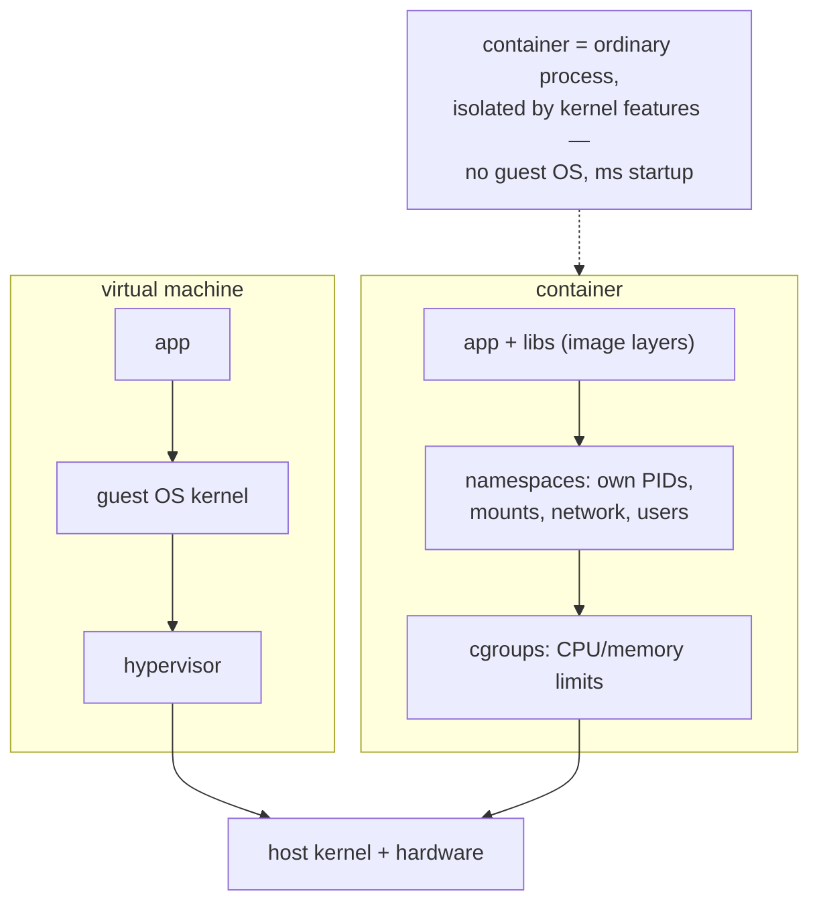

## In simple terms

A **container** is a way of packaging an application together with its dependencies — libraries, binaries, config — and running it in isolation from everything else on the host. It looks like a tiny virtual machine but it's just a normal process with extra OS features applied: its own filesystem view, its own process tree, its own network stack.

## The Visual Map



## More detail

Linux containers are built from a handful of kernel features:

- **Namespaces** — separate views of PIDs, mounts, networks, users, hostname, IPC. A process in a PID namespace can't see processes outside it.
- **cgroups** — limit and account for CPU, memory, I/O.
- **Capabilities, seccomp, SELinux/AppArmor** — restrict what the contained process can do.
- **Union filesystems** (overlayfs) — layer a read-only image with a thin writable layer per container.

A **container image** is a tarball-plus-metadata that describes the filesystem and how to start the entry process. The OCI (Open Container Initiative) standardises both the image format and the runtime interface, so any compliant runtime can run any compliant image.

Compared to virtual machines:

| Property         | VM                       | Container                 |
|------------------|--------------------------|---------------------------|
| Isolation        | Full OS, hardware-level  | Process-level, OS-shared  |
| Boot time        | Seconds to minutes       | Milliseconds              |
| Image size       | GBs                      | MBs to hundreds of MBs    |
| Overhead         | High                     | Negligible                |
| Security boundary | Strong                   | Weaker (shared kernel)    |

Docker popularised containers in 2013; today the ecosystem is much broader: Docker, containerd, CRI-O, Podman, runc, gVisor, Firecracker.

Containers gave us reproducible builds, repeatable deploys, and a unit of work the cloud could schedule efficiently. They are what made microservices and serverless practical at scale, and the foundation underneath Kubernetes.

## Under the Hood

A `Dockerfile` is a build script whose every step becomes a cached, content-addressed filesystem layer:

```dockerfile
FROM python:3.12-slim            # base layers: a minimal Debian + Python

WORKDIR /app
COPY requirements.txt .
RUN pip install -r requirements.txt   # this layer caches — rebuilds only
                                      # when requirements.txt changes
COPY . .                         # app code: the layer that changes often
                                 # goes LAST so everything above stays cached
USER nobody                      # don't run as root inside the container
EXPOSE 8000
CMD ["python", "-m", "uvicorn", "app:api", "--host", "0.0.0.0"]
```

At `docker run`, the runtime stacks these read-only layers with overlayfs, adds a thin writable layer, unshares the namespaces, applies cgroup limits, and `exec`s the `CMD` — the "container" is that one process. Layer ordering is the practical craft: stable layers first, volatile layers last, so rebuilds and pulls move only what changed.

## Engineering Trade-offs

- **Shared kernel: density vs isolation.** No guest OS means millisecond starts and hundreds of containers per host — and one kernel vulnerability away from escape. Untrusted multi-tenant code gets re-wrapped in microVMs (Firecracker) or user-space kernels (gVisor), trading speed back for the boundary.
- **Image immutability vs image hygiene.** "Build once, run anywhere" kills works-on-my-machine, but every image freezes its dependencies — patching OpenSSL now means rebuilding and redeploying every image, which is why registries ship vulnerability scanners.
- **Layer caching vs image sprawl.** Layers dedupe storage and speed pulls, yet careless Dockerfiles (fat base images, secrets in layers, apt caches) ship gigabytes of attack surface. Multi-stage builds exist to leave the toolchain behind.
- **Ephemerality vs state.** Containers are designed to be killed and replaced, which makes stateless services trivially schedulable — and pushes every stateful concern (databases, queues) onto volumes and operators that reintroduce the complexity containers removed.

## Real-world examples

- A `Dockerfile` describes how to build an image; `docker run` starts a container from it.
- A Kubernetes pod is one or more containers scheduled together on a node.
- AWS Lambda runs your function in a Firecracker microVM, which behaves like a very strongly isolated container.
- Cloud functions (AWS Lambda, Cloudflare Workers) sit on top of container or microVM technology — your function code is wrapped in a 50 ms cold-start container the platform reuses across invocations.

## Common misconceptions

- **"Containers are mini-VMs."** They are processes with kernel-level isolation; they share the host kernel.
- **"Containerised = secure."** Default Docker isolation is weaker than a VM's. Untrusted code needs additional sandboxing (gVisor, Kata Containers).

## Try it yourself

Containers are made of namespaces — inspect yours, then enter a fresh PID namespace and watch the process tree vanish:

```bash
ls -l /proc/self/ns/        # every process has namespaces; these are yours

# enter new PID + mount namespaces (rootless, via user namespaces):
unshare --user --pid --mount-proc --fork ps aux
```

Inside the `unshare`, `ps` shows a process tree of *one or two entries* — your shell believes it is PID 1 on an empty machine. That illusion, plus cgroups and an overlay filesystem, is the entire container trick.

## Learn next

- [Kubernetes](/t/kubernetes) — scheduling containers across a fleet.
- [Microservices](/t/microservices) — the architecture containers made practical.
- [Virtualization](/t/virtualization) — the heavier isolation containers are compared against.
