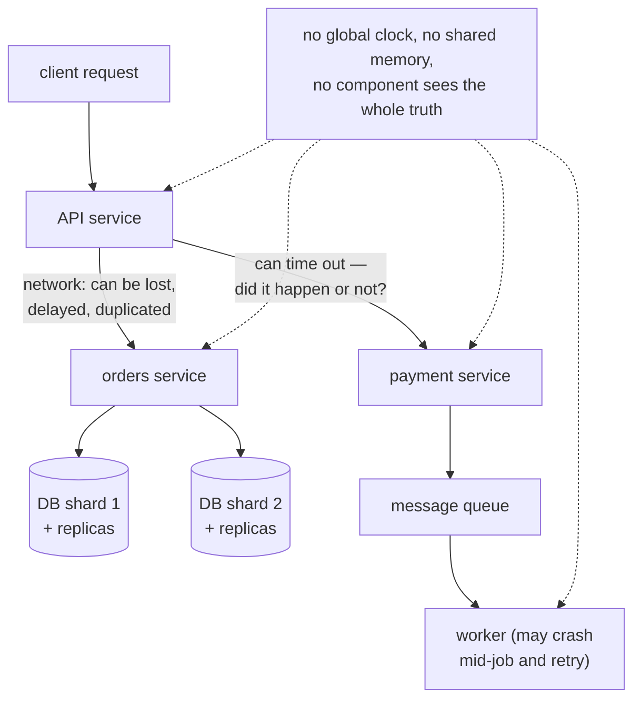

## In simple terms

A **distributed system** is a system whose parts run on more than one computer and have to cooperate without any of them being in charge of the others. The components talk over a network — which means messages can be lost, delayed, duplicated, or reordered, and any individual machine can die at any moment. The whole discipline of distributed systems is about getting useful, correct work done despite that uncertainty.

## The Visual Map



## More detail

The defining property of a distributed system isn't that it has many machines — it's that **no single component sees the whole truth**. There is no global clock, no shared memory, no operating system to mediate, and no observer who can stop time to take a consistent snapshot. Famously, Leslie Lamport quipped: "A distributed system is one in which the failure of a computer you didn't even know existed can render your own computer unusable."

The eight **fallacies of distributed computing** (Deutsch and Gosling, 1990s) are the standard list of what newcomers assume that turns out to be false:

1. The network is reliable.
2. Latency is zero.
3. Bandwidth is infinite.
4. The network is secure.
5. Topology doesn't change.
6. There is one administrator.
7. Transport cost is zero.
8. The network is homogeneous.

The core tools the field developed to cope:

- **Replication** — keep copies of data on multiple machines so any one can fail.
- **Consensus protocols** (Paxos, Raft, ZAB) — let machines agree on a single value even when some misbehave.
- **Sharding** — split data so each machine owns a slice.
- **Eventual consistency** — relax the requirement that everyone agrees *immediately*; accept that they will agree *eventually* in exchange for availability and latency.
- **Idempotency** — design operations so retrying them doesn't double-charge.
- **Logical clocks** (Lamport, vector) — order events without a global clock.
- **Quorums** — require majorities to agree, so minorities can't fork the state.

The **CAP theorem** (Brewer, 2000) summarises a fundamental trade-off: in the presence of a network partition, you must choose between consistency and availability.

Almost every system that's "in the cloud" is distributed — and even a single web app talking to a managed database, a cache, and a payment gateway is participating in one, with all the failure modes that implies. Understanding the patterns is the difference between "works in the demo" and "stays up at 3 a.m. during an AWS regional incident".

## Under the Hood

No global clock — so order events with a **Lamport clock**: a counter that ticks on every event and fast-forwards on every message received:

```python
class Node:
    def __init__(self, name):
        self.name, self.clock = name, 0
    def event(self, what):
        self.clock += 1
        print(f"  {self.name}: {what}  (t={self.clock})")
    def send(self):
        self.clock += 1
        return self.clock
    def recv(self, msg_time, what):
        self.clock = max(self.clock, msg_time) + 1   # the key rule
        print(f"  {self.name}: {what}  (t={self.clock})")

a, b = Node("A"), Node("B")
a.event("write x=1")
t = a.send()                      # A's clock travels with the message
b.event("local work")             # B was busy, clock low
b.recv(t, "got A's message")      # B jumps PAST A's send time
b.event("write y=2")              # ...so this is provably 'after' x=1
```

`max(local, received) + 1` guarantees that if event X *could have caused* event Y, X's timestamp is smaller. That "happened-before" relation — not wall-clock time — is what distributed protocols actually order by.

## Engineering Trade-offs

- **One machine vs many: a step change in failure modes.** A monolithic process fails whole; a distributed system fails *partially* — a request can succeed on one side of a timeout and be unknown on the other. Every pattern in this field (retries, idempotency, sagas) exists to handle "I don't know what happened".
- **Consistency vs availability vs latency.** CAP forces a choice during partitions, and PACELC extends it: even with no partition, coordination costs latency. Strongly consistent systems pay quorum round-trips on every write; eventually consistent ones push the reconciliation burden onto application code.
- **Scale-out capacity vs coordination overhead.** Adding machines adds throughput only for work that doesn't need agreement; anything requiring coordination (transactions, uniqueness, ordering) gets *harder* with each node. Good designs minimise the coordinated core.
- **Operational surface.** Three replicas means three machines to patch, monitor, and debug, plus the network between them. The system's reliability now depends on observability tooling (tracing, structured logs) that a single process never needed.

## Real-world examples

- **Google Spanner** — a globally-distributed, externally-consistent SQL database using GPS- and atomic-clock-synchronised time to bound clock skew.
- **Amazon DynamoDB** — a leaderless, eventually-consistent key-value store. The original 2007 paper kicked off the NoSQL movement.
- **Kubernetes** — every cluster is a distributed system; etcd (Raft) provides the consistent control plane.
- **Cassandra**, **CockroachDB**, **Kafka**, **ZooKeeper**, **Consul**, **Redis Cluster** — all distributed.
- **A single Slack message** crossing services is a distributed transaction across many components.

## Common misconceptions

- **"Distributed = microservices."** Microservices is one *architecture* pattern; the broader distributed systems field includes databases, queues, file systems, and consensus regardless of architecture.
- **"More replicas = more reliable."** Up to a point. Past that, the coordination overhead and the chance of a network partition dominate. Most production systems run 3 or 5 replicas, not 100.
- **"Distributed transactions just work."** They are a research-grade problem. Most systems sidestep them with sagas, outboxes, eventual consistency, or by simply ensuring transactional state stays inside one shard.

## Try it yourself

Fallacy #1, demonstrated: send requests over a "network" that silently drops some — and notice the sender cannot tell a slow reply from a lost one:

```bash
python3 -c "
import random, socket
random.seed(2)

rx = socket.socket(socket.AF_INET, socket.SOCK_DGRAM)
rx.bind(('127.0.0.1', 0)); rx.settimeout(0.2)
tx = socket.socket(socket.AF_INET, socket.SOCK_DGRAM)

for i in range(6):
    if random.random() > 0.4:                 # the network 'decides'
        tx.sendto(f'req {i}'.encode(), rx.getsockname())
    try:
        data, _ = rx.recvfrom(64)
        print(f'req {i}: delivered ->', data.decode())
    except socket.timeout:
        print(f'req {i}: TIMEOUT — lost? slow? did the server act on it? unknowable')
"
```

Every timeout line is the fundamental dilemma: retry (and risk doing it twice) or don't (and risk doing it zero times). [Idempotency](/t/idempotency) is the standard escape.

## Learn next

- [Consensus](/t/consensus) — the agreement primitive everything else leans on.
- [Replication](/t/replication) and [sharding](/t/sharding) — the two main scaling axes.
- [Microservices](/t/microservices) — the architecture that brought these concerns to every team.
