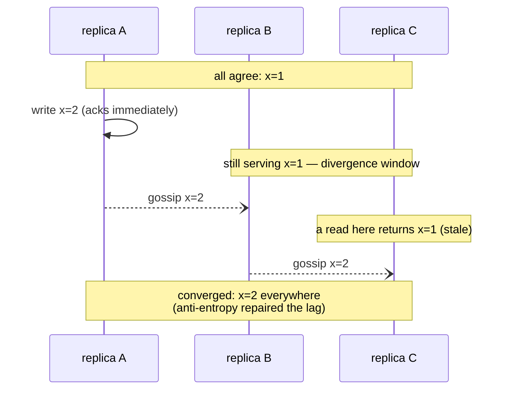

## In simple terms

**Eventual consistency** is the trade-off where, after a write, different replicas might briefly return different values — but if you stop writing, they all converge on the same answer eventually (usually within milliseconds). The benefit: lower latency, higher availability, scales beautifully. The cost: your application has to be OK with seeing stale data sometimes.

## The Visual Map



## More detail

A formal definition: in the absence of new writes, all reads will eventually return the most recent value.

How long "eventually" takes depends on the system:

- **Tens of milliseconds** — typical for a healthy Cassandra cluster.
- **Sub-second** — typical for DNS, well-running CDN cache invalidations.
- **Seconds** — typical for cross-region replication in many cloud databases.
- **Minutes** — possible for low-traffic edge cache invalidation.
- **Hours** — happens during partitions; healed by anti-entropy / repair on reconnect.

The spectrum of consistency models from strongest to weakest:

| Model | Guarantee |
|---|---|
| Linearizability | Every read returns the most recent write; reads/writes look like they happened at a single global instant. |
| Sequential consistency | All processes see writes in the same order; not necessarily real-time. |
| Causal consistency | Causally-related operations are seen in order; concurrent ones may not be. |
| Read-your-writes | A user sees their own writes immediately, but not necessarily others'. |
| Monotonic reads | If you've seen value V, you'll never go back to an older value. |
| Eventual consistency | All replicas converge eventually; no other ordering guarantee. |

Many real-world systems offer **tunable consistency** per request: write at QUORUM and read at QUORUM gives strong consistency on a Cassandra-style system; read at ONE gives eventual consistency with lower latency.

Conflict resolution strategies when replicas disagree:

- **Last-write-wins (LWW)** — pick the write with the latest timestamp. Simple, can lose updates.
- **Vector clocks** — track causal history; surface conflicts to the application.
- **CRDTs** (Conflict-free Replicated Data Types) — datatypes whose operations commute, so concurrent updates merge deterministically. The basis of Yjs, Automerge, Riak's counters.
- **Application-level merge** — let the application decide (e.g., "concatenate both messages" for chat history).

Most distributed databases default to some form of eventual consistency because it's what allows them to be both available during partitions and fast across regions. Understanding which of your data is OK with eventual consistency (and which isn't) is a core distributed-systems design skill.

## Under the Hood

The sharp edge of the model — last-write-wins silently losing an update during concurrent writes:

```python
import itertools
clock = itertools.count(1)

def lww_merge(a, b):                 # each value carries (timestamp, data)
    return max(a, b)                 # later timestamp wins, the other VANISHES

# two replicas, partitioned, both accept a write to the same cart
west = (next(clock), {"cart": ["book"]})
east = (next(clock), {"cart": ["lamp"]})        # slightly later timestamp

merged = lww_merge(west, east)
print("LWW merge :", merged[1], "  <- the book is gone, no error raised")

# the CRDT-style alternative: a merge that keeps both (set union)
def union_merge(a, b):
    return {"cart": sorted(set(a[1]["cart"]) | set(b[1]["cart"]))}
print("set merge :", union_merge(west, east), "  <- Amazon's cart choice")
```

This is why Amazon's Dynamo paper merged carts by union — a deleted item occasionally reappearing beats a purchase silently vanishing. The merge function *is* the consistency policy.

## Engineering Trade-offs

- **Latency and availability vs staleness.** Acking a write locally and gossiping later means single-digit-millisecond writes and no unavailability during partitions — and reads anywhere may lag. The question per data type: what does a stale read *cost*? Nothing for a like count; real money for an inventory check.
- **Convergence is guaranteed; correctness of the merge is your job.** The model only promises replicas end up identical. LWW converges by discarding data; CRDTs converge losslessly but constrain your data types; app-level merges are precise and expensive to write.
- **Session guarantees patch the worst UX.** Pure eventual consistency lets a user not see their own comment. Read-your-writes and monotonic-reads (sticky sessions, client-tracked versions) fix the embarrassing cases without paying for full linearizability.
- **Anti-entropy isn't free.** Background repair (Merkle-tree comparison, read repair, hinted handoff) is constant CPU, disk, and network spend — the deferred cost of every fast write, paid continuously.

## Real-world examples

- **DNS** is eventually consistent — a record change propagates over hours as TTLs expire.
- **Amazon's cart** is eventually consistent; in their famous "Dynamo" paper, they explained that "the customer might briefly see two different shopping carts; this is preferable to refusing the request entirely".
- **Google Docs** uses CRDT-like collaborative editing so multiple editors' changes converge automatically.
- **Cassandra at scale** (Netflix, Discord, Apple) operates at eventual consistency for nearly all reads, falling back to QUORUM for the few that need stronger guarantees.

## Common misconceptions

- **"Eventually consistent means slow to update."** Usually it's the opposite — eventually consistent reads are faster because they don't wait for a quorum.
- **"Eventually consistent = unreliable."** It's a different reliability model. Strong consistency systems are *unavailable* during partitions; eventually-consistent ones stay available with stale reads.

## Try it yourself

Watch gossip-style anti-entropy converge a divergent cluster — and count how few rounds it takes:

```bash
python3 -c "
import random
random.seed(3)
N = 10
state = [0] * N
state[0] = 1                      # one replica has the new value

rounds = 0
while not all(state):
    rounds += 1
    for i in range(N):            # each node syncs with one random peer
        j = random.randrange(N)
        state[i] = state[j] = max(state[i], state[j])
    print(f'round {rounds}: {sum(state)}/{N} replicas current  {\"\".join(map(str, state))}')
print(f'converged in {rounds} rounds — gossip spreads epidemically, O(log N)')
"
```

Logarithmic spread is why "eventually" is usually milliseconds: doubling the cluster adds roughly one gossip round, not double the time.

## Learn next

- [CAP theorem](/t/cap-theorem) — the trade-off that motivates the model.
- [CRDT](/t/crdt) — data types that make convergence lossless.
- [Consensus](/t/consensus) — the strong-consistency alternative and its costs.
