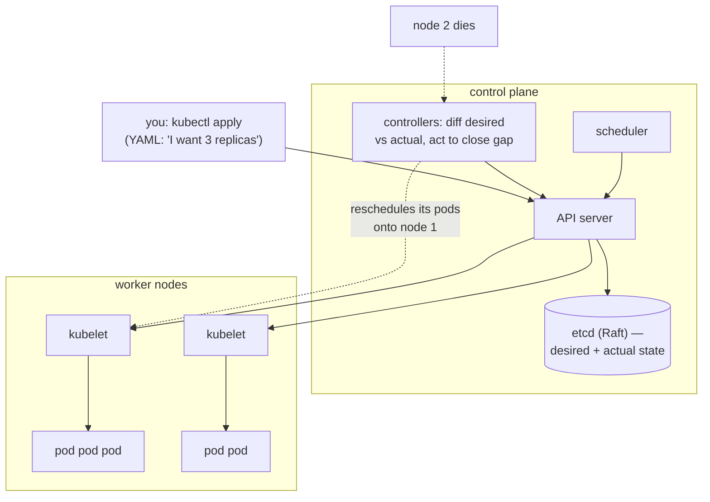

## In simple terms

**Kubernetes** ("k8s" because there are eight letters between K and s) is the most-used way to run containers in production at scale. You declare what you want to run ("3 copies of this container, 1 GB RAM each, exposed on port 80") and Kubernetes figures out which machines to put them on, restarts them when they crash, updates them gradually when you push a new version, and reschedules them when a machine dies.

## The Visual Map



## More detail

The core objects you'll meet:

- **Pod** — one or more containers sharing network and storage; the smallest deployable unit.
- **Deployment** — declares N replicas of a Pod template; handles rolling updates.
- **Service** — stable virtual IP / DNS name that load-balances over the Pods backing it.
- **Ingress** — routes external HTTP traffic to Services.
- **ConfigMap / Secret** — config and credentials, mounted into Pods.
- **Namespace** — isolation boundary for resources.
- **StatefulSet** — like Deployment, but for stateful workloads (stable identity, ordered rollouts).
- **DaemonSet** — one Pod per node (logging agents, monitoring exporters).
- **Job / CronJob** — batch / scheduled work.

The control plane:

- **API server** — REST API; everything talks to it.
- **etcd** — strongly-consistent KV store (Raft) holding all cluster state.
- **Scheduler** — picks a node for each Pod based on resource needs and constraints.
- **Controller manager** — runs reconciliation loops that drive actual state toward desired state.
- **kubelet** — agent on each node that runs containers.

The mental model is **declarative reconciliation**: you describe desired state via YAML; controllers continuously diff that against actual state and act to close the gap. Most "what does Kubernetes *do*?" comes down to this loop.

The Kubernetes ecosystem is vast: **Helm** (packaging), **Argo CD / Flux** (GitOps), **Istio / Linkerd** (service meshes), **cert-manager** (TLS), **Prometheus / Grafana** (metrics), **OpenTelemetry** (traces). Kubernetes is famously complex — the 2020s saw a real conversation about whether a typical mid-size team needs it, or whether a managed PaaS is a better fit.

If you operate containers at any meaningful scale, you almost certainly touch Kubernetes — either directly or via a managed offering (EKS, GKE, AKS). Even teams that avoid it benefit from understanding the model, because so much modern tooling presupposes it.

## Under the Hood

A Deployment manifest — the declarative contract the reconciliation loop enforces forever:

```yaml
apiVersion: apps/v1
kind: Deployment
metadata:
  name: storefront
spec:
  replicas: 3                      # the desired state. not a command — a CONTRACT
  selector:
    matchLabels: { app: storefront }
  strategy:
    rollingUpdate: { maxUnavailable: 1, maxSurge: 1 }   # how updates roll
  template:
    metadata:
      labels: { app: storefront }
    spec:
      containers:
        - name: web
          image: registry.local/storefront:2.7.0   # change this line = rollout
          resources:
            requests: { cpu: 250m, memory: 256Mi } # scheduler places by this
            limits:   { cpu: "1",  memory: 512Mi } # cgroup-enforced ceiling
          readinessProbe:                          # no traffic until this passes
            httpGet: { path: /healthz, port: 8080 }
```

Kill a pod and the controller recreates it; drain a node and pods reschedule; edit `image:` and a rolling update replaces pods one at a time, gated by the readiness probe. You never say *do* — you say *be*, and the loop does whatever it takes, indefinitely.

## Engineering Trade-offs

- **Declarative self-healing vs cognitive load.** The reconciliation model absorbs node failures, crashes, and rollouts automatically — but debugging means reasoning about a dozen asynchronous controllers ("why won't it schedule?" has twenty possible answers). The "$5 droplet" backlash is the honest counterweight: below a certain scale, the machinery costs more than it saves.
- **Portability vs managed convenience.** The API is the same on every cloud, a genuine lock-in escape — yet real clusters accrete provider-specific load balancers, storage classes, and IAM glue, so "portable" means "re-plumbable", not "moves freely".
- **Resource requests: bin-packing vs honesty.** The scheduler packs nodes by *requested* resources. Teams over-request for safety and clusters run at 30% utilisation; under-request and the OOM-killer arrives. Right-sizing is a permanent operational chore (and a product category).
- **etcd is the CP heart.** All cluster state lives in one Raft quorum — strongly consistent, and unavailable during partitions: lose quorum and nothing can be scheduled or changed, though running pods keep running. The control plane inherits every consensus trade-off.

## Real-world examples

- **Google Borg** — k8s's internal predecessor at Google, which the 2014 k8s open-source release was loosely modelled on.
- The **CNCF** (Cloud Native Computing Foundation) hosts Kubernetes and most of its ecosystem; CNCF events draw tens of thousands of attendees.
- **OpenAI** runs much of its inference and training infrastructure on Kubernetes.
- The 2020s era of "**we should have just used a $5 droplet**" backlash is real but partial — k8s remains the dominant pattern for serious multi-service workloads.

## Common misconceptions

- **"Kubernetes is a substitute for cloud."** It runs on cloud, on-prem, or hybrid; it's a workload manager, not a hosting service.
- **"You need Kubernetes for microservices."** You can run microservices on simpler platforms (managed PaaS, ECS, Nomad, Fly Machines). K8s is one option, not the only one.

## Try it yourself

The reconciliation loop is simple enough to hold in your head — here it is, complete with a node failure:

```bash
python3 -c "
import random
random.seed(5)
desired = 3
actual = []                      # running pods, by node

def reconcile():
    while len(actual) < desired:
        actual.append(f'pod-{random.randrange(1000)} on node-{random.choice(\"ABC\")}')
    while len(actual) > desired:
        actual.pop()

reconcile(); print('steady   :', actual)
actual[:] = [p for p in actual if 'node-B' not in p]   # node B dies
print('node B ✝ :', actual)
reconcile(); print('healed   :', actual)
desired = 5                       # you edit the YAML
reconcile(); print('scaled   :', len(actual), 'pods')
"
```

Diff desired against actual, act, repeat — every Kubernetes controller, from Deployments to cert-manager, is a variation of these ten lines.

## Learn next

- [Container](/t/container) — the unit Kubernetes schedules.
- [Microservices](/t/microservices) — the architecture it became famous serving.
- [Service mesh](/t/service-mesh) — the networking layer commonly added on top.
