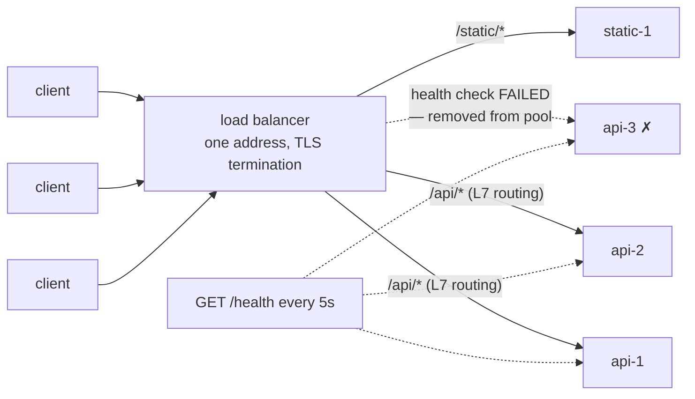

## In simple terms

When you have ten servers behind a web address, something must decide which one handles each new request. That's the **load balancer**: a single point at the front that accepts connections and forwards them, one at a time, to whichever backend is least busy (or next in rotation). Clients see one address; the load balancer sees ten servers — it hides the fleet and manages it.

## The Visual Map



## More detail

Load balancers operate at different layers of the network stack:

**Layer 4 (transport) load balancers** work at the TCP/UDP level — they see IP packets and port numbers but not the application payload. Extremely fast (often implemented in hardware or kernel bypass), but cannot make routing decisions based on HTTP paths or cookies.

**Layer 7 (application) load balancers** terminate the TCP connection, parse the HTTP (or gRPC, etc.) request, and forward it. They can route based on URL path (`/api/*` → service A, `/static/*` → CDN), inject headers, terminate TLS, and perform health checks at the application level. HAProxy, Nginx, AWS ALB, and Envoy are examples.

**Algorithms** for picking the backend:
- **Round-robin** — next server in a cycle. Simple and fair when requests are equal cost.
- **Least-connections** — send to whichever server has the fewest active connections. Better for long-lived requests.
- **IP hash** — hash the client's IP to always route to the same server. Provides *sticky sessions* without explicit session tracking.
- **Weighted** — some servers get more traffic than others (for heterogeneous fleets or canary deploys).

**Health checks** are essential: the load balancer probes each backend (TCP connect, or HTTP `GET /health`) and stops routing to any that fail. This is how the fleet tolerates individual server crashes without the client noticing.

**High availability of the load balancer itself** — since it's a single point of entry, it must be redundant too. Common patterns: active-passive with a floating VIP (virtual IP) failing over on heartbeat loss; or active-active with DNS round-robin or anycast.

In [Kubernetes](/t/kubernetes) and [service meshes](/t/service-mesh), load balancing moves inside the cluster (every pod has a sidecar proxy that balances outgoing calls) — the traditional external load balancer remains for ingress traffic only.

A load balancer is the boundary between "one server" and "a fleet". Without it, scaling a service means changing DNS and accepting downtime; with it, you add or remove backends transparently, roll out canary deployments, and survive server failures silently. It is also where TLS termination, rate limiting, and authentication can be applied uniformly without every backend implementing them.

## Under the Hood

A production-shaped nginx configuration — algorithm, weights, health behavior, and TLS in twenty lines:

```text
upstream api_pool {
    least_conn;                          # algorithm: fewest active connections
    server 10.0.1.10:8080 weight=3;      # beefier machine takes 3x share
    server 10.0.1.11:8080;
    server 10.0.1.12:8080 max_fails=2 fail_timeout=10s;   # passive health check:
                                         # 2 failures -> benched for 10s
    server 10.0.1.13:8080 backup;        # only used if the others are down
    keepalive 32;                        # pooled connections to backends
}

server {
    listen 443 ssl;
    ssl_certificate     /etc/ssl/site.pem;     # TLS terminates HERE —
    ssl_certificate_key /etc/ssl/site.key;     # backends speak plain HTTP

    location /api/   { proxy_pass http://api_pool; }        # L7 routing
    location /static/ { root /var/www; }                    # served directly
}
```

Every concept in this topic is a line in this file: the pool, the algorithm, weighting for canaries, health-check benching, and the TLS boundary. Swap `least_conn` for `ip_hash` and you have sticky sessions instead.

## Engineering Trade-offs

- **L4 speed vs L7 intelligence.** Layer 4 forwards packets at millions per second without parsing them; Layer 7 buys path routing, header injection, and per-request decisions at the cost of terminating and re-establishing every connection. Big deployments stack both: L4 at the edge, L7 behind it.
- **Algorithm choice shows up in tail latency.** Round-robin is fine for uniform short requests; one slow backend poisons it. Least-connections (or "random of two choices") adapts to variable cost — the difference is invisible at p50 and dramatic at p99.
- **Sticky sessions vs even spread.** Pinning clients to servers lets backends keep session state, but hot clients create hot servers and a backend's death loses its sessions. The cleaner fix — stateless backends with shared session storage — is an application change, not a config change.
- **The balancer is itself a single point of failure.** Everything funnels through it: it needs redundancy (VIP failover, anycast), and its capacity, TLS throughput, and config become shared fate for every service behind it. A bad rule deployed to the LB is an outage for everyone at once.

## Real-world examples

- AWS Elastic Load Balancer (ALB/NLB) sits in front of EC2 instances or ECS tasks and distributes HTTP or TCP traffic.
- Nginx configured as a reverse proxy performs Layer 7 load balancing and TLS termination for a group of application servers.
- Kubernetes' `Service` type `LoadBalancer` provisions a cloud load balancer pointing at the pod IP addresses.
- Cloudflare and other CDNs use anycast routing — the same IP is advertised from multiple data-centres, and BGP delivers each request to the nearest one.

## Common misconceptions

- **"A load balancer is a single machine."** Modern load balancers run in clusters or as distributed software (Envoy sidecar, eBPF-based kube-proxy) — there's no single physical bottleneck.
- **"Round-robin is good enough."** It is for uniform short requests. For variable-cost or long-lived connections (streaming, WebSocket, database queries), least-connections or random-with-two-choices gives substantially better tail latency.

## Try it yourself

Race round-robin against least-connections on a workload with occasional slow requests, and compare the queues that build up:

```bash
python3 -c "
import random
random.seed(11)
reqs = [random.choice([1,1,1,1,10]) for _ in range(2000)]   # 20% are 10x slower

def simulate(pick):
    load = [0, 0, 0, 0]                  # outstanding work per backend
    worst = 0
    for i, cost in enumerate(reqs):
        b = pick(i, load)
        load[b] += cost
        worst = max(worst, load[b])
        load[:] = [max(0, l - 1) for l in load]   # each tick drains 1 unit
    return worst

rr = simulate(lambda i, load: i % 4)
lc = simulate(lambda i, load: load.index(min(load)))
print(f'worst backlog — round-robin     : {rr}')
print(f'worst backlog — least-connections: {lc}  ({rr/lc:.1f}x better tail)')
"
```

Round-robin keeps assigning work to a backend already stuck on slow requests; least-connections routes around it. That gap *is* the p99 difference users feel.

## Learn next

- [Microservices](/t/microservices) — the fleets load balancers front.
- [Kubernetes](/t/kubernetes) — where Services and kube-proxy do this job internally.
- [Service mesh](/t/service-mesh) — per-call balancing between services, not just at the edge.
- [CDN](/t/cdn) — global load distribution one layer further out.
