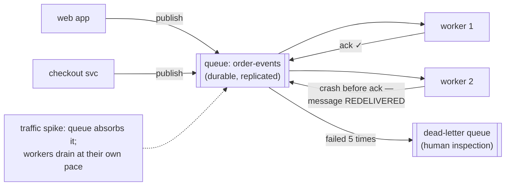

## In simple terms

A **message queue** is a durable buffer between producers ("here, do this") and consumers ("ok, I'll handle it when I can"). Producers don't have to wait for consumers; consumers don't have to be available the moment a message arrives. Messages sit in the queue until somebody picks them up. This is the foundation of most asynchronous, decoupled, scalable backend architectures.

## The Visual Map



## More detail

Two main styles:

- **Queue (point-to-point)** — each message is delivered to exactly one consumer in a group. Used for work distribution: 10 worker processes pulling jobs off a queue.
- **Pub/sub (topic)** — each message is broadcast to all subscribers. Used for event notification: 5 services each reacting to "order placed".

Many modern brokers (Kafka, NATS) support both.

Common features:

- **Durability** — messages survive broker restarts (written to disk, often replicated).
- **At-least-once delivery** — message will be delivered, possibly more than once. Consumers must be idempotent.
- **Ordering** — within a partition / queue, often FIFO. Across partitions, no.
- **Dead-letter queue** — messages that fail repeatedly go to a quarantine queue for human inspection.
- **Consumer groups** — multiple workers share the load of one queue.
- **Backpressure** — slow consumers signal producers to slow down.
- **Replay** — log-based brokers (Kafka) let you rewind and re-process old messages.

The 2026 landscape: **Kafka** (log-based streaming, replay, very high throughput), **RabbitMQ** (AMQP routing, work queues), **NATS** (lightweight, low-latency), **Redis Streams** (when you already have Redis), **AWS SQS/SNS**, **Kinesis**, **Google Pub/Sub**, **Cloudflare Queues** (managed).

Common patterns built on message queues:

- **Job processing** (Sidekiq, BullMQ, Celery, RQ) — web request enqueues, worker processes.
- **Event sourcing** — every change as an event in an immutable log.
- **CQRS** — separate write path (events) from read path (materialised views).
- **Saga** — distributed transactions as a sequence of compensable events.
- **Outbox pattern** — write events to the same database transaction as the data change, then publish to queue from a separate process.

Almost every non-trivial backend has a message queue somewhere — even if it's just a Redis list serving as a job queue. They're the standard way to decouple services, smooth traffic spikes, and survive partial outages without dropping work.

## Under the Hood

The core mechanics — visibility timeout, ack, and redelivery — in a queue you can read in one sitting:

```python
import time

class Queue:
    def __init__(self, visibility=30):
        self.ready, self.inflight, self.vis = [], {}, visibility

    def publish(self, msg):
        self.ready.append({"body": msg, "attempts": 0})

    def consume(self):
        self._requeue_expired()
        if not self.ready:
            return None
        m = self.ready.pop(0)
        m["attempts"] += 1
        handle = id(m)
        self.inflight[handle] = (time.monotonic(), m)   # invisible, NOT deleted
        return handle, m

    def ack(self, handle):
        del self.inflight[handle]                       # only now is it gone

    def _requeue_expired(self):                         # crashed consumer?
        now = time.monotonic()
        for h, (t, m) in list(self.inflight.items()):
            if now - t > self.vis:
                del self.inflight[h]
                self.ready.append(m)                    # redelivered -> duplicate!
```

`consume` doesn't delete — it *hides*. The message only disappears on `ack`; a consumer that crashes mid-job simply lets the visibility timer expire and the message returns. That mechanism is exactly why delivery is *at-least*-once and consumers must tolerate duplicates.

## Engineering Trade-offs

- **Decoupling vs invisibility.** Producers no longer know or care whether consumers are up — which also means nobody gets an error when work silently piles up. Queue-depth monitoring and DLQ alerts replace the immediate feedback a synchronous call gave you for free.
- **At-least-once vs exactly-once.** Guaranteed delivery requires redelivery, and redelivery means duplicates; the broker can't know if your crash happened before or after the side effect. "Exactly-once" in practice = at-least-once delivery + [idempotent](/t/idempotency) consumers (or transactional integration like Kafka's).
- **Queue vs log.** Classic queues (SQS, RabbitMQ) delete on ack — simple, but history is gone. Log brokers (Kafka) keep everything for a retention window: replay and multiple independent readers, at the price of partition management and consumer-offset bookkeeping.
- **Buffering hides overload until it can't.** A queue absorbs a spike beautifully — and a chronically slow consumer turns it into an ever-growing backlog with hours of latency. Backpressure, TTLs, and max-depth alarms are how you find out you have a throughput problem *before* the queue does.

## Real-world examples

- **LinkedIn invented Kafka** to handle their activity stream and now process trillions of events per day across the industry.
- **Stripe** uses a heavily-customised internal queue for webhook delivery — retried with exponential backoff for up to 3 days.
- **Discord** moves messages through several queues before they hit your client, allowing the system to absorb huge traffic spikes (e.g. major game launches).
- **AWS S3 → SQS → Lambda** is a canonical event-driven pipeline: upload to S3 emits an event, queued, processed by Lambda.

## Common misconceptions

- **"Queues guarantee exactly-once delivery."** Most provide at-least-once; exactly-once requires consumer-side idempotency (or careful transactional integration).
- **"Messaging makes the system more reliable."** It changes the failure mode. Now you can have orphaned messages, head-of-line blocking, poison messages, replay storms — different problems, not fewer.

## Try it yourself

Produce a duplicate delivery with a crashing consumer, then defuse it with an idempotent handler:

```bash
python3 -c "
queue = [{'id': 'order-7', 'amount': 99}]
charged = {}            # idempotency ledger keyed by message id

def handle(msg, crash_before_ack=False):
    if msg['id'] in charged:
        print(f'  {msg[\"id\"]}: duplicate — already charged, skipping')
        return True
    charged[msg['id']] = msg['amount']
    print(f'  {msg[\"id\"]}: charged \${msg[\"amount\"]}')
    if crash_before_ack:
        print('  worker CRASHED before ack -> broker will redeliver')
        return False
    return True

msg = queue[0]
print('delivery 1:'); acked = handle(msg, crash_before_ack=True)
if not acked:
    print('delivery 2 (redelivery):'); handle(msg)
print('total charged:', charged, '— once, despite two deliveries')
"
```

Without the ledger check, the customer pays twice. At-least-once delivery plus idempotent handling is the standard contract of every production queue.

## Learn next

- [Idempotency](/t/idempotency) — the consumer-side discipline queues require.
- [Microservices](/t/microservices) — the architecture queues decouple.
- [Eventual consistency](/t/eventual-consistency) — the data model async processing implies.
