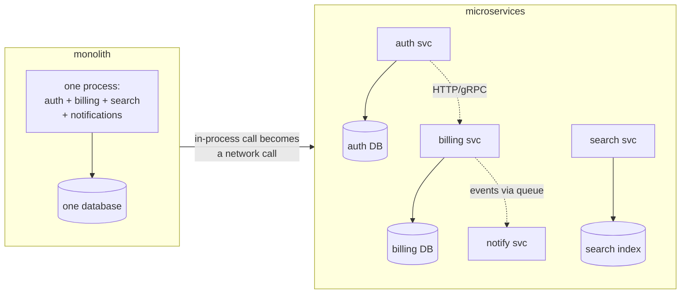

## In simple terms

A **microservice** architecture breaks an application up into many small services that each do one thing — auth, billing, search, notifications — and talk to each other over the network. The opposite is a **monolith**, where one big codebase and one process does everything.

## The Visual Map



## More detail

Often-cited benefits:

- **Independent deploys** — each team ships their service on their own cadence.
- **Independent scaling** — scale the busy service, not everything.
- **Technology diversity** — different services can pick their own language and database.
- **Bounded fault impact** — a failure in one service doesn't crash the whole app, *if* the rest is built to degrade gracefully.
- **Smaller teams own smaller code** — Conway's law: org and architecture mirror each other.

Costs and risks (always understated):

- **Distributed systems are harder** — network failures, retries, partial outages, eventual consistency.
- **Operational complexity** — many services means many deploys, dashboards, on-call rotations.
- **End-to-end debugging** — a single user request can traverse a dozen services.
- **Data consistency** — no cross-service transactions; you live with sagas, outbox patterns, and reconciliation jobs.

Rules of thumb:

- **Start with a monolith.** Split out a service only when a clear seam exists and the cost is justified.
- **A service that just wraps a database table is too small.**
- **A service owned by no team is doomed.**

Supporting tech you usually adopt with microservices: containers, an orchestrator (Kubernetes), service discovery, distributed tracing, centralised logging, a CI/CD pipeline that can ship dozens of services.

Microservices, when right-sized, let large organisations move quickly without coordinating every change across the whole company. When wrong-sized, they recreate every problem a monolith had plus the entire surface area of a distributed system.

## Under the Hood

The architecture, as deployment config — each service independently built, versioned, scaled, and owned:

```yaml
# docker-compose.yml — a microservice system in miniature
services:
  auth:
    image: registry.local/auth:2.4.1      # its own version...
    environment: { DB_URL: postgres://auth-db/auth }
    deploy: { replicas: 2 }

  billing:
    image: registry.local/billing:7.0.3   # ...on its own release cadence
    environment:
      DB_URL: postgres://billing-db/billing
      AUTH_URL: http://auth:8080          # cross-service call = network call
    deploy: { replicas: 4 }               # scaled independently

  notifications:
    image: registry.local/notify:1.9.0
    environment: { QUEUE_URL: amqp://broker }   # async via the queue

  auth-db:    { image: postgres:17 }      # one database PER service —
  billing-db: { image: postgres:17 }      # no shared tables, no cross-DB joins
```

The two load-bearing decisions are visible right here: every call between services crosses the network (so it can fail), and every service owns its data exclusively (so there are no cross-service transactions).

## Engineering Trade-offs

- **Team autonomy vs systemic complexity.** Independent deploys remove cross-team coordination — and replace it with versioned APIs, backwards-compatibility contracts, and integration environments. You trade meeting overhead for engineering overhead.
- **In-process calls become network calls.** A function call that couldn't fail now has latency, timeouts, retries, and partial failure. Tail latency compounds: a request fanning out to 10 services at p99=100ms has a much worse p99 itself.
- **Per-service databases vs transactions.** Data ownership enables independent evolution, but "debit billing, credit wallet" is no longer one ACID transaction — it's a [saga](/t/saga-pattern) with compensation logic and reconciliation jobs.
- **Platform prerequisite.** The architecture only pays off on top of mature CI/CD, observability, and orchestration. Adopting microservices before that platform exists is how teams end up slower than their old monolith — the lesson behind Uber's consolidation of ~2,200 services.

## Real-world examples

- Amazon's "two-pizza team" rule famously aligns team size with service ownership.
- Netflix is the canonical microservices case study.
- Shopify ran a monolith for years and proudly still mostly does — successfully.
- Uber publicly walked back parts of its microservices architecture in 2020, consolidating ~2,200 services into larger ones because the operational overhead exceeded the agility benefit.

## Common misconceptions

- **"Microservices are how big tech got to scale."** Some did; others scaled monoliths for many years. Architecture is one input among many.
- **"Microservices ship faster."** They can — but only if the platform underneath them is mature. Without it, they often slow teams down.

## Try it yourself

Run two "services" and watch an in-process call become a fallible network hop — including what happens when the dependency is down:

```bash
python3 -c "
import threading, urllib.request, urllib.error
from http.server import BaseHTTPRequestHandler, ThreadingHTTPServer

class Auth(BaseHTTPRequestHandler):
    def do_GET(self):
        self.send_response(200); self.end_headers()
        self.wfile.write(b'{\"user\": \"ada\", \"valid\": true}')
    def log_message(self, *a): pass

auth = ThreadingHTTPServer(('127.0.0.1', 0), Auth)
threading.Thread(target=auth.serve_forever, daemon=True).start()
auth_url = f'http://127.0.0.1:{auth.server_address[1]}'

# billing service calling auth service:
print('auth up  :', urllib.request.urlopen(auth_url, timeout=1).read().decode())
auth.shutdown(); auth.server_close()
try:
    urllib.request.urlopen(auth_url, timeout=1)
except (urllib.error.URLError, ConnectionError) as e:
    print('auth down: billing must now decide — fail? retry? degrade?')
"
```

That final question is the daily texture of microservice engineering; circuit breakers and fallbacks are the standard answers.

## Learn next

- [Container](/t/container) — the packaging unit that made this architecture practical.
- [Message queue](/t/message-queue) — the async alternative to fragile call chains.
- [Service mesh](/t/service-mesh) — retries, mTLS, and routing factored out of every service.
- [Saga pattern](/t/saga-pattern) — transactions when your data spans services.
