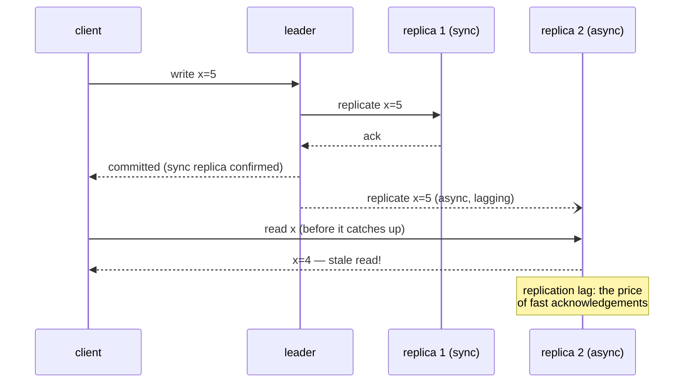

## In simple terms

**Replication** is keeping copies of your data on more than one machine. If one machine dies, the others still have it; if more readers come, you can serve them from any copy. The hard part is keeping the copies in sync without slowing everything down.

## The Visual Map



## More detail

Three common models:

- **Single-leader (primary/replica)** — all writes go to one leader; replicas asynchronously or synchronously follow along. Simple, scales reads, but failover is non-trivial. Used by MySQL, PostgreSQL, MongoDB.
- **Multi-leader** — multiple nodes accept writes and replicate to each other. Allows multi-region writes; introduces conflict-resolution problems.
- **Leaderless** — any node accepts a write, gossips to others (Cassandra, DynamoDB). Configurable quorums let you trade latency for consistency per operation.

Replication can be:

- **Synchronous** — write isn't acknowledged until replicas confirm. Stronger guarantee, slower.
- **Asynchronous** — leader acks immediately, replicas catch up. Faster, risk of lag and data loss on failover.

Why it's hard:

- **Replication lag** — replicas can be seconds behind. Reads from a replica can return stale data.
- **Split brain** — a partition causes two leaders. Solved by consensus protocols.
- **Conflict resolution** — multi-leader systems need rules (last-write-wins, CRDTs, app-defined).

Replication is the foundation under high availability: cloud databases promise "99.99%" precisely because they replicate across machines, racks, and regions — and it's how reads scale beyond a single machine.

## Under the Hood

What production single-leader replication actually looks like — a PostgreSQL primary and its standby:

```text
# primary: postgresql.conf
wal_level = replica              # write-ahead log carries every change
max_wal_senders = 5              # how many replicas may stream it
synchronous_standby_names = 'standby1'   # this one must ack before commit
synchronous_commit = on          # the sync/async dial, per-transaction

# standby: created by copying the primary, then streaming the WAL
# pg_basebackup -h primary -D /var/lib/postgresql/data -R
primary_conninfo = 'host=primary port=5432 user=replicator'

-- on the primary, lag is observable per replica:
SELECT application_name, state,
       pg_wal_lsn_diff(pg_current_wal_lsn(), replay_lsn) AS lag_bytes
FROM pg_stat_replication;
```

The mechanism is the **write-ahead log**: every change is a log record, replicas replay the same records in the same order, and "lag" is literally how many bytes of log a replica hasn't replayed yet. `synchronous_commit` is the trade-off dial: `on` waits for the standby (durable, slower), `off`/async acks immediately (fast, loses the tail on failover).

## Engineering Trade-offs

- **Sync vs async is durability vs latency.** Synchronous replication means a crash loses nothing but every commit pays a network round-trip — and a slow replica slows *all* writes. Async is fast but a failover discards whatever the replica hadn't received. Most fleets mix: one sync standby nearby, async copies further away.
- **Read scaling invites stale reads.** Serving reads from replicas multiplies capacity, but a user can write on the leader and not see their own write on a lagging replica. Fixes (read-your-writes routing, session pinning) reintroduce the coupling replicas were meant to remove.
- **Failover is the dangerous part.** Promoting a replica requires deciding the old leader is dead — guess wrong and two leaders accept conflicting writes (split brain). That decision is a [consensus](/t/consensus) problem, which is why serious systems put Raft/Paxos under their failover.
- **Multi-leader buys write locality, pays in conflicts.** Accepting writes in every region cuts user latency, but concurrent writes to the same key must be merged: last-write-wins silently drops data; [CRDTs](/t/crdt) and app-level resolution preserve it at design cost.

## Real-world examples

- A Postgres primary with two read replicas: one writer, two readers, automatic failover.
- DynamoDB Global Tables replicate writes across continents.
- A blockchain is leaderless replication taken to an extreme.
- Cassandra's tunable consistency (`ANY`, `ONE`, `QUORUM`, `ALL`) lets the same cluster behave like an AP system for some queries and a CP system for others, on a per-request basis.

## Common misconceptions

- **"More replicas = more durability."** Up to a point. Synchronous replication to a single nearby replica usually buys most of the safety; cross-region adds latency.
- **"Replicas are read-only standbys."** Often they're production-load read replicas with their own indexes and caches.

## Try it yourself

Simulate async replication lag and catch a stale read in the act:

```bash
python3 -c "
import random
random.seed(4)
leader, replica, lag_queue = {}, {}, []

def write(k, v):
    leader[k] = v
    lag_queue.append((k, v))          # replication happens 'later'

def replicate(n=1):                   # replica applies n queued changes
    for _ in range(min(n, len(lag_queue))):
        k, v = lag_queue.pop(0); replica[k] = v

write('balance', 100); replicate(1)   # in sync
write('balance', 250)                 # ack'd by leader, NOT yet replicated
print('leader sees :', leader['balance'])
print('replica sees:', replica['balance'], ' <- stale read from a lagging replica')
replicate(1)
print('after catch-up:', replica['balance'], '(eventually consistent)')
"
```

That window between the two reads is replication lag — invisible in tests, routine in production, and the reason "read your own writes" needs deliberate engineering.

## Learn next

- [Consensus](/t/consensus) — how failover avoids split brain.
- [Sharding](/t/sharding) — the orthogonal axis: splitting data instead of copying it.
- [Eventual consistency](/t/eventual-consistency) — the model async replication actually gives you.
