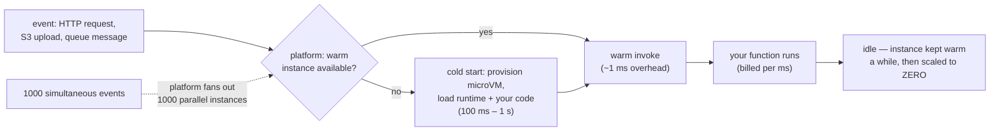

## In simple terms

**Serverless** is the deployment model where you don't manage any servers — you give the platform your code, and it spins up resources to run it on demand, scales to zero when idle, and only bills you for the work it actually did. The name is a slight misnomer (there are still servers, you just don't see them), but the experience is real: no capacity planning, no patching, no idle costs.

## The Visual Map



## More detail

Two flavours often conflated:

- **Functions-as-a-Service (FaaS)** — you upload a function; the platform invokes it per request / event. AWS Lambda, Cloudflare Workers, Vercel Functions, Google Cloud Functions, Azure Functions.
- **Serverless containers** — you upload a container; the platform runs and scales it. AWS Fargate, Google Cloud Run, Fly Machines, Cloud Run for Anthos. Closer to traditional deployment but with the same "scale to zero, pay per use" billing model.

What makes something "serverless":

- **No provisioning** — you don't pick instance counts or sizes.
- **Pay per use** — billed per request / per compute-second, not per running hour.
- **Scale to zero** — costs nothing when idle.
- **Automatic horizontal scaling** — platform spins up parallel instances as needed.
- **Managed runtime** — you don't patch the OS.

The 2026 spectrum:

| Model | When it shines |
|---|---|
| Edge functions (Cloudflare Workers, Vercel Edge) | Latency-critical, global, simple compute |
| FaaS (Lambda, Functions) | Event-driven, sporadic workloads |
| Serverless containers (Cloud Run, Fargate) | Existing container apps without server management |
| Managed PaaS (Fly, Render, Railway) | Always-on apps, simpler than k8s |
| Self-managed k8s | Full control, multi-service complex systems |
| Bare VMs / bare metal | Maximum control, predictable steady-state cost |

Serverless dramatically lowers the operational floor for new services: a few hundred lines of code, deployed in minutes, scaling automatically, costing pennies. The model is especially compelling for bursty workloads, side projects, internal tools, and event-driven processing.

## Under the Hood

A complete serverless deployment is a handler plus a declaration — there is genuinely nothing else to operate:

```python
# handler.py — the entire "server"
import json

def handler(event, context):
    # state must live OUTSIDE the function: the instance may vanish after this call
    name = json.loads(event.get("body") or "{}").get("name", "world")
    return {
        "statusCode": 200,
        "headers": {"Content-Type": "application/json"},
        "body": json.dumps({"message": f"hello, {name}"}),
    }
```

```text
# serverless.yml / SAM-style declaration — the rest of the architecture
functions:
  hello:
    handler: handler.handler
    memorySize: 256        # the ONLY capacity knob (CPU scales with it)
    timeout: 10            # hard cap — long work goes to queues/steps
    events:
      - httpApi: POST /hello
      - sqs: arn:...:order-events     # same function, event-driven too
```

The signature `handler(event, context)` encodes the whole contract: the platform owns the process lifecycle, hands you one event at a time, and may run a thousand copies concurrently or none at all. Everything stateful — sessions, files, counters — must live in external services, which is what makes the instant fan-out safe.

## Engineering Trade-offs

- **Zero ops vs cold starts.** Scale-to-zero is why idle costs nothing — and why the first request after idle pays 100 ms–1 s of provisioning (V8-isolate platforms like Workers cut this to sub-millisecond by sacrificing the full-OS runtime). Latency-critical paths use provisioned concurrency, paying idle costs back.
- **Per-request billing flips at steady load.** Bursty traffic is dramatically cheaper per-request; a continuously busy service costs more than the reserved containers it would otherwise run on. The crossover is a calculation every growing serverless app eventually does.
- **Statelessness is forced, not optional.** No in-process caches, no sticky sessions, no local files between invocations — architectural discipline that scales beautifully and makes some workloads (WebSockets, long jobs, big in-memory models) awkward fits for hard duration caps.
- **Deepest lock-in in the cloud.** The function model is portable in theory; the event sources, IAM glue, and step orchestration around it are profoundly provider-specific. Moving a serverless app is a rewrite of everything except the handlers.

## Real-world examples

- **AWS Lambda** invoked trillions of times across customers in the 2020s; deployed for everything from S3 event triggers to entire APIs.
- **Cloudflare Workers** serves a meaningful fraction of internet requests with sub-millisecond cold starts via V8 isolates.
- **Vercel** popularised front-end deployment with serverless functions for the API layer; the model now drives most React/Next.js production deployments.
- The **Serverless Framework** and **SST** are open-source tools for managing serverless deployments across providers.

## Common misconceptions

- **"Serverless means no servers."** It means *you* don't run them. There are servers; you don't think about them.
- **"Serverless is always cheaper."** True for low / spiky traffic. A continuously-busy service is often cheaper on reserved capacity.
- **"Serverless is slow because of cold starts."** Modern edge platforms have sub-millisecond cold starts. Even AWS Lambda's cold starts are usually a non-issue for human-facing APIs.

## Try it yourself

Measure the cold-vs-warm gap on your own machine — a fresh interpreter per request vs a resident one:

```bash
python3 -c "
import subprocess, time

# 'cold start': spawn a new Python process per invocation (runtime init each time)
t = time.perf_counter()
for _ in range(5):
    subprocess.run(['python3', '-c', 'pass'])
cold = (time.perf_counter() - t) / 5

# 'warm': the runtime already loaded, just call the function
def handler(event): return {'ok': True}
t = time.perf_counter()
for _ in range(100_000):
    handler({})
warm = (time.perf_counter() - t) / 100_000

print(f'cold (new process) : {cold*1000:8.2f} ms per invoke')
print(f'warm (resident)    : {warm*1000:8.5f} ms per invoke  ({cold/warm:,.0f}x faster)')
"
```

Real platforms add VM provisioning and code download on top of that interpreter cost — which is why they work so hard to keep instances warm and why edge platforms switched to isolates.

## Learn next

- [Container](/t/container) — the packaging serverless containers use underneath.
- [Cloud provider](/t/cloud-provider) — the IaaS-to-FaaS spectrum this model sits at the end of.
- [Microservices](/t/microservices) — the architecture style serverless functions often implement.
