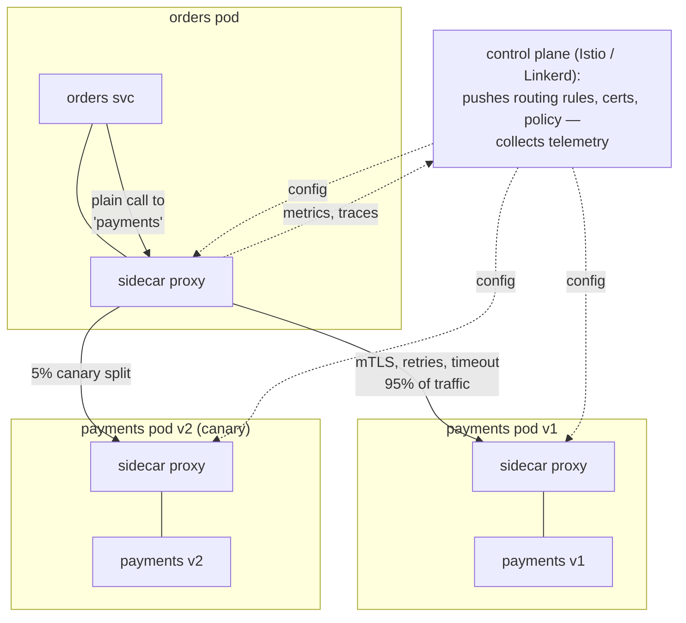

## In simple terms

A **service mesh** takes all the tricky parts of services talking to each other over a network — retrying failed calls, balancing load, encrypting traffic, measuring latency — and moves them *out* of your application code into a dedicated infrastructure layer. Each service gets a little helper proxy alongside it that intercepts all its network traffic. Your code just calls "the orders service"; the mesh handles everything about *how* that call actually travels.

## The Visual Map



## More detail

In a [microservices](/t/microservices) system with dozens or hundreds of services, every service needs the same networking concerns solved: timeouts, retries, circuit breaking, mutual TLS, load balancing, traffic splitting, and per-call metrics. Without a mesh, each team reimplements these in every language they use. A service mesh solves them once, in the platform.

The common design is the **sidecar proxy**: next to each service instance runs a small proxy (often Envoy) that intercepts all inbound and outbound traffic. The proxies form the **data plane** — they do the actual work. A central **control plane** (Istio, Linkerd) configures all the proxies: it pushes routing rules, certificates, and policy, and collects telemetry.

What that buys you:

- **mTLS everywhere** — encrypted, authenticated service-to-service traffic with automatic certificate rotation (a building block of [zero trust](/t/zero-trust)).
- **Traffic control** — canary releases, blue-green, retries, timeouts, circuit breaking — configured declaratively, not coded.
- **Observability** — uniform metrics, traces, and logs for every call, for free.

The cost is real: more moving parts, extra latency per hop, and significant operational complexity — which is why meshes pay off mainly at larger scale.

As microservice counts grow, the *network between services* becomes the hardest part of the system. A service mesh standardizes that layer so reliability, security, and observability are consistent across every service regardless of language — and so platform teams can change networking behavior without redeploying application code.

## Under the Hood

"Configured declaratively, not coded" looks like this — an Istio canary release plus resilience policy, no application change involved:

```yaml
apiVersion: networking.istio.io/v1
kind: VirtualService
metadata: { name: payments }
spec:
  hosts: ["payments"]
  http:
    - route:
        - destination: { host: payments, subset: v1 }
          weight: 95
        - destination: { host: payments, subset: v2 }   # the canary
          weight: 5
      retries:
        attempts: 3
        perTryTimeout: 2s
        retryOn: 5xx,reset                # retry only safe failure classes
      timeout: 6s                         # caller never waits longer
---
apiVersion: networking.istio.io/v1
kind: DestinationRule
metadata: { name: payments }
spec:
  host: payments
  trafficPolicy:
    outlierDetection:                     # circuit breaking, mesh-style:
      consecutive5xxErrors: 5             # 5 errors in a row...
      baseEjectionTime: 30s               # ...ejects the bad pod for 30s
  subsets:
    - { name: v1, labels: { version: v1 } }
    - { name: v2, labels: { version: v2 } }
```

Edit `weight: 5` to `50`, apply, and the control plane reconfigures every sidecar in seconds — rollout, rollback, retries, and ejection all live in config the platform team owns.

## Engineering Trade-offs

- **Solve once in the platform vs N times in libraries.** A mesh gives every service — any language — identical retries, mTLS, and metrics without code changes. The library alternative (resilience4j, gRPC interceptors) is simpler to operate but must be re-implemented and kept consistent per language and team.
- **Sidecar cost multiplies by pod count.** Every instance carries a proxy: extra memory, extra CPU, and one or two added hops (~1ms each) per call. Newer designs (Istio ambient mode, eBPF-based meshes like Cilium) exist precisely to shrink this tax.
- **Declarative power, debugging depth.** Traffic now flows through rules spread across VirtualServices, DestinationRules, and proxy config — "why did this request fail?" can involve the app, two sidecars, and the control plane. The observability the mesh provides is partly spent debugging the mesh.
- **Retries amplify load if configured carelessly.** Three retry attempts across three call hops can turn one user request into 27 backend calls during an incident — retry budgets and `retryOn` discipline are what separate resilience from a self-inflicted DDoS.

## Real-world examples

- **Istio** (control plane) with **Envoy** sidecars is the canonical Kubernetes service mesh.
- **Linkerd** is a lighter-weight alternative focused on simplicity and low overhead.
- A team rolls out a risky change to 1% of traffic by editing a mesh traffic-split rule — no application redeploy, instant rollback.

## Common misconceptions

- **"Every microservices app needs a mesh."** Below a certain scale the operational overhead outweighs the benefit; a library or API gateway is often enough.
- **"A service mesh replaces Kubernetes."** No — it runs *on top of* an orchestrator like [Kubernetes](/t/kubernetes), handling the network layer that orchestration leaves to you.

## Try it yourself

The math the mesh's retry policy exploits — and the load amplification it risks:

```bash
python3 -c "
p_fail = 0.10                      # 10% of calls fail transiently
for attempts in (1, 2, 3):
    success = 1 - p_fail ** attempts
    print(f'{attempts} attempt(s): {success:.1%} success rate')

print()
print('the dark side — call chain 3 services deep, 3 attempts each:')
for hops in (1, 2, 3):
    worst = 3 ** hops
    print(f'  {hops} hop(s): up to {worst} backend calls for ONE user request during an outage')
"
```

Two attempts turn 90% into 99%; three turn it into 99.9% — and the same exponent, applied down a call chain, is how naive retries melt a struggling system. Mesh retry budgets exist to cap that second exponential.

## Learn next

- [Microservices](/t/microservices) — the scale problem meshes exist to tame.
- [Kubernetes](/t/kubernetes) — the orchestrator meshes run on.
- [Circuit breaker](/t/circuit-breaker) — the resilience pattern meshes implement as outlier detection.
