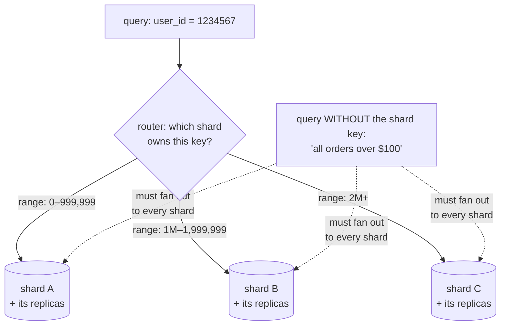

## In simple terms

When one machine can't hold all your data — or can't handle the request load — you **shard**: split the data into pieces by some key, and put each piece on a different machine. User IDs 1–999,999 on shard A; 1,000,000–1,999,999 on shard B; and so on.

## The Visual Map



## More detail

Common sharding strategies:

- **Range** — contiguous ranges of the key per shard. Good for range queries; risk of hot spots if the key is sequential.
- **Hash** — `hash(key) mod N` chooses the shard. Distributes evenly; no range queries.
- **Consistent hashing** — placeholder ring of slots so adding/removing nodes moves only a fraction of the keys. Used by DynamoDB, Cassandra, memcached clients.
- **Lookup directory** — explicit map from key range to shard; flexible but adds a hop.

Choosing the **shard key** is the single most important decision:

- It should be a value present on (almost) every query, so requests route to one shard.
- It should distribute load evenly — avoid keys with hot accounts (`user_id` where one user makes 90% of the traffic).
- Changing it later is painful — a resharding migration is a big project.

Sharding interacts uncomfortably with:

- **Joins / transactions** that cross shards (slow, often forbidden).
- **Unique constraints** other than the shard key (need a coordinator).
- **Rebalancing** as the cluster grows.

Modern systems hide some of this: Vitess, Citus, YugabyteDB, Spanner, CockroachDB all do automatic sharding with various trade-offs.

Sharding is how databases scale beyond what one machine can hold or serve. The cost is complexity: distributed transactions, cross-shard queries, and the operational pain of moving data when traffic patterns shift.

## Under the Hood

Why everyone uses consistent hashing: compare how many keys move when you grow the cluster:

```python
import hashlib

def h(s):
    return int(hashlib.md5(s.encode()).hexdigest(), 16)

keys = [f"user{i}" for i in range(10_000)]

# naive: hash(key) mod N — grow 4 -> 5 nodes
before = {k: h(k) % 4 for k in keys}
after  = {k: h(k) % 5 for k in keys}
moved = sum(before[k] != after[k] for k in keys)
print(f"mod-N    : {moved/len(keys):.0%} of keys move")        # ~80%

# consistent hashing: nodes own points on a ring; a key goes to
# the next node clockwise. adding a node only claims its arc.
def ring(nodes, vnodes=100):
    return sorted((h(f"{n}#{v}"), n) for n in nodes for v in range(vnodes))

def owner(r, key):
    kh = h(key)
    return next((n for p, n in r if p >= kh), r[0][1])

r4, r5 = ring(["n1","n2","n3","n4"]), ring(["n1","n2","n3","n4","n5"])
moved = sum(owner(r4, k) != owner(r5, k) for k in keys)
print(f"consistent: {moved/len(keys):.0%} of keys move")       # ~20% = 1/5
```

`mod N` reshuffles almost everything when N changes; consistent hashing moves only the fraction the new node takes over. That difference is what makes elastic clusters operationally feasible.

## Engineering Trade-offs

- **Scale-out vs query power.** Each shard answers key-addressed queries fast forever — but joins, multi-row transactions, and global uniqueness now span machines. The schema bends around the shard key, not the other way.
- **Range vs hash sharding.** Range keeps related keys adjacent (great for scans, time-series), but sequential keys hammer the newest shard. Hash spreads load evenly and destroys locality. Systems like Spanner/CockroachDB pick range + automatic splitting; Cassandra picks hash.
- **The shard key is nearly irreversible.** It must appear on every hot query and spread load evenly — and a wrong choice means a live-traffic resharding migration, among the riskiest operations in production databases.
- **Hot shards defeat the point.** One celebrity account, one viral post, one whale tenant can saturate its shard while others idle. Mitigations (key salting, splitting hot ranges, per-tenant isolation) all add routing complexity.
- **Don't shard early.** Indexes, caching, vertical scaling, and read [replicas](/t/replication) are each an order of magnitude cheaper to operate. Shard when the write volume or data size genuinely exceeds one primary.

## Real-world examples

- A messaging app shards messages by `chat_id` so all a chat's messages live together.
- An e-commerce site shards orders by `customer_id` so a single customer's history is one query.
- Reddit's comment storage is sharded by `link_id` (the post the comment is on).
- Instagram famously shards photos by user ID, which means every photo a single user posts is on the same shard — fast for profile views, fast for personal feeds, slow for global trending lists.

## Common misconceptions

- **"Sharding is the first thing to try when slow."** Almost never. Add indexes, cache, scale vertically, add read replicas, *then* shard.
- **"Sharding replaces replication."** They're orthogonal: each shard is usually replicated for availability.

## Try it yourself

Shard a workload two ways and watch a hot key break the even distribution:

```bash
python3 -c "
import hashlib, collections
def shard(key, n=4):
    return int(hashlib.md5(key.encode()).hexdigest(), 16) % n

# uniform traffic: hash sharding looks perfect
load = collections.Counter(shard(f'user{i}') for i in range(100_000))
print('uniform traffic :', dict(sorted(load.items())))

# real traffic: one viral account gets 50% of requests
reqs = [f'user{i}' for i in range(50_000)] + ['celebrity'] * 50_000
load = collections.Counter(shard(u) for u in reqs)
print('with a hot key  :', dict(sorted(load.items())), '<- one shard melts')
"
```

The hash is doing its job perfectly — the *workload* is skewed. Shard keys must be chosen for the traffic you'll actually get, not the data you store.

## Learn next

- [Replication](/t/replication) — the other axis: each shard is itself replicated.
- [Consensus](/t/consensus) — what keeps a shard's replicas agreeing.
- [Database](/t/database) — the single-machine baseline sharding extends.
