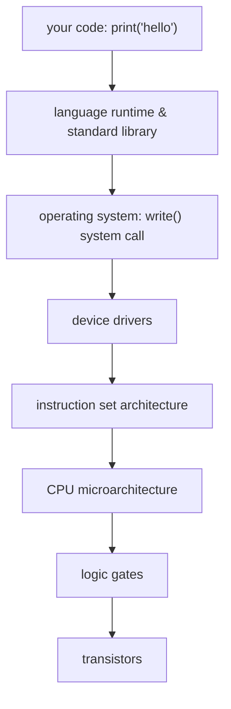

## In simple terms

**Abstraction** is the art of hiding detail. A steering wheel is an abstraction: you turn it to steer, without knowing anything about the steering rack, hydraulics, or wheel geometry underneath. Software is built the same way — each layer offers a simple interface and hides the messy machinery behind it. You call `print("hello")` without thinking about character encodings, system calls, or pixels. Abstraction is arguably *the* central technique of computer science: it's how we build things too complicated for any one person to hold in their head all at once.

## The Visual Map

The tower of abstractions a single `print("hello")` rests on:



Each layer only needs to understand the interface of the one below it.

## More detail

Abstraction works by separating **what** something does from **how** it does it — the *interface* from the *implementation*. As long as the interface stays stable, the implementation can change underneath without breaking anything that uses it.

It shows up at every level of computing, stacked on top of one another:

- **Hardware**: transistors → [logic gates](/t/logic-gates) → CPU → instruction set.
- **Software**: machine code → assembly → high-level languages → libraries → frameworks.
- **Data**: bits → numbers → [data structures](/t/data-structure) → objects → APIs.

This is what makes division of labor, reuse, and large-scale software possible at all: without abstraction, every programmer would have to understand the entire stack from electrons to application. It's also where much of the *cost* and *risk* in systems lives — a good abstraction multiplies productivity for everyone who builds on it, while a bad or leaky one spreads confusion and bugs across everything above it.

Related ideas: **encapsulation** (bundling data with the operations on it and hiding the internals), **information hiding** (exposing only what callers need), and the **leaky abstraction** (Joel Spolsky's observation that abstractions sometimes fail to fully hide what's beneath — a network file system that's mostly transparent until the network goes slow).

The skill of engineering is largely choosing the *right* abstractions: ones that are simple to use, hard to misuse, and don't leak their underlying complexity at the wrong moment.

## Under the Hood

The same interface, two implementations — callers never know which one they got:

```python
class Storage:
    def get(self, key): ...
    def put(self, key, value): ...

class MemoryStorage(Storage):           # fast, gone on restart
    def __init__(self): self._d = {}
    def get(self, key): return self._d.get(key)
    def put(self, key, value): self._d[key] = value

class FileStorage(Storage):             # slow, survives restarts
    def get(self, key):
        try:
            with open(f"{key}.txt") as f: return f.read()
        except FileNotFoundError: return None
    def put(self, key, value):
        with open(f"{key}.txt", "w") as f: f.write(value)

def remember(store: Storage):           # written against the interface
    store.put("greeting", "hello")
    return store.get("greeting")
```

`remember()` works with either implementation — and with a Redis-backed one written years later. That substitutability is the entire payoff.

## Engineering Trade-offs

- **Indirection has a cost.** Every layer adds function calls, allocations, or copies. Usually negligible; in hot loops (or in the kernel/syscall boundary) it's measurable, which is why performance work often means *piercing* an abstraction deliberately.
- **Leaks are inevitable.** Performance, errors, and edge cases from lower layers eventually surface — an ORM behaves differently when the query misses an index; a "file" on network storage fails in ways a local file can't. Design for the leak: expose escape hatches.
- **Over-abstraction vs duplication.** Wrapping everything "for flexibility" creates indirection nobody needed; copy-pasting twice is often cheaper than the wrong shared abstraction. A useful rule: abstract after the *third* concrete use, when the real shape is visible.
- **Stability vs evolution.** A published interface is a promise — the more users, the harder it is to change. The art is keeping interfaces small so there is less to regret.

## Real-world examples

- A **function** hides its implementation behind a name and a signature — the most basic software abstraction.
- A **file** is an abstraction over scattered disk blocks; a **process** is an abstraction over shared hardware.
- **HTTP** lets a browser talk to any server without knowing the language, framework, or hardware behind it.
- **SQL** describes *what* data you want; the database invents *how* to fetch it.

## Common misconceptions

- **"More abstraction is always better."** Every layer adds indirection and can hide useful detail; over-abstraction makes code harder to follow, not easier. Good design uses the *fewest* abstractions that do the job.
- **"Abstractions hide complexity completely."** Many *leak* — performance, errors, and edge cases from lower layers eventually surface, which is why understanding what's underneath still matters.

## Try it yourself

Peel back one layer: see the bytecode your Python source becomes before the interpreter runs it.

```bash
python3 -c "
import dis
dis.dis(compile('print(\"hello\")', '<demo>', 'exec'))
"
```

One line of source expands into stack-machine instructions (`LOAD_NAME`, `CALL`, …) — an entire abstraction layer you normally never see, sitting between your code and the CPU.

## Learn next

- [Data structures](/t/data-structure) — clean interfaces over fiddly memory mechanics.
- [Operating system](/t/operating-system) — the deepest stack of abstractions you use every day: files, processes, virtual memory.
- [Algorithms](/t/algorithms) — abstractions over computation itself: "sort" hides a dozen possible strategies.
