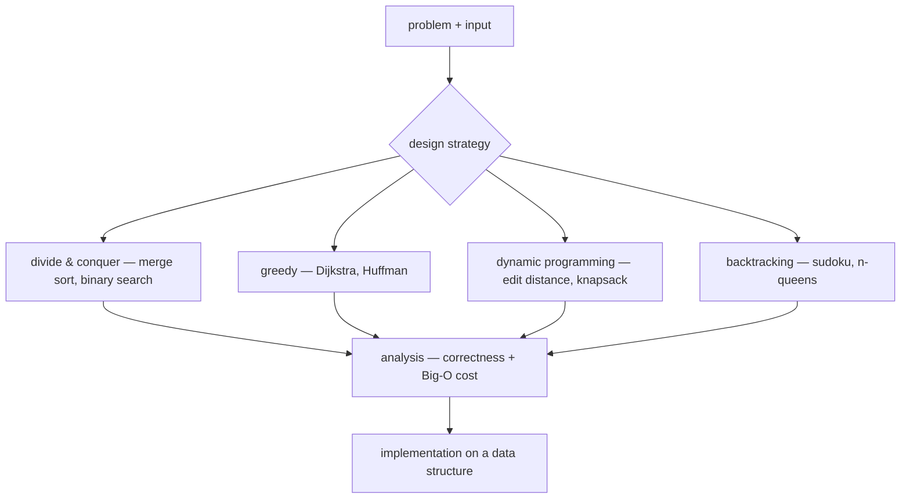

## In simple terms

An algorithm is a recipe. Given some input, it lists the exact steps a computer (or a person) should take to produce a correct output. "Sort this list", "find the shortest route", "search this text" — each is a problem with many possible algorithms.

## The Visual Map



## More detail

A good algorithm is:

- **Correct** — it always produces the right answer (or a clearly bounded approximation).
- **Finite** — it eventually stops.
- **Unambiguous** — every step is well-defined.
- **Efficient** — it uses reasonable time and memory, ideally analysed with **Big-O notation**.

Big-O tells you how the cost grows with the input size `n`:

| Notation | Meaning                  | Example                              |
|----------|--------------------------|--------------------------------------|
| O(1)     | constant                 | reading the first element of a list  |
| O(log n) | logarithmic              | binary search                        |
| O(n)     | linear                   | scanning a list                      |
| O(n log n) | linearithmic           | merge sort, quicksort (average)      |
| O(n²)    | quadratic                | bubble sort                          |
| O(2ⁿ)    | exponential              | naive subset-sum                     |

Classical algorithm families include sorting, searching, graph algorithms (shortest path, spanning tree), dynamic programming, and divide-and-conquer.

The stakes are real: the right algorithm can turn a problem that would take a year into one that finishes in a second. Choosing or designing one is the central engineering skill in computer science — far more leverage than any amount of low-level tuning applied to the wrong approach.

## Under the Hood

Binary search — the canonical divide-and-conquer algorithm. Each comparison halves the remaining range, so a million sorted items need at most 20 steps:

```python
def binary_search(items, target):
    lo, hi = 0, len(items) - 1
    while lo <= hi:
        mid = (lo + hi) // 2
        if items[mid] == target:
            return mid
        if items[mid] < target:
            lo = mid + 1          # discard the lower half
        else:
            hi = mid - 1          # discard the upper half
    return -1                     # not present

print(binary_search([2, 5, 8, 12, 16, 23, 38, 56, 72, 91], 23))  # 5
```

The precondition — the input must already be sorted — is typical: algorithms buy speed by exploiting structure in the data.

## Engineering Trade-offs

- **Time vs memory.** Many speedups spend memory to save time: memoization caches results, hash indexes duplicate keys, precomputed tables trade RAM for CPU. The reverse trade exists too (streaming algorithms use tiny memory but only see data once).
- **Worst case vs typical case.** Quicksort is O(n²) in the worst case but beats merge sort in practice thanks to cache-friendly behaviour; production sorts (Timsort, introsort) are hybrids engineered to get both.
- **Simplicity vs optimality.** The asymptotically best known algorithm is often complex, constant-heavy, and bug-prone. A simple O(n log n) solution usually beats a clever O(n) one that nobody on the team can maintain — pick the clever one only when profiling proves you need it.
- **Exact vs approximate.** For NP-hard problems (routing, scheduling, packing), exact answers are exponential; heuristics and approximation algorithms give good-enough answers in polynomial time.

## Real-world examples

- Google's PageRank ranks web pages using a graph algorithm.
- GPS navigation finds the fastest route with variants of Dijkstra's algorithm.
- `git` finds the common ancestor of two branches using a graph traversal.

## Common misconceptions

- **"There is only one algorithm for each problem."** Most useful problems have many; the trade-offs are time, memory, and simplicity.
- **"Faster always means better."** Sometimes a slightly slower algorithm is easier to maintain, easier to parallelise, or uses less memory.

## Try it yourself

Race linear search against binary search on a million sorted numbers:

```bash
python3 -c "
import timeit
setup = 'import bisect; data = list(range(1_000_000)); target = 999_999'
linear = timeit.timeit('target in data', setup=setup, number=100)
binary = timeit.timeit('bisect.bisect_left(data, target)', setup=setup, number=100)
print(f'linear search: {linear:.3f}s   binary search: {binary:.6f}s')
print(f'speedup: {linear / binary:,.0f}x')
"
```

Same machine, same data, same answer — four to five orders of magnitude apart. That gap is the algorithm.

## Learn next

- [Data structures](/t/data-structure) — the shapes algorithms operate on; the two are designed together.
- [Big O](/t/big-o) — the language for comparing algorithmic cost.
- [Recursion](/t/recursion) — the technique behind divide-and-conquer designs.
