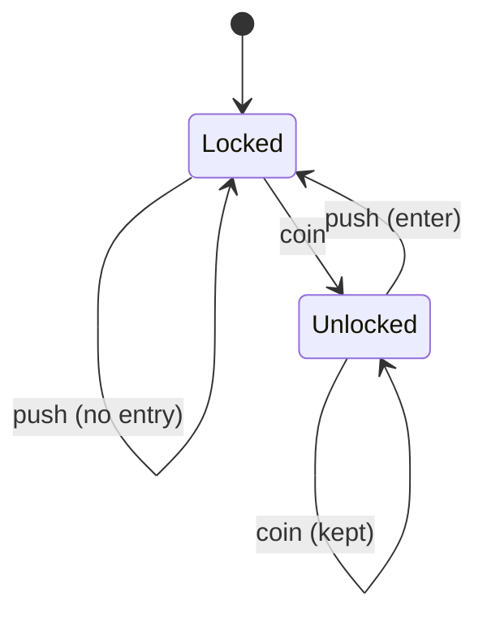

## In simple terms

An **automaton** is an idealized machine that reads input one symbol at a time and reacts by changing its internal **state**. Picture a turnstile: it has two states (locked, unlocked), and inputs (insert coin, push) move it between them. That's a tiny automaton. Automata theory studies these abstract machines in increasing power — from ones with just a handful of states up to the all-powerful Turing machine — to understand precisely what each kind of machine can and cannot compute.

## The Visual Map

The turnstile, drawn as the state machine it is:



## More detail

Automata form a ladder of capability, each rung able to recognize a richer class of [formal languages](/t/formal-language):

- **Finite automata (FSM)** — a fixed set of states and transitions, with *no memory* beyond the current state. They recognize **regular languages** (exactly what regular expressions match). Simple, fast, and everywhere — but they can't count without bound.
- **Pushdown automata** — a finite automaton plus a **stack**. The stack lets them handle nesting, so they recognize **context-free languages** — the basis of parsing programming languages.
- **Turing machines** — a finite controller plus an unbounded **tape** it can read and write freely. This is the most powerful model; anything computable at all can be computed by one. (See [Turing machine](/t/turing-machine).)

Two flavors of finite automata are worth knowing: **deterministic (DFA)**, where each input leads to exactly one next state, and **nondeterministic (NFA)**, which may have several — a famous theorem proves they recognize the *same* languages, and any NFA can be converted to a DFA.

The pattern across the ladder is that **more memory means more power**: no memory (FSM), a stack (pushdown), or an unlimited tape (Turing). This directly connects to [computability](/t/computability) — the Turing machine sits at the top precisely because it captures everything that can be computed.

Beyond grounding the theory, automata are intensely practical: finite-state machines are everywhere in real software — regular-expression engines, lexical analyzers in compilers, network protocol handlers, vending machines, game AI, and UI workflows are all naturally expressed as state machines. A state machine gives engineers a clean, bug-resistant way to model any system that moves through a fixed set of states, because illegal transitions simply don't exist in the table.

## Under the Hood

A finite-state machine is just a transition table — the turnstile in six lines:

```python
TRANSITIONS = {
    ("locked",   "coin"): "unlocked",
    ("locked",   "push"): "locked",     # push while locked: nothing
    ("unlocked", "push"): "locked",     # person passes through
    ("unlocked", "coin"): "unlocked",   # extra coin: kept, no change
}

def run(events, state="locked"):
    for event in events:
        state = TRANSITIONS[(state, event)]
        print(f"{event:5} -> {state}")
    return state

run(["push", "coin", "coin", "push", "push"])
```

No flags, no nested ifs — every legal behaviour is one row, and anything not in the table is impossible by construction. Lexers and protocol handlers are this exact pattern with more rows.

## Engineering Trade-offs

- **Explicit FSM vs ad-hoc flags.** Modeling states explicitly prevents impossible combinations (`is_open && is_closed`) and makes every transition reviewable — at the cost of upfront ceremony. Past roughly three booleans interacting, the table is almost always the better deal.
- **DFA vs NFA in regex engines.** Compiling an NFA to a DFA gives guaranteed linear-time matching but can explode the state count exponentially; backtracking engines (PCRE, Python `re`) stay small but risk exponential *time* on hostile input (ReDoS). RE2 chooses the DFA/simulation side; most language runtimes chose backtracking — a real security-relevant trade.
- **State explosion.** A machine per feature is clean; the *product* of several machines multiplies states. Hierarchical/statechart notations (Harel statecharts, XState) trade notation complexity for keeping the combinatorics manageable.

## Real-world examples

- A **regular-expression engine** compiles your pattern into a finite automaton and runs the input through it.
- A **compiler's lexer** is a finite-state machine that turns characters into tokens.
- **Protocol and UI state machines** (a TCP connection's states, a checkout flow) model exactly which transitions are legal from each state.

## Common misconceptions

- **"Automata are purely theoretical."** The Turing machine is a thought tool, but finite-state machines are deployed constantly in real code — regex, parsers, protocols, and embedded controllers.
- **"A finite-state machine can compute anything with enough states."** No — without unbounded memory it provably can't recognize, for instance, arbitrarily nested parentheses; that needs at least a stack.

## Try it yourself

Run the turnstile and try to break it:

```bash
python3 -c "
T = {('locked','coin'): 'unlocked', ('locked','push'): 'locked',
     ('unlocked','push'): 'locked', ('unlocked','coin'): 'unlocked'}
state = 'locked'
for event in ['push', 'push', 'coin', 'push', 'coin', 'coin', 'push']:
    state = T[(state, event)]
    print(f'{event:5} -> {state}')
"
```

However you reorder the events, the machine never reaches an undefined situation — the table *is* the specification. Add a third state (say, `alarm` after three pushes while locked) and watch how cheap the change is.

## Learn next

- [Formal language](/t/formal-language) — each automaton class recognizes a matching language class.
- [Turing machine](/t/turing-machine) — the top of the ladder, where computability begins.
- [Regular expression](/t/regular-expression) — finite automata in their most-used disguise.
