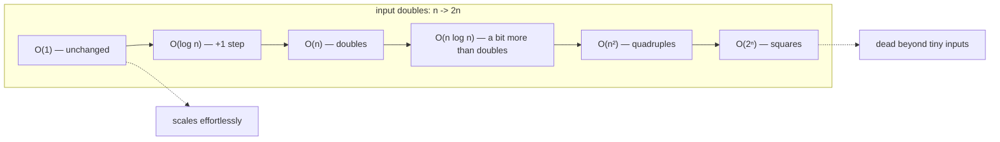

## In simple terms

**Big O** is a short way of saying "how slow does this get as the input gets bigger?" Instead of giving you a concrete time in seconds (which depends on the machine), it gives you the *shape* of the growth. O(n) means "double the input, roughly double the time." O(n²) means "double the input, roughly quadruple the time."

## The Visual Map

What happens to each class when the input doubles:



## More detail

Big O ignores constant factors and lower-order terms, so we can compare algorithms across machines and inputs. The common growth rates, fastest to slowest:

| Notation  | Name           | Example                                       |
|-----------|----------------|-----------------------------------------------|
| O(1)      | constant       | Look up an array element by index             |
| O(log n)  | logarithmic    | Binary search a sorted array                  |
| O(n)      | linear         | Find the max of an array                      |
| O(n log n)| linearithmic   | Merge sort, quicksort (average)               |
| O(n²)     | quadratic      | Naive sort (bubble, insertion); pair-wise comparisons |
| O(n³)     | cubic          | Naive matrix multiply                         |
| O(2ⁿ)     | exponential    | Brute-force subset enumeration                |
| O(n!)     | factorial      | Brute-force traveling salesman                |

A few rules of thumb:

- For n = 1000, O(n²) is a million ops — usually fine. O(n³) is a billion — usually not.
- For n = 1,000,000, you almost always need O(n) or O(n log n).
- Constants matter in practice: a "slow" O(n log n) algorithm with a huge constant can lose to a "fast" O(n²) one for small n.

Related notations:

- **Big Ω** — lower bound. "It takes *at least* this much."
- **Big Θ** — tight bound. Both upper and lower.
- **Amortised O(x)** — average over a sequence of operations. Dynamic-array append is amortised O(1).

Big O is how engineers reason about scale. Choosing an O(n) over an O(n²) algorithm is often the single biggest performance decision you'll make. Interviews lean heavily on it for the same reason: it separates "works on a demo" from "works in production".

## Under the Hood

Growth rates made concrete — count the actual operations:

```python
def linear(items):                 # O(n): one pass
    ops = 0
    for _ in items:
        ops += 1
    return ops

def quadratic(items):              # O(n²): every pair
    ops = 0
    for a in items:
        for b in items:
            ops += 1
    return ops

for n in (10, 100, 1000):
    data = range(n)
    print(f"n={n:5}  linear={linear(data):>9,}  quadratic={quadratic(data):>11,}")
# n=   10  linear=       10  quadratic=        100
# n=  100  linear=      100  quadratic=     10,000
# n= 1000  linear=    1,000  quadratic=  1,000,000
```

Each 10× increase in n costs the linear function 10× and the quadratic one 100× — exactly what the notation predicts, independent of any machine.

## Engineering Trade-offs

- **Asymptotics vs constants.** Big O hides the constant factor, but hardware doesn't: a cache-friendly O(n²) (sequential array scans) can beat a pointer-chasing O(n log n) until n gets large. Measure before optimising.
- **Worst case vs amortised.** Amortised O(1) means *occasionally* expensive — a dynamic array's resize, a hash table's rehash. Fine for throughput; dangerous for tail latency in real-time paths, where a predictable O(log n) may serve better.
- **Time vs space.** Most asymptotic speedups buy time with memory: an index, a memo table, a precomputed cache. When memory is the scarce resource, the trade runs the other way.

## Real-world examples

- The Git blame for a 100k-line file: O(n) → fast. O(n²) → painful.
- A database query that scans every row is O(n); the same query with the right index is O(log n) or O(1).
- A regex that backtracks exponentially can hang a server on a 50-character input ("ReDoS").
- Big O famously broke down during the AlphaGo project: the brute-force Go search tree is enormous, but Monte Carlo Tree Search plus a neural net evaluator turned out to win anyway.

## Common misconceptions

- **"Lower Big O is always faster."** Asymptotically, yes. For small inputs and reasonable hardware, constants and cache effects often dominate.
- **"Big O measures wall-clock time."** It measures growth rate of operations, not seconds. Two O(n) algorithms can differ by 1000× in real time.

## Try it yourself

Watch the doubling law happen in wall-clock time:

```bash
python3 -c "
import timeit
for n in (1000, 2000, 4000):
    t = timeit.timeit(f'sorted(range({n}, 0, -1))', number=200)
    q = timeit.timeit(
        f'[x for x in range({n}) for y in range({n}) if x == y]', number=1)
    print(f'n={n}:  n log n sort: {t:.4f}s   n^2 scan: {q:.4f}s')
"
```

Each doubling of n roughly doubles the sort time but quadruples the quadratic scan — the shapes from the table, measured on your own machine.

## Learn next

- [Data structures](/t/data-structure) — the structures Big O usually compares.
- [Recursion](/t/recursion) — one of the techniques that produces logarithmic algorithms.
- [Complexity theory](/t/complexity-theory) — what happens when *no* fast algorithm exists at all.
