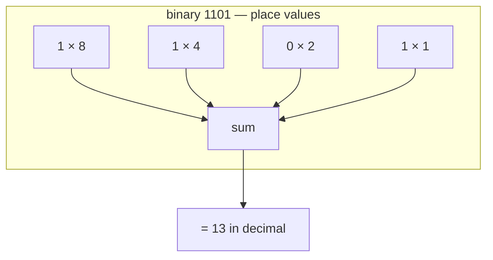

## In simple terms

Binary is a way of writing numbers using only **two** symbols, `0` and `1`, instead of the usual ten (`0`–`9`). Each position is worth twice the one to its right, the same way each position in normal numbers is worth ten times the one to its right.

## The Visual Map



## More detail

In **decimal** (base 10), the number `203` means:

```
2 * 100 + 0 * 10 + 3 * 1
```

In **binary** (base 2), the number `1101` means:

```
1 * 8 + 1 * 4 + 0 * 2 + 1 * 1  =  13
```

Place values double as you move left: `1, 2, 4, 8, 16, 32, 64, 128, …`. Every whole number has exactly one binary representation, and arithmetic (add, subtract, multiply) follows the same rules as decimal — there are just fewer digits to carry.

Computers are built from devices with two stable states, so binary is what they natively store and compute. Every integer in a program, every byte in a file, every pixel of every image is binary underneath.

To represent negative numbers, computers usually use **two's complement**: to negate a number, invert every bit and add one. The beauty of the scheme is that the hardware can then *add* signed numbers with the exact same circuit it uses for unsigned ones. To represent fractions, computers use a binary version of scientific notation called [floating point](/t/floating-point).

## Under the Hood

Conversion in both directions, plus two's complement, in a few lines of Python:

```python
n = 42
print(bin(n))            # '0b101010'  — decimal to binary
print(int("101010", 2))  # 42         — binary string to decimal

# two's complement of -42 in 8 bits: invert and add one
print(format(-42 & 0xFF, "08b"))   # '11010110'
print(0b11010110 - 256)            # -42 — same bits, signed reading
```

The same byte `11010110` means 214 read as unsigned and −42 read as two's complement — the bits don't change, only the interpretation does.

## Engineering Trade-offs

- **Width vs range.** Fixed-width integers (8/16/32/64 bits) are fast because they match the hardware, but they overflow: `255 + 1` wraps to `0` in an unsigned byte. Arbitrary-precision integers (Python's `int`, Java's `BigInteger`) never overflow but cost heap allocations and are many times slower.
- **Signed vs unsigned.** Unsigned doubles the positive range, but mixing the two is a classic source of bugs (`-1` silently becomes `4294967295`). Many style guides ban unsigned arithmetic outside of bit manipulation for exactly this reason.
- **Human readability.** Binary is verbose for people — eight characters per byte — which is why programmers write [hexadecimal](/t/hexadecimal) instead: one hex digit per nibble, `0xD6` instead of `11010110`. Same number, friendlier notation.

## Real-world examples

- The number `42` in an 8-bit byte is `00101010`.
- IPv4 addresses are 32 bits — four 8-bit chunks shown in decimal, like `192.168.1.1`.
- Colours on the web are written in hexadecimal (`#1f6feb`), which is just binary grouped four bits at a time.
- The 2038 problem: signed 32-bit Unix timestamps overflow on 19 January 2038 — a direct consequence of fixed-width two's complement.

## Common misconceptions

- **"Binary is hard for computers."** It is the opposite — binary is easy for computers and slightly awkward for humans. We use decimal for our convenience.
- **"Binary can only represent small numbers."** Binary can represent any whole number; you just need more bits for larger numbers.

## Try it yourself

Bash can do base-2 arithmetic natively — no tools needed:

```bash
echo $((2#101010))        # 42  — binary literal to decimal
printf '%x\n' 214         # d6  — decimal to hex (one hex digit per 4 bits)
python3 -c "print(bin(42), int('101010', 2))"   # both directions
```

Try `echo $((2#11111111))` and confirm a full byte is 255.

## Learn next

- [Hexadecimal](/t/hexadecimal) — the compact notation programmers use for binary.
- [Floating point](/t/floating-point) — how binary represents fractions and very large numbers.
- [Boolean logic](/t/boolean-logic) — making decisions with the same two values.
