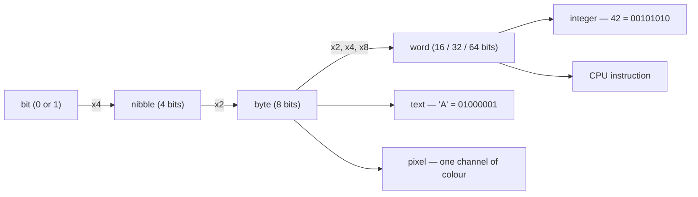

## In simple terms

A **bit** is a single answer to a yes/no question. It can be `0` or `1`, off or on, false or true. Every piece of data inside a computer — text, pictures, music, programs — is ultimately a long line of these tiny choices.

## The Visual Map



## More detail

The word "bit" is a contraction of **bi**nary digi**t**. In hardware it is usually a voltage that is either high or low. In math and logic it is just a value from the two-element set `{0, 1}`. In information theory, one bit is precisely the amount of information that halves your uncertainty — the answer to one perfectly balanced yes/no question.

Bits are grouped to represent richer things:

- 4 bits = a **nibble** (one hexadecimal digit)
- 8 bits = a **byte** (the smallest addressable unit in most machines)
- 16 / 32 / 64 bits = the **word** size of common CPUs

`n` bits can represent `2^n` distinct values, so a byte can hold one of 256 possible patterns.

This is the key idea that makes general-purpose computers possible: once you accept that every kind of information can be encoded as a sequence of bits, the same machine can play music, render a video game, and run a spreadsheet — the bits are the alphabet, and everything else is interpretation.

## Under the Hood

Programs read and write individual bits with masks and shifts. This C snippet packs three on/off settings into a single byte:

```c
#include <stdio.h>

#define DARK_MODE   (1u << 0)   /* 00000001 */
#define NOTIFY      (1u << 1)   /* 00000010 */
#define AUTOSAVE    (1u << 2)   /* 00000100 */

int main(void) {
    unsigned char flags = 0;
    flags |= DARK_MODE | AUTOSAVE;     /* set bits   -> 00000101 */
    flags &= ~DARK_MODE;               /* clear a bit -> 00000100 */

    printf("autosave is %s\n", (flags & AUTOSAVE) ? "on" : "off");
    return 0;
}
```

`|` sets bits, `& ~` clears them, `&` tests them. The kernel, network protocols, and file formats all use this trick to store many booleans in one machine word.

## Engineering Trade-offs

- **Packing vs addressability.** Storing 8 booleans in one byte uses 8× less memory than one-byte-per-flag, but every read/write now costs a mask-and-shift, and you can no longer point at an individual flag with a plain pointer. Most languages' `bool` spends a whole byte for speed and simplicity.
- **Fewer bits vs range.** A narrower integer saves memory and bus bandwidth but overflows sooner — 8 bits cap at 255, and the 32-bit Unix timestamp runs out in 2038. Choosing a width is choosing which failures you can live with.
- **Density vs reliability.** The more tightly bits are packed into physical media, the more vulnerable each one is to noise; that is why server RAM adds ECC bits and storage adds checksums — spending extra bits to protect the others.

## Real-world examples

- A light switch holds one bit of state.
- A pixel in a black-and-white image is one bit.
- An ASCII character is 7 bits (packed into 1 byte).
- A modern processor moves billions of bits per second across its buses.
- Unix file permissions (`chmod 755`) are nine bits — read/write/execute for owner, group, and world.

## Common misconceptions

- **"A bit is the same as a byte."** No — a byte is 8 bits. File sizes are usually in bytes (MB, GB); network speeds are usually in bits per second (Mbps, Gbps), which is why 100 Mbps is only about 12 MB/s.
- **"Bits are physical things."** Bits are an abstraction. The physical carrier can be voltage, light, magnetism, or anything with two distinguishable states.

## Try it yourself

See the actual bits behind a piece of text:

```bash
python3 -c "print(' '.join(f'{b:08b}' for b in 'Hi!'.encode()))"
# 01001000 01101001 00100001
```

Three characters, three bytes, twenty-four bits. Change the string and watch the pattern change — the capital `H` (01001000) and lowercase `h` (01101000) differ by exactly one bit.

## Learn next

- [Binary numbers](/t/binary-numbers) — how strings of bits represent any whole number.
- [Boolean logic](/t/boolean-logic) — how bits combine to make decisions.
- [Character encoding](/t/character-encoding) — how bits become text, from ASCII to UTF-8.
