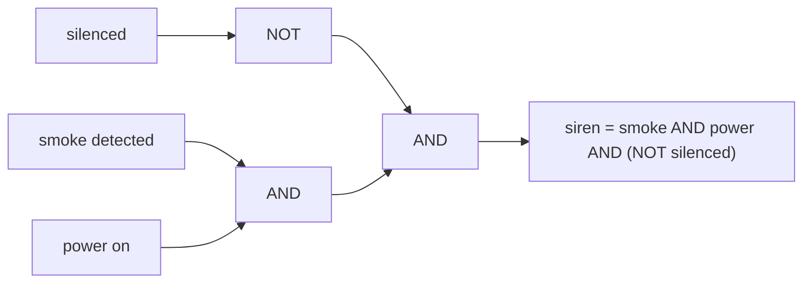

## In simple terms

Boolean logic is arithmetic for `true` and `false`. Three basic operations — **AND**, **OR**, and **NOT** — let you combine yes/no questions into more interesting yes/no answers.

## The Visual Map

A smoke alarm's decision, drawn as logic:



## More detail

Named after George Boole, boolean algebra works on two values (`true`/`false`, or `1`/`0`):

| A | B | A AND B | A OR B | NOT A |
|---|---|---------|--------|-------|
| 0 | 0 |    0    |   0    |   1   |
| 0 | 1 |    0    |   1    |   1   |
| 1 | 0 |    0    |   1    |   0   |
| 1 | 1 |    1    |   1    |   0   |

From these three operations you can derive every other one (`XOR`, `NAND`, `NOR`, ...). The remarkable fact, due to Claude Shannon, is that **electrical circuits** can implement the same algebra — which is the foundation of every digital computer.

That is why boolean logic is how programs decide. Every `if` statement, every loop condition, every database `WHERE` clause is boolean logic. Underneath, every CPU instruction that compares or branches is boolean logic implemented in hardware.

Two identities worth memorising are **De Morgan's laws**, which let you push a NOT through a condition:

```
NOT (A AND B)  =  (NOT A) OR  (NOT B)
NOT (A OR  B)  =  (NOT A) AND (NOT B)
```

They are the tool for untangling conditions like "not (logged in and verified)" into the often clearer "logged out or unverified".

## Under the Hood

C exposes boolean logic twice — as *logical* operators that short-circuit, and as *bitwise* operators that work on all bits of a word at once:

```c
#include <stdio.h>

int main(void) {
    int logged_in = 1, banned = 0;

    /* logical: && stops early ("short-circuits") if the left side decides */
    if (logged_in && !banned) puts("welcome");

    /* bitwise: operates on every bit in parallel */
    unsigned a = 0b1100, b = 0b1010;
    printf("%u %u %u\n", a & b, a | b, a ^ b);   /* 8 14 6 */
    return 0;
}
```

Short-circuiting is what makes the idiom `if (ptr != NULL && ptr->ready)` safe — the right side is never evaluated when the left side is false.

## Engineering Trade-offs

- **Short-circuit vs side effects.** `&&`/`||` skipping the right-hand side is both an optimisation and a guard idiom — but if the right side has side effects (a function call, a counter), skipping it silently changes behaviour. Keep condition expressions pure.
- **Bitwise parallelism vs readability.** A 64-bit word can AND 64 booleans in one instruction — bitsets and bloom filters exploit this for huge speedups — at the cost of code that needs comments to decode.
- **Simplification vs clarity.** Boolean algebra lets you minimise a condition to the fewest operations (hardware designers do this with Karnaugh maps), but the minimal form is often less readable than the one that mirrors the business rule. In software, optimise for the reader; the compiler minimises for you.

## Real-world examples

- `if (user.isLoggedIn && !user.isBanned) { ... }`
- A search query like `cats AND (kittens OR puppies)` is boolean logic.
- A smoke alarm: `siren = smoke_detected AND power_on AND NOT silenced`.
- SQL: `WHERE age >= 18 AND (country = 'NL' OR country = 'DE')`.

## Common misconceptions

- **"Boolean logic is the same as math."** It is a kind of math, but it operates on only two values, not numbers in general.
- **"Boolean logic only matters for programmers."** It is also how the hardware itself works — see [logic gates](/t/logic-gates).

## Try it yourself

Print the full truth table for AND, OR, and XOR:

```bash
python3 -c "
from itertools import product
print('A B  AND OR XOR')
for a, b in product((0, 1), repeat=2):
    print(a, b, ' ', a & b, ' ', a | b, ' ', a ^ b)
"
```

Then verify De Morgan's law holds for every input: `not (a and b) == (not a) or (not b)`.

## Learn next

- [Logic gates](/t/logic-gates) — boolean logic as physical circuitry.
- [Binary numbers](/t/binary-numbers) — the values these decisions operate on.
- [Discrete mathematics](/t/discrete-mathematics) — the broader math family boolean algebra belongs to.
