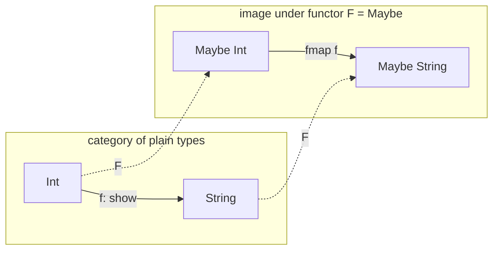

## In simple terms

Category theory asks: "what do all these different mathematical structures have in common?" Sets, groups, vector spaces, and types all have objects and maps between them. Category theory abstracts over all of these, studying only the composition laws — how maps chain together. The payoff for programmers: the concepts of functor, monad, and natural transformation — ubiquitous in functional programming — are directly category-theoretic concepts. Understanding the math explains *why* monads compose the way they do, not just the pattern.

## The Visual Map

A functor `F` (think `Maybe`) maps one category into another, preserving composition — the square commutes:



Map then lift, or lift then map — you land in the same place. That's the functor law, drawn.

## More detail

**A category** consists of:
- **Objects** (which can be types, sets, spaces — anything).
- **Morphisms** (arrows between objects, such as functions between types).
- **Composition:** for any morphisms `f: A→B` and `g: B→C`, there's a composite `g∘f: A→C`.
- **Identity:** every object has an identity morphism `id_A: A→A`.
- Laws: composition is associative; identity morphisms are the unit of composition.

The simplest category for programmers: **Hask** (or **Types**) — objects are types, morphisms are functions. Composition is function composition: `(g∘f)(x) = g(f(x))`.

**Functor:** a mapping between categories that preserves structure. A functor `F` maps objects to objects and morphisms to morphisms: if `f: A→B` then `F(f): F(A)→F(B)`. Laws: `F(id_A) = id_{F(A)}`, `F(g∘f) = F(g)∘F(f)`.

In Haskell: a `Functor` is a type constructor `F` with `fmap :: (a -> b) -> F a -> F b`. `Maybe`, `List`, `IO`, `Either e` are all functors. `fmap` applies a function "inside" the container without changing the structure.

**Natural transformation:** a mapping between functors. If `F` and `G` are functors, a natural transformation `η: F⇒G` associates to every object `A` a morphism `η_A: F(A)→G(A)`, consistently. In Haskell: polymorphic functions like `Maybe a -> [a]` (listify) or `[a] -> Maybe a` (safeHead) are natural transformations.

**Monad:** a functor `M` with two natural transformations:
- `return (η): A → M A` — lift a value into the monad.
- `join (μ): M(M A) → M A` — flatten nested monads.

Or equivalently, via the Kleisli triple: `return` and `bind (>>=) :: M a -> (a -> M b) -> M b`.

Monad laws (left/right identity, associativity) come from the category-theoretic definition. The laws aren't arbitrary rules — they express that the monad's composition is coherent.

**Adjunctions and free constructions:** many common structures (free monoids/monads, forgetful functors) are adjunctions — pairs of functors that are "mutually inverse" in a weak sense. Lists are the free monoid; the state monad is an adjunction. These connections explain *why* certain patterns arise naturally.

**Category theory in programming:**
- **Monads** (`IO`, `Maybe`, `State`, `Parser`) — all instances of the category-theoretic monad.
- **Functors** — `fmap`/`map` on collections, `Promise.then` (functorial over resolved values).
- **Applicatives** — between functors and monads; `Promise.all` is applicative.
- **Optics (lenses)** — represented as profunctor optics in a category of profunctors.
- **Free monads** — programs as data structures (used in Haskell, PureScript for effects).
- **Yoneda lemma** — explains why polymorphic functions are data; used in library design.

Category theory provides the unifying language behind Haskell's type class hierarchy (Functor → Applicative → Monad), Scala's Cats library, Arrow in Kotlin, and the design of compositional APIs. It demystifies why monads satisfy their laws, why certain abstractions compose cleanly and others don't, and how to design APIs that are provably correct by construction.

## Under the Hood

A `Maybe` monad in Python, with its laws checked by running them:

```python
# Maybe: either ("just", value) or NOTHING
NOTHING = ("nothing",)
just    = lambda v: ("just", v)

def bind(m, f):                       # >>= : sequence, short-circuit on NOTHING
    return f(m[1]) if m[0] == "just" else NOTHING

# two effectful functions to chain
half    = lambda x: just(x // 2) if x % 2 == 0 else NOTHING
dec     = lambda x: just(x - 1)  if x > 0      else NOTHING

print(bind(bind(just(8), half), dec))    # ('just', 3)
print(bind(bind(just(7), half), dec))    # ('nothing',) — failure propagates

# the monad laws, as executable assertions
m, f, g, a = just(10), half, dec, 6
assert bind(just(a), f) == f(a)                                   # left identity
assert bind(m, just) == m                                         # right identity
assert bind(bind(m, f), g) == bind(m, lambda x: bind(f(x), g))    # associativity
print("all three monad laws hold")
```

The laws are why you may freely refactor a chain of binds — flatten it, split it, inline it — without changing behaviour. Optimisers and library authors rely on exactly this.

## Engineering Trade-offs

- **Abstraction power vs learnability.** An API written against `Functor`/`Monad` works for dozens of types at once and inherits proven laws — but it reads as hieroglyphics to newcomers. Teams pay a real onboarding tax for categorical abstraction; Haskell embraces it, Go's designers explicitly refused it.
- **Laws vs convenience.** Law-abiding instances enable safe refactoring and optimisation (e.g. fusing two `map`s into one). "Almost-monads" that bend the laws — like JavaScript's `Promise`, whose `then` auto-flattens and so can't nest — work fine day-to-day but break the equational reasoning the abstraction promises.
- **Generality vs performance and errors.** Code polymorphic over any monad can't exploit the concrete type's fast paths, and type errors surface in the abstraction's vocabulary rather than the user's problem domain. Libraries often ship both: a lawful generic core plus specialised, friendlier wrappers.

## Real-world examples

- Haskell's `Functor`, `Applicative`, `Monad` hierarchy is directly a hierarchy of categories.
- Scala's Cats library implements category-theoretic type classes for production functional Scala.
- React's design principle of "UI as a function of state" echoes categorical composition.
- Elm's architecture (Model-Update-View) has a monadic structure.

## Common misconceptions

- **"Category theory is too abstract to be useful."** Functors, monads, and applicatives are used in everyday Haskell, Scala, and Rust code. The abstraction earns its cost: code written against these interfaces is automatically correct for all instances.
- **"You need category theory to use monads."** Monads in Haskell can be understood and used without category theory. But category theory explains *why* the laws must hold and why the abstraction is the right one.

## Try it yourself

Verify the functor composition law on a structure you use daily — Python lists:

```bash
python3 -c "
fmap = lambda f, xs: [f(x) for x in xs]
compose = lambda g, f: lambda x: g(f(x))

f = lambda x: x + 1
g = lambda x: x * 2
xs = [1, 2, 3]

mapped_twice   = fmap(g, fmap(f, xs))          # map f, then map g
mapped_once    = fmap(compose(g, f), xs)       # map the composition
print(mapped_twice, mapped_once, mapped_twice == mapped_once)
"
```

`fmap g . fmap f == fmap (g . f)` — two passes over the list equal one pass with the composed function. Optimising compilers (GHC's fusion rules) rewrite your code using exactly this law.

## Learn next

- [Type theory](/t/type-theory) — the type systems category theory gives semantics to.
- [Haskell](/t/haskell) — the language whose standard library is organised categorically.
- [Lambda calculus](/t/lambda-calculus) — the computational core all of this is modeling.
