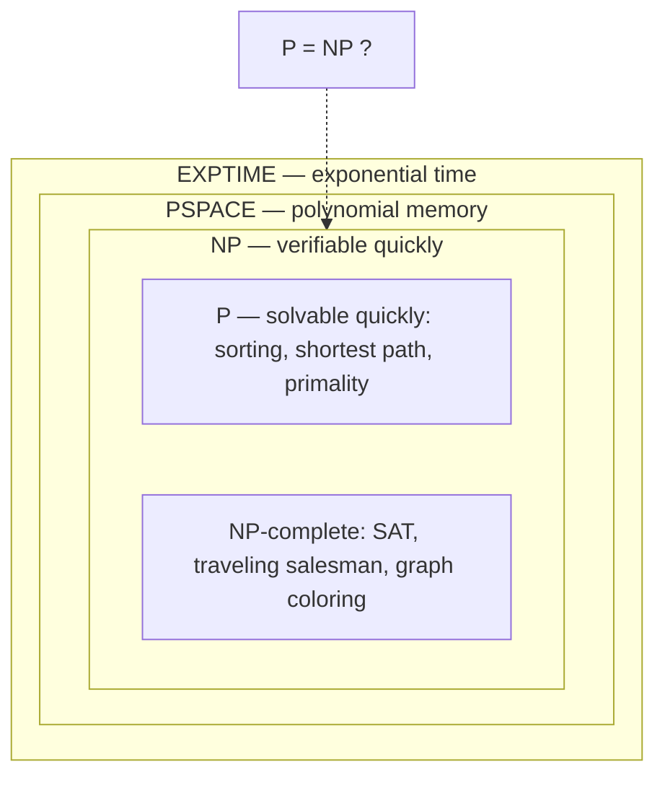

## In simple terms

**Computational complexity theory** asks: *how hard is a problem, fundamentally?* Not "how do we solve it," but "how much time and memory must *any* solution use, and does that grow manageably or explosively as the input gets bigger?" Some problems scale gently — sorting a list of a million items is routine. Others appear to blow up so fast that even the world's fastest computers can't handle moderately large inputs. Complexity theory is the science of telling these apart and proving which is which.

## The Visual Map

The major complexity classes nest inside one another (as far as anyone can prove):



If anyone finds a fast algorithm for a single NP-complete problem, the NP ring collapses into P.

## More detail

Where [Big O](/t/big-o) describes the cost of a *specific algorithm*, complexity theory classifies *problems themselves* by the best possible algorithm. It groups problems into **complexity classes**:

- **P** — problems solvable in **polynomial time** (e.g. n², n³). Considered "tractable."
- **NP** — problems whose *solutions can be verified* in polynomial time, even if finding them seems hard. (Sudoku: checking a filled grid is easy; solving a big one may not be.)
- **NP-complete** — the hardest problems in NP; if any one of them had a fast solution, *all* of NP would. Examples: the traveling salesman decision problem, boolean satisfiability (SAT), graph coloring.
- **PSPACE, EXPTIME**, and many more, layered by time and memory bounds.

The field's most famous open question is **P vs NP**: are the problems we can *verify* quickly also ones we can *solve* quickly? Almost everyone believes **P ≠ NP** (hard problems really are hard), but no one has proven it — it's one of the Millennium Prize problems, with a million-dollar bounty.

A key tool is **reduction**: showing problem A is "at least as hard as" B by transforming B into A. Reductions are how thousands of problems were all proven NP-complete — they're really the *same* difficulty in disguise.

The practical payoff: complexity theory tells you when to *stop looking* for a fast, exact algorithm and instead use approximations, heuristics, or accept limits. It's why we don't expect a perfect, efficient solver for every scheduling or routing problem — and, more surprisingly, it's what makes modern **cryptography** possible: encryption is secure precisely because breaking it is believed to be computationally intractable. The boundary between "easy" and "hard" shapes what software can and can't realistically do.

## Engineering Trade-offs

- **Exact vs approximate.** For NP-hard problems, exact optimality costs exponential time. Approximation algorithms and heuristics (simulated annealing, local search) give provably-decent or usually-good answers in polynomial time — almost always the right engineering trade.
- **Worst case vs real instances.** Complexity classes speak about the *worst* input. Modern SAT solvers routinely crush industrial instances with millions of variables despite SAT being NP-complete — theory bounds the cliff, practice often walks the safe paths. Don't refuse to try a "hard" problem; don't promise it will always work either.
- **Hardness as a feature.** Cryptography deliberately builds on problems believed intractable (factoring, discrete log). Here the trade-off inverts: a complexity-theoretic *breakthrough* would be a security *catastrophe* — which is why post-quantum cryptography hedges against one.

## Real-world examples

- **Cryptography** rests on the assumed hardness of problems like factoring large numbers — if P = NP, much of it would collapse.
- **Route planning, scheduling, and chip layout** are NP-hard, so real tools use heuristics and approximations rather than guaranteed-optimal answers.
- A developer recognizing a task is "basically traveling salesman" knows to reach for an approximation instead of chasing a perfect algorithm.

## Common misconceptions

- **"NP means 'non-polynomial' / 'impossible.'"** NP means *nondeterministic polynomial* — verifiable quickly. Many NP problems are solved routinely at practical sizes.
- **"NP-hard problems can't be solved at all."** They can — just not always quickly and exactly for large inputs. Approximation and heuristics handle them in practice every day.

## Try it yourself

Feel exponential growth directly — brute-force subset-sum doubles in cost with every element added:

```bash
python3 -c "
import time
from itertools import combinations

def subset_sum(nums, target):
    return any(sum(c) == target
               for r in range(len(nums) + 1)
               for c in combinations(nums, r))

for n in (16, 20, 24):
    nums = list(range(1, n + 1))
    t = time.perf_counter()
    subset_sum(nums, -1)          # no solution: forces a full search
    print(f'n={n}: {time.perf_counter() - t:.2f}s  ({2**n:,} subsets)')
"
```

Each +4 elements multiplies the work by 16. Extrapolate to n=60 and you're past the age of the universe — that wall is what "intractable" means.

## Learn next

- [Big O](/t/big-o) — the measuring stick complexity theory is built on.
- [Computability](/t/computability) — the sibling question: not how hard, but possible at all?
- [Cryptography](/t/cryptography) — the engineering discipline built on top of assumed hardness.
