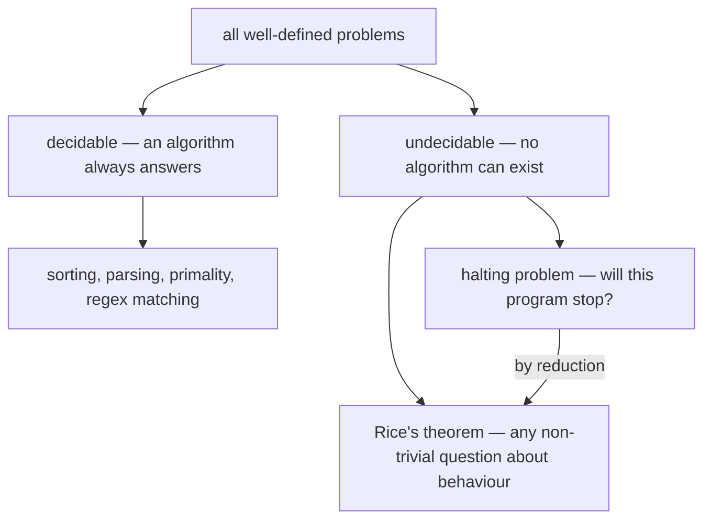

## In simple terms

**Computability theory** asks the most basic question in all of computer science: *what can be computed at all?* Not "how fast" — that's [complexity theory](/t/complexity-theory) — but whether a problem can be solved by *any* algorithm, given unlimited time and memory. The startling answer, proven in the 1930s before computers even existed, is that some perfectly well-defined problems are **undecidable**: no program can ever solve them. There are hard limits on what computation can do, and we know exactly where some of them are.

## The Visual Map



## More detail

The foundational result is the **halting problem**: can you write a program that, given any program and its input, decides whether it will eventually stop or loop forever? Alan Turing proved in 1936 that **you cannot** — no such universal halt-checker can exist. The proof is a self-referential trap (closely related to the liar paradox): assume the checker exists, then build a program that does the opposite of what the checker predicts about itself, and you get a contradiction.

Key ideas in the field:

- **Decidable** problems — a guaranteed algorithm exists that always halts with the right yes/no answer.
- **Undecidable** problems — no such algorithm can exist (the halting problem, and by **reduction**, many others).
- **The Church–Turing thesis** — the claim that anything *intuitively* computable can be computed by a [Turing machine](/t/turing-machine). Every reasonable model of computation proposed since (lambda calculus, register machines, modern CPUs) has turned out to be exactly equivalent in power.

Once one problem is known undecidable, others are proven undecidable by reduction — showing that solving them would also solve the halting problem. **Rice's theorem** generalizes this: essentially *any* non-trivial question about what a program *does* (not just how it's written) is undecidable.

This draws the outer boundary of computing — it tells us which problems are forever beyond *any* software, no matter how powerful the hardware. That's not just philosophy: it's why a compiler can't perfectly detect all infinite loops, why no antivirus can perfectly decide whether arbitrary code is malicious, and why fully general program verification is impossible. Knowing a problem is undecidable saves you from chasing a solution that provably cannot exist.

## Under the Hood

Turing's argument, sketched as code. Suppose someone hands you a perfect `halts()`:

```python
def halts(program, argument):
    """Returns True iff program(argument) eventually stops."""
    ...  # suppose this oracle exists

def contrary(program):
    if halts(program, program):   # would it stop when fed itself?
        while True:               # ... then loop forever
            pass
    return                        # ... otherwise stop immediately

contrary(contrary)   # paradox: halts() can be neither right nor wrong
```

If `halts(contrary, contrary)` returns `True`, then `contrary(contrary)` loops forever — so the answer was wrong. If it returns `False`, `contrary` halts — wrong again. The oracle cannot exist.

## Engineering Trade-offs

Undecidability doesn't stop engineers — it forces a choice of which imperfection to accept:

- **Sound vs complete analysis.** A static analyzer can be *sound* (never misses a bug of the kind it checks, but raises false alarms) or *complete* (no false alarms, but misses real bugs) — never both, by Rice's theorem. Compilers, linters, and security scanners each pick a side.
- **Timeouts as the practical halting oracle.** Real systems answer "will it finish?" with "kill it after N seconds." Cheap and effective — but it cannot distinguish "slow" from "never."
- **Restricting the language.** Make a language non-Turing-complete (no unbounded loops or recursion) and termination becomes *guaranteed*: that's why many config languages (Dhall, Starlark's bounded loops), eBPF programs, and smart-contract gas limits deliberately give up expressive power to regain decidability.

## Real-world examples

- **The halting problem** means no tool can perfectly determine, for all programs, whether they'll hang — static analyzers must approximate.
- **Rice's theorem** implies that perfectly deciding non-trivial program properties (e.g., "does this code ever access a null pointer, exactly?") is undecidable in general.
- The undecidability of certain type-system or grammar questions shapes how real programming languages are designed.
- The Linux kernel's **eBPF verifier** only accepts programs it can *prove* terminate — a deliberately restricted model, because the general question is unanswerable.

## Common misconceptions

- **"Undecidable means too slow to compute."** No — it means *impossible*, for any algorithm, with any amount of time. That's stronger than merely intractable.
- **"More powerful computers could solve undecidable problems."** They can't. Undecidability is a limit of computation itself, independent of speed, memory, or hardware.

## Try it yourself

Use the engineer's halting oracle — a timeout — and see why it's only an approximation:

```bash
timeout 2 python3 -c "while True: pass"; echo "exit code: $?"
# exit code: 124  (killed by timeout — but was it looping forever, or just slow?)

timeout 2 python3 -c "print(sum(range(10**6)))"; echo "exit code: $?"
# 499999500000 / exit code: 0  (finished in time)
```

Exit code 124 means "didn't finish in 2 seconds" — the timeout genuinely cannot tell an infinite loop from a computation that needed 3.

## Learn next

- [Turing machine](/t/turing-machine) — the formal model these limits are proven against.
- [Automata](/t/automata) — the weaker machines for which halting *is* decidable.
- [Complexity theory](/t/complexity-theory) — among solvable problems, which are *feasible*?
