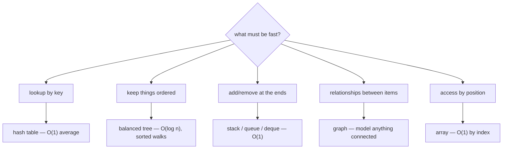

## In simple terms

A **data structure** is a way of arranging values so the things you want to do with them are fast. A shopping list is a data structure; so is a phone book, a calendar, a family tree. Different shapes are good at different questions.

## The Visual Map

Choosing a structure is asking what operation must be fast:



## More detail

A few of the structures every programmer should know:

| Structure          | Strength                                  | Typical use                          |
|--------------------|-------------------------------------------|--------------------------------------|
| **Array**          | O(1) random access by index               | Fixed-size lists, image rows         |
| **Dynamic array / vector** | O(1) amortised append              | Most "list" types (Python, Rust Vec) |
| **Linked list**    | O(1) insert/delete given a node           | Queues, undo histories               |
| **Hash table**     | O(1) average lookup by key                | Sets, dictionaries, caches           |
| **Tree** (balanced) | O(log n) lookup, ordered traversal       | Sorted maps, file systems            |
| **Heap**           | O(log n) insert; O(1) peek-min            | Priority queues, scheduling          |
| **Graph**          | Models arbitrary relationships            | Social networks, maps                |
| **Trie**           | O(k) lookup for strings of length k       | Autocomplete, IP routing             |

Choosing one well requires asking: what operations will this code do most? Insert once, look up a million times → hash table. Frequent insert at front and back → deque. Need things in sorted order → balanced tree. Range queries → segment tree or sorted array.

Algorithms and data structures are designed together: picking the right structure can turn an O(n) operation into O(1) — the difference between a program that handles a thousand users and one that handles a million.

Most languages ship the common ones in their standard library:

- Python: `list`, `dict`, `set`, `deque`, `heapq`.
- Java: `ArrayList`, `HashMap`, `TreeMap`, `LinkedList`, `PriorityQueue`.
- Rust: `Vec`, `HashMap`, `BTreeMap`, `VecDeque`, `BinaryHeap`.
- JavaScript: `Array`, `Map`, `Set`. (Trees and heaps you build yourself.)

## Under the Hood

The two most fundamental layouts, side by side in C. An array is one contiguous block; a linked list is nodes scattered across the heap, stitched together with pointers:

```c
/* array: items sit next to each other — index math finds any element */
int scores[4] = {90, 85, 77, 68};          /* scores[2] is *(scores + 2) */

/* linked list: each node knows only where the next one lives */
struct node {
    int value;
    struct node *next;
};
```

That single difference drives everything else: the array gets O(1) indexing and cache-friendly scans but O(n) middle insertion; the list gets O(1) insertion at a known node but must walk pointers to find anything.

## Engineering Trade-offs

- **Array vs linked list.** Contiguous memory is what CPUs love — prefetchers stream it, caches hold whole chunks. In practice a dynamic array beats a linked list even at the list's "own game" (middle insertion) for surprisingly large sizes, because pointer-chasing defeats the cache.
- **Hash table vs balanced tree.** Hashes give O(1) average lookup but no ordering and occasional O(n) resizes; trees give O(log n) everything plus sorted iteration and range queries. Databases index with [B-trees](/t/b-tree) precisely because range scans matter.
- **Memory overhead.** Every linked node pays for a pointer (8 bytes) plus allocator bookkeeping; a hash table keeps slack space to stay fast. For millions of small items, structure overhead can exceed the data itself.
- **Mutation vs sharing.** Immutable (persistent) structures cost extra allocations per update but can be shared freely across threads without locks — the trade functional languages and React both make.

## Real-world examples

- Your browser's "back" button is a stack.
- A printer queue is a queue.
- A spell-checker uses a trie or hash set.
- A graph search powers turn-by-turn navigation.
- B-trees power both the file system on your laptop (ext4, NTFS, APFS) and the indexes inside PostgreSQL and MySQL — same data structure, two different industries.

## Common misconceptions

- **"More features = better."** Pick the simplest structure that supports your operations cheaply. Extra features cost memory and confusion.
- **"Hash tables are always O(1)."** Average case, yes. With a bad hash function or adversarial keys, you can hit O(n).

## Try it yourself

Measure why structure choice matters — membership tests on a list vs a set:

```bash
python3 -c "
import timeit
setup = 'data = list(range(100_000)); s = set(data); target = 99_999'
in_list = timeit.timeit('target in data', setup=setup, number=1000)
in_set  = timeit.timeit('target in s',    setup=setup, number=1000)
print(f'list (O(n) scan):   {in_list:.3f}s')
print(f'set (O(1) hash):    {in_set:.6f}s  -> {in_list/in_set:,.0f}x faster')
"
```

Identical data, identical question — the only thing that changed is the shape it's stored in.

## Learn next

- [Big O](/t/big-o) — how to talk about how fast each operation is.
- [Hash table](/t/hash-table) and [tree](/t/tree) — the two workhorses, in depth.
- [Algorithms](/t/algorithms) — the recipes that run on these shapes.
