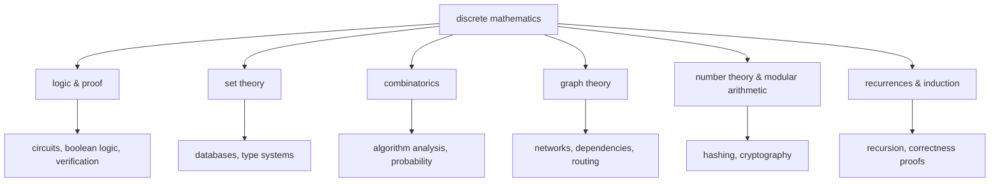

## In simple terms

**Discrete mathematics** is the math of *separate, countable things* — whole numbers, yes/no values, finite sets, networks of nodes — as opposed to the smooth, continuous quantities of calculus. Computers are discrete machines: everything is ultimately distinct bits and finite steps. So discrete math, not calculus, is the mathematics that underpins computer science. It's the toolkit for reasoning precisely about the objects programs actually manipulate.

## The Visual Map



## More detail

Discrete math is less a single subject than a family of closely related ones, each feeding directly into computing:

- **Logic** — propositions, predicates, and proof. The basis of [boolean logic](/t/boolean-logic), circuit design, and reasoning about program correctness.
- **Set theory** — collections, unions, intersections, relations, functions. The vocabulary underneath databases and type systems.
- **Combinatorics** — counting arrangements and possibilities; essential for probability, algorithm analysis, and "how many cases are there?"
- **Graph theory** — nodes and edges modeling networks, dependencies, and relationships. (See [graph theory](/t/graph-theory).)
- **Number theory and modular arithmetic** — the math behind hashing and cryptography.
- **Recurrences and induction** — proving statements about all sizes of input, and analyzing recursive algorithms.

A central skill the field teaches is **proof** — induction in particular, which mirrors [recursion](/t/recursion) and is how you show an algorithm is correct *for all inputs*, not just the ones you tested.

Almost every deeper topic in computer science is applied discrete math. Algorithm analysis is combinatorics; databases are set theory and logic; cryptography is number theory; compilers and verification are formal logic; networks and dependency resolution are graph theory. You can write programs without it, but you can't *reason rigorously* about whether they're correct or efficient without the language and tools discrete math provides.

## Engineering Trade-offs

- **Proof vs testing.** A proof by induction covers *all* inputs; a test suite covers the ones you thought of. Proofs are expensive and most code doesn't get them — the engineering judgment is choosing which properties (a consensus protocol, a crypto primitive, a lock-free queue) are worth the rigor.
- **Counting vs enumerating.** Combinatorics often tells you the size of a search space *without* visiting it. Knowing a configuration space holds 2⁶⁴ cases — before writing the brute-force loop — is the cheapest performance analysis you'll ever do.
- **Discrete vs continuous modeling.** Some domains (graphics, machine learning, signal processing) genuinely need continuous math, then *discretize* it to run on digital hardware — floating point, pixels, time steps. Knowing which side of that line your problem lives on prevents both kinds of modeling error.

## Real-world examples

- Counting how many operations a nested loop performs (combinatorics) to derive its [Big O](/t/big-o).
- Using **modular arithmetic** to build hash functions and public-key cryptography.
- Modeling task dependencies as a graph and topologically sorting them — the math behind build systems and package managers.

## Common misconceptions

- **"You need calculus to do computer science."** Some areas (graphics, ML) use continuous math, but the core of CS rests on *discrete* math far more than on calculus.
- **"Discrete math is just abstract theory with no practical use."** It's the opposite — it directly models the finite, countable structures that every program manipulates.

## Try it yourself

Three pillars of discrete math, one line of Python each:

```bash
python3 -c "
import math
# combinatorics: poker hands — ways to choose 5 cards from 52
print('C(52,5) =', math.comb(52, 5))                 # 2,598,960

# modular arithmetic: fast exponentiation mod a prime (RSA's core operation)
print('7^128 mod 13 =', pow(7, 128, 13))

# set theory: the operations under every SQL JOIN and WHERE
a, b = {1, 2, 3, 4}, {3, 4, 5}
print('union', a | b, ' intersection', a & b, ' difference', a - b)
"
```

`pow(7, 128, 13)` runs in microseconds even for 2048-bit numbers — that efficiency gap (square-and-multiply vs 128 multiplications) is itself a discrete-math result.

## Learn next

- [Graph theory](/t/graph-theory) — the pillar with its own deep computing importance.
- [Boolean logic](/t/boolean-logic) — the two-valued logic at the bottom of everything digital.
- [Set theory](/t/set-theory) — the vocabulary beneath databases and type systems.
