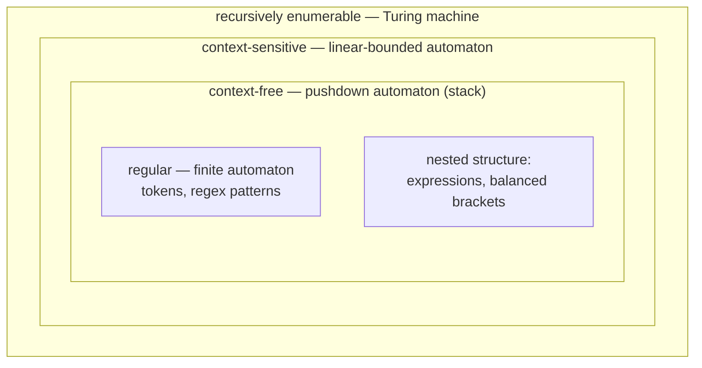

## In simple terms

A **formal language** is a set of strings — sequences of symbols — defined by exact rules rather than by meaning or usage. "Every string of balanced parentheses" is a formal language. "Every valid arithmetic expression" is another. Unlike human languages, there's no ambiguity or judgment call: a string is either *in* the language or it isn't, decided purely by the rules. This precision is what lets us define programming languages exactly, and reason mathematically about what machines can recognize.

## The Visual Map

The Chomsky hierarchy: each level strictly contains the one below it, and each needs a more powerful machine:



## More detail

A formal language is built from an **alphabet** (a finite set of symbols) and a **grammar** (rules for which strings are valid). Grammars and the languages they generate form the **Chomsky hierarchy**, a ladder of increasing power, each level matched to a kind of machine that can recognize it:

| Grammar | Language | Recognized by |
|---|---|---|
| Regular | Regular | Finite [automata](/t/automata) |
| Context-free | Context-free | Pushdown automata (stack) |
| Context-sensitive | Context-sensitive | Linear-bounded automata |
| Unrestricted | Recursively enumerable | [Turing machines](/t/turing-machine) |

The two lower levels are the workhorses of real software:

- **Regular languages** describe simple patterns — exactly what **regular expressions** match, recognized by a finite-state machine. Great for tokens (numbers, identifiers), but provably *unable* to count nesting (regex can't match balanced parentheses).
- **Context-free languages** describe nested structure — what programming-language **grammars** (in BNF) define, and what **parsers** build into syntax trees.

This hierarchy ties directly to [computability](/t/computability): the more expressive the language, the more powerful the machine needed to recognize it, all the way up to the Turing machine.

Formal languages are the theory that makes [compilers](/t/compiler) and interpreters possible. Every programming language is defined by a formal grammar; the first stages of any compiler — lexing with regular languages, parsing with context-free grammars — are direct applications. The same theory explains *why* certain tasks have the difficulty they do: it's a theorem, not an accident, that you can't validate nested HTML with a pure regular expression.

## Under the Hood

A context-free grammar for arithmetic expressions, and the derivation of `1+2*3`:

```text
Expr   -> Expr "+" Term  |  Term
Term   -> Term "*" Factor |  Factor
Factor -> NUMBER  |  "(" Expr ")"

1+2*3:   Expr
         ├── Expr ── Term ── Factor ── 1
         ├── "+"
         └── Term
             ├── Term ── Factor ── 2
             ├── "*"
             └── Factor ── 3
```

The grammar encodes precedence structurally: `*` binds tighter than `+` because `Term` sits *below* `Expr` in the rules — the parse tree computes `1+(2*3)` with no precedence table needed.

## Engineering Trade-offs

- **Expressiveness vs guarantees.** Climbing the hierarchy buys structure but costs speed and decidability: regular languages match in linear time with constant memory; general context-free parsing is worst-case O(n³); beyond that, basic questions become undecidable. Use the *weakest* class that fits.
- **Grammar ambiguity vs naturalness.** The most readable grammar for a language is often ambiguous (the classic dangling-`else`). Parser generators force you to refactor the grammar or add precedence declarations — a real design cost paid for deterministic parsing.
- **Theory vs practice in "regex".** Modern regex engines (PCRE, Python's `re`) added backreferences and lookarounds, pushing them *beyond* regular languages — and losing the linear-time guarantee. That's why a crafted input can hang them (ReDoS), while strictly-regular engines like RE2 refuse those features and stay safe.

## Real-world examples

- **Regular expressions** matching email addresses or log patterns are regular languages in action.
- A programming language's **grammar** (e.g., the formal spec of C or Python) is a context-free language that its parser implements.
- The classic insight "you can't parse HTML with regex" is really a statement about formal-language classes: HTML's nesting is context-free, beyond a regular language's power.

## Common misconceptions

- **"A formal language is a programming language."** Programming languages *are* formal languages, but the term is broader — any precisely-defined set of strings qualifies, including simple regex patterns.
- **"Regular expressions can match anything."** They're limited to *regular* languages — they fundamentally cannot handle arbitrary nesting, which requires at least a context-free grammar.

## Try it yourself

Watch the regular/context-free boundary in action — a regex vs a stack on nested brackets:

```bash
python3 -c "
import re

flat = re.compile(r'^\(+\)+$')          # regular: cannot COUNT nesting

def balanced(s):                         # one counter = a tiny stack
    depth = 0
    for ch in s:
        depth += ch == '('
        depth -= ch == ')'
        if depth < 0: return False
    return depth == 0

for s in ['(())', '(()', '())(']:
    print(f'{s:6}  regex: {bool(flat.match(s))!s:5}  stack: {balanced(s)}')
"
```

The regex happily accepts `(()` — it can check the *shape* but not the *count*. The stack-based checker gets every case right. That gap is the line between the bottom two rungs of the hierarchy.

## Learn next

- [Automata](/t/automata) — the machines that recognize each language class.
- [Regular expression](/t/regular-expression) — the bottom of the hierarchy, in daily use.
- [Parsing](/t/parsing) — context-free grammars at work inside every compiler.
