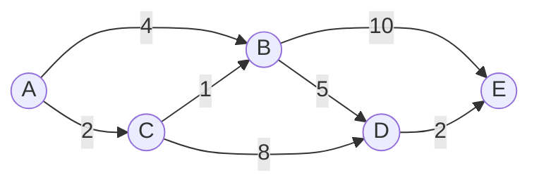

## In simple terms

**Graph theory** studies **graphs**: dots (called **nodes** or **vertices**) connected by lines (called **edges**). That's it — and yet this tiny idea models an astonishing range of things. A social network is a graph (people connected by friendships). A road map is a graph (intersections connected by streets). The web is a graph (pages connected by links). Whenever you have *things* and *relationships between them*, you have a graph, and graph theory is the toolkit for reasoning about it.

## The Visual Map

A weighted, directed graph — and the shortest path A→E hiding inside it:



The cheapest route from A to E is A→C→B→D→E with cost 2+1+5+2 = 10 — beating the "direct-looking" A→B→E at 14. Finding that systematically is Dijkstra's algorithm.

## More detail

Graphs come in varieties that capture different situations:

- **Directed vs. undirected** — do edges have a direction (follower → followee) or not (mutual friendship)?
- **Weighted vs. unweighted** — do edges carry a value (distance, cost, capacity)?
- **Cyclic vs. acyclic** — a **DAG** (directed acyclic graph) has no cycles and models dependencies and orderings. A [tree](/t/tree) is a special connected, acyclic graph.

On top of these sit the classic **algorithms** that show up constantly in software:

- **Traversal** — BFS (breadth-first) and DFS (depth-first) to explore or search a graph.
- **Shortest path** — Dijkstra's and A* for routing and navigation.
- **Minimum spanning tree** — connecting everything at least cost.
- **Topological sort** — ordering a DAG so dependencies come first.
- **Connectivity, cycles, matching, and coloring** — each underpinning real problems (and some, like graph coloring, are famously [NP-hard](/t/complexity-theory)).

A graph is both a mathematical object and a [data structure](/t/data-structure) (stored as an adjacency list or matrix), which is why graph theory sits right at the boundary of math and practical programming.

Graphs are one of the most broadly applicable models in all of computing. Routing and navigation, social-network analysis, recommendation engines, dependency resolution in package managers and build systems, compiler optimization, network design, and the link analysis behind search engines (PageRank) are *all* graph problems. Recognizing that a messy real-world problem is "really" a graph problem instantly gives you a whole library of proven algorithms to apply.

## Engineering Trade-offs

- **Adjacency list vs adjacency matrix.** A list stores only the edges that exist — O(V+E) memory, ideal for sparse graphs (most real ones). A matrix answers "is there an edge between u and v?" in O(1) but costs O(V²) memory regardless — only worth it for dense graphs or heavy edge-lookup workloads.
- **BFS vs DFS.** BFS finds shortest paths (in hops) but holds a whole frontier in memory; DFS uses memory proportional to depth and suits reachability, cycle detection, and topological sort. Pick by question, not habit.
- **Exact vs heuristic search.** Dijkstra explores impartially; A* uses a heuristic (straight-line distance) to focus effort and is dramatically faster when a good heuristic exists — but a bad heuristic silently breaks optimality guarantees.
- **Precompute vs query-time.** Map services don't run plain Dijkstra per request over the planet; they precompute hierarchies (contraction hierarchies) — minutes of preprocessing buying microsecond queries.

## Real-world examples

- **GPS navigation** runs shortest-path algorithms over a graph of roads.
- **Package managers and build tools** topologically sort a dependency DAG to decide install/build order.
- **Search engines** model the web as a graph and rank pages by their link structure.

## Common misconceptions

- **"A graph is a chart or a plot."** In this field a "graph" is a network of nodes and edges, not a bar or line chart — same word, unrelated meaning.
- **"Graph algorithms are niche."** They're everywhere — routing, social apps, dependencies, and search are all graph problems, often hiding in plain sight.

## Try it yourself

Breadth-first search over the graph in the diagram, in plain Python:

```bash
python3 -c "
from collections import deque

graph = {'A': ['B', 'C'], 'B': ['D', 'E'], 'C': ['B', 'D'],
         'D': ['E'], 'E': []}

def bfs_path(start, goal):
    queue = deque([[start]])
    seen = {start}
    while queue:
        path = queue.popleft()
        if path[-1] == goal:
            return path
        for nxt in graph[path[-1]]:
            if nxt not in seen:
                seen.add(nxt)
                queue.append(path + [nxt])

print(bfs_path('A', 'E'))   # ['A', 'B', 'E'] — fewest hops
"
```

BFS finds the fewest-*hops* path (A→B→E). Compare with the weighted answer in the diagram — fewest hops and lowest cost are different questions, answered by different algorithms.

## Learn next

- [Tree](/t/tree) — the most important special case: connected and acyclic.
- [Data structures](/t/data-structure) — how graphs are actually stored and traversed.
- [Algorithms](/t/algorithms) — the design strategies graph algorithms are built from.
