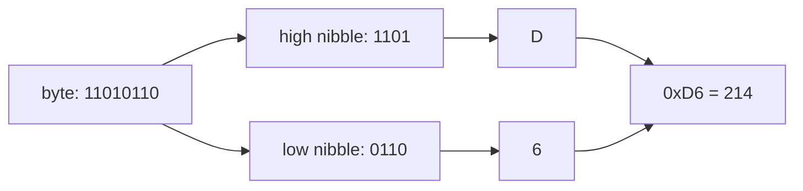

## In simple terms

**Hexadecimal** is base 16 instead of base 10. Its 16 digits are `0`-`9` and then `A`-`F` (for 10-15). It's everywhere in computing because one hex digit is exactly four bits — so you can read a hex string off a screen and convert it to or from binary in your head, four bits at a time.

## The Visual Map



## More detail

Each hex digit maps cleanly to four binary digits:

| Hex | Binary | Decimal |
|---|---|---|
| 0 | 0000 | 0 |
| 4 | 0100 | 4 |
| 8 | 1000 | 8 |
| A | 1010 | 10 |
| F | 1111 | 15 |

So a byte (8 bits) is exactly two hex digits, from `00` to `FF` (0 to 255). A 32-bit integer is 8 hex digits, a 64-bit one is 16.

Conventions you'll see:

- **`0x`** prefix — `0xFF` means 255 in hex in most programming languages.
- **`#`** prefix — common in CSS for colors (`#1f6feb`).
- **No prefix** — addresses in `objdump` output, memory dumps in debuggers.

Hex dominates wherever you need to look at bits without losing your mind: memory addresses, machine code, hash digests, network captures, RGB colors, encoded characters, hardware registers. Pretty much any time a computer wants to show you a number the size of a byte or larger in a way that maps to bits, it uses hex — debugging crash dumps, reading docs for hardware registers, inspecting checksums, even picking a brand colour.

## Under the Hood

Reading and writing hex from code:

```python
n = 214
print(hex(n))             # '0xd6'
print(f"{n:02X}")         # 'D6'  — formatted, upper-case, zero-padded
print(int("d6", 16))      # 214  — parse hex back to a number

# a colour is just three bytes
r, g, b = 0x1F, 0x6F, 0xEB
print(f"#{r:02x}{g:02x}{b:02x}")   # '#1f6feb'
```

The conversions are trivial precisely because 16 is a power of 2 — each hex digit is an independent 4-bit group, no carrying across digit boundaries.

## Engineering Trade-offs

- **Hex vs binary.** Both show you the bits; hex is 4× denser (`0xFF` vs `0b11111111`). Binary literals only win when individual bit *positions* matter visually, like documenting a flags register.
- **Hex vs decimal.** Decimal is natural for quantities, hopeless for bit patterns: you can't tell from `214` which bits are set, but `0xD6` decodes at a glance. Use decimal for counts, hex for identities, addresses, and masks.
- **Hex vs octal.** Octal (base 8, 3-bit groups) lost because hardware standardised on 8-bit bytes, which octal splits awkwardly. It survives in one niche — Unix file permissions (`chmod 755`) — where the three rwx bits per owner/group/world fit octal digits exactly.

## Real-world examples

- A SHA-256 hash is 64 hex digits (256 bits / 4).
- A Git commit ID is displayed as 7-40 hex characters.
- An IPv6 address (`2001:0db8::1`) is groups of hex digits.
- An RGBA colour like `#1F6FEBcc` packs four bytes: R=`1F`, G=`6F`, B=`EB`, A=`cc`.
- A MAC address (`a4:5e:60:01:23:45`) is six hex bytes.

## Common misconceptions

- **"Hex is a different *kind* of number."** It's the same number, just written in base 16 instead of base 10. `0xFF` and `255` and `0b11111111` are all the same value.
- **"Hex digits go up to G or H."** Just A-F. Six letters.

## Try it yourself

Dump any data as hex with `od` (part of coreutils):

```bash
echo "Hi!" | od -A x -t x1z
# 000000 48 69 21 0a    >Hi!.<
```

`H` is `0x48`, `i` is `0x69`, `!` is `0x21`, and the newline is `0x0a`. Convert in both directions in your shell:

```bash
printf '%x\n' 214        # d6
echo $((16#d6))          # 214
```

## Learn next

- [Binary numbers](/t/binary-numbers) — the underlying base hex is shorthand for.
- [Bits](/t/bits) — the smallest unit hex helps us read.
- [Character encoding](/t/character-encoding) — why `0x48` means "H" in the first place.
