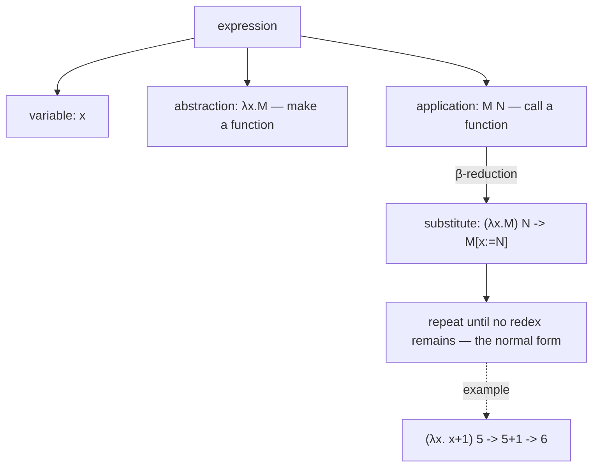

## In simple terms

Lambda calculus is the smallest possible programming language: just variables, function creation (λ), and function application. Despite having only three constructs, it is Turing-complete — anything computable can be expressed in lambda calculus. Alonzo Church invented it in the 1930s (the same decade Turing invented Turing machines), and the two are provably equivalent. Lambda calculus is the theoretical DNA of every functional programming language: Haskell, Lisp, ML, Erlang, and even JavaScript's functions are all implementations of lambda calculus concepts.

## The Visual Map

The entire language is three constructs; computation is one rewrite rule applied until done:



## More detail

**Syntax:** lambda calculus expressions are:
- **Variable:** `x`, `y`, `z` — references to named values.
- **Abstraction:** `λx.M` — a function with parameter `x` and body `M`. In JavaScript: `x => M`.
- **Application:** `M N` — apply function `M` to argument `N`. In JavaScript: `M(N)`.

That's it — the entire grammar is three rules.

**Reduction rules:**
- **β-reduction (beta):** apply a function: `(λx.M) N → M[x:=N]` — substitute N for all free occurrences of x in M.
  - Example: `(λx. x + 1) 5 → 5 + 1 → 6`
- **α-conversion (alpha):** rename bound variables to avoid capture: `λx.x ≡ λy.y`.
- **η-reduction (eta):** `λx.(M x) ≡ M` when x is not free in M (a function that just applies M to its argument is M).

**Church encodings:** numbers, booleans, and data structures can be encoded as lambda expressions:
- **Booleans:** `TRUE = λa.λb.a` (selects first), `FALSE = λa.λb.b` (selects second).
- **Church numerals:** `0 = λf.λx.x`, `1 = λf.λx.f x`, `2 = λf.λx.f(f x)` — n applies f to x n times.
- **Pairs:** `PAIR = λx.λy.λf.f x y`, `FST = λp.p TRUE`, `SND = λp.p FALSE`.

**Fixed-point combinator (Y combinator):** the Y combinator enables recursion in lambda calculus without named functions:
`Y = λf.(λx.f(x x))(λx.f(x x))`
`Y f → f (Y f)` — applying Y to f produces a fixed point: the value v such that `f v = v`. This is how recursive functions are defined without self-reference. YC Combinator's name references this.

**Simply typed lambda calculus (STLC):** adding types to lambda calculus: each variable and expression has a type; functions have type `A → B`. β-reduction preserves types (subject reduction). STLC is the foundation of ML's type system.

**Curry-Howard correspondence:** a profound connection between lambda calculus and logic:
- Lambda terms ↔ proofs.
- Types ↔ propositions.
- A function of type `A → B` is simultaneously a proof that "A implies B."
- β-reduction ↔ proof simplification.
This connection underpins proof assistants (Coq, Lean) and dependently typed languages.

Understanding lambda calculus illuminates why functions are values (λ-abstractions), why closures capture variables (free variables in λ-terms), what type inference does (solving typing constraints in STLC), and why continuations and monads work (denotational semantics in terms of lambda calculus). For anyone working in programming language design, type theory, formal verification, or advanced functional programming, it is the common language.

## Under the Hood

Church encodings are runnable — Python's `lambda` is close enough:

```python
# booleans select one of two arguments
TRUE  = lambda a: lambda b: a
FALSE = lambda a: lambda b: b
IF    = lambda c: lambda t: lambda e: c(t)(e)

# numerals apply f to x n times
ZERO  = lambda f: lambda x: x
SUCC  = lambda n: lambda f: lambda x: f(n(f)(x))
ADD   = lambda m: lambda n: lambda f: lambda x: m(f)(n(f)(x))

to_int = lambda n: n(lambda i: i + 1)(0)    # escape hatch for printing

TWO   = SUCC(SUCC(ZERO))
THREE = SUCC(TWO)
print(to_int(ADD(TWO)(THREE)))              # 5
print(IF(TRUE)("yes")("no"))                # yes
```

No numbers, no booleans, no `if` — only functions, and arithmetic still works. That is the Turing-completeness claim made tangible.

## Engineering Trade-offs

- **Minimality vs ergonomics.** Three constructs make the system easy to *prove things about* and brutal to *program in directly* — Church-encoded arithmetic is unusably slow. Real functional languages keep the λ-core for semantics and bolt on native ints, data types, and pattern matching for practicality.
- **Evaluation order matters.** Call-by-value (eager, like ML) evaluates arguments first — simple and predictable, but diverges on terms a lazier strategy could finish. Normal-order/call-by-need (Haskell) finds a normal form whenever one exists, at the cost of harder-to-predict space behaviour (the infamous lazy space leak).
- **Purity vs effects.** Pure λ-calculus has no I/O, state, or exceptions. Languages must choose how to reintroduce them: ML allows effects anywhere (pragmatic, less equational reasoning); Haskell quarantines them in types via monads (more reasoning power, steeper learning curve).

## Real-world examples

- JavaScript's arrow functions are lambda abstractions; the `=>` syntax is deliberate.
- Haskell is a direct implementation of a typed lambda calculus with monadic I/O and lazy evaluation.
- The V8 engine's intermediate representation (Turbofan IR) is essentially a typed lambda calculus.
- Coq proofs are lambda terms; the Curry-Howard correspondence means proof checking is type checking.

## Common misconceptions

- **"Lambda calculus is just λ syntax in programming."** Lambda calculus is a formal mathematical system. Using `lambda` or `=>` in Python/JavaScript doesn't mean you're writing lambda calculus — though those constructs implement the same idea.
- **"Lambda calculus is impractical."** It is the theoretical underpinning of Haskell (one of the most correct languages ever designed) and is used practically in compiler IR, proof assistants, and type theory research.

## Try it yourself

Multiplication falls out of numeral composition — `MUL m n` is literally `m ∘ n`:

```bash
python3 -c "
ZERO = lambda f: lambda x: x
SUCC = lambda n: lambda f: lambda x: f(n(f)(x))
MUL  = lambda m: lambda n: lambda f: m(n(f))     # composition IS multiplication
to_int = lambda n: n(lambda i: i + 1)(0)

TWO   = SUCC(SUCC(ZERO))
THREE = SUCC(TWO)
print(to_int(MUL(TWO)(THREE)))    # 6
print(to_int(MUL(THREE)(THREE)))  # 9
"
```

Applying "do f two times" to "do f three times" gives "do f six times" — multiplication with no multiplication operator anywhere.

## Learn next

- [Type theory](/t/type-theory) — what happens when you give λ-terms types.
- [Closure](/t/closure) — free-variable capture, the λ-calculus idea inside every modern language.
- [Turing machine](/t/turing-machine) — the provably equivalent rival model of computation.
