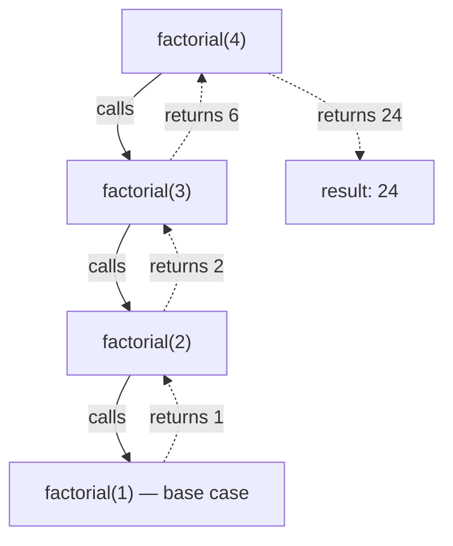

## In simple terms

**Recursion** is solving a problem by reducing it to a smaller version of itself. The function calls itself with a simpler input and combines that result to answer the original question. Every recursion needs a **base case** — a small input it can answer directly — otherwise it runs forever.

## The Visual Map

`factorial(4)` descends to the base case, then the results multiply on the way back up:



## More detail

Recursion shines on problems with a self-similar structure:

- **Tree traversals** — a tree is a node plus child trees.
- **Divide-and-conquer algorithms** — merge sort, quicksort, FFT.
- **Backtracking** — n-queens, sudoku, parsing.
- **Many graph algorithms** — DFS, topological sort.

Each call lives on the **call stack**; too deep, and you get a stack overflow. Many languages support **tail-call optimisation**: if the recursive call is the last thing the function does, the compiler can reuse the current stack frame, turning recursion into a loop. Scheme, OCaml, and most functional languages guarantee this; C++ and Rust do it opportunistically; Python and Java do not.

Recursion and iteration are interchangeable in principle. The choice is about clarity: tree-shaped problems are usually clearest recursively; long linear traversals are usually clearest as a loop. Most beautiful algorithms are recursive when written naturally — recognising self-similarity in a problem and turning it into recursion is a core programming skill, and a near-universal interview topic.

## Under the Hood

The classic shape, plus the failure mode and its fix:

```python
def factorial(n):
    if n <= 1:                    # base case
        return 1
    return n * factorial(n - 1)   # recursive case

# the cost of forgetting structure: naive fibonacci recomputes
# everything and is O(2^n) ...
def fib_slow(n):
    return n if n < 2 else fib_slow(n - 1) + fib_slow(n - 2)

# ... memoization caches each result once: O(n)
from functools import lru_cache

@lru_cache(maxsize=None)
def fib_fast(n):
    return n if n < 2 else fib_fast(n - 1) + fib_fast(n - 2)
```

Same recurrence, same answers — the cache turns an exponential call tree into a linear chain.

## Engineering Trade-offs

- **Clarity vs call overhead.** A recursive tree walk mirrors the data's shape and is hard to get wrong; the equivalent loop with an explicit stack is faster in languages without tail calls but easier to break. Profile before trading readability away.
- **Stack depth vs explicit stack.** The call stack is finite (Python defaults to ~1000 frames; C stacks are a few MB). Logarithmic depth (binary search, balanced trees) is always safe; linear depth on user-controlled input is a crash waiting to happen — convert to iteration or an explicit stack.
- **Recomputation vs memory.** Naive recursion on overlapping subproblems (Fibonacci, edit distance) is exponential. Memoization or bottom-up dynamic programming fixes the time at the cost of storing every subresult.

## Real-world examples

- A file-system traversal: process each entry; if it's a directory, recurse.
- React renders a component tree by recursively rendering children.
- Compilers walk syntax trees recursively to type-check and generate code.
- Most parsers (including the one in your TypeScript / Rust / Swift compiler) are recursive-descent: each grammar rule is a function that recursively calls the rules it references.

## Common misconceptions

- **"Recursion is always slow."** Function-call overhead is real, but a clear recursive algorithm with a smart base case is often faster than a contorted iterative version. Modern compilers are good at it.
- **"Recursion always needs a stack overflow guard."** Bounded-depth recursion (e.g. logarithmic in n) is perfectly safe.

## Try it yourself

Find your interpreter's recursion ceiling — and hit it:

```bash
python3 -c "
import sys
print('limit:', sys.getrecursionlimit())

def depth(n):
    try:
        return depth(n + 1)
    except RecursionError:
        return n

print('actual frames reached:', depth(0))
"
```

Then walk a real recursive structure — your filesystem — and watch recursion mirror its shape:

```bash
python3 -c "
import os
def tree(path, indent=0):
    print(' ' * indent + (os.path.basename(path) or path))
    if os.path.isdir(path):
        for entry in sorted(os.listdir(path))[:5]:
            tree(os.path.join(path, entry), indent + 2)
tree('.')
"
```

## Learn next

- [Big O](/t/big-o) — how to talk about recursion's cost.
- [Tree](/t/tree) — the data structure recursion fits most naturally.
- [Algorithms](/t/algorithms) — divide-and-conquer and backtracking, recursion's home turf.
