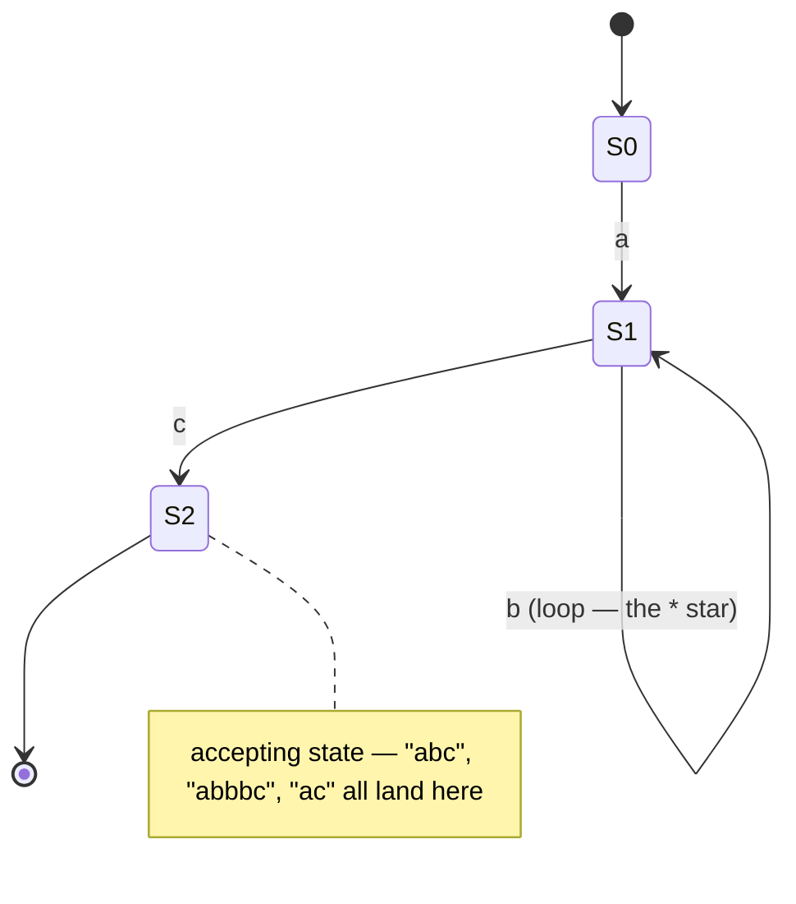

## In simple terms

A regular expression is a concise pattern that describes a set of strings. `/^\d{3}-\d{4}$/` describes phone numbers like "555-1234." Every programming language has regex built in for searching, validating, and extracting text. Behind the notation lies a beautiful theory: every regex corresponds to a finite automaton (a state machine), and the two are provably equivalent — you can convert one to the other mechanically. This theory determines what regexes *can* and *cannot* do.

## The Visual Map

The regex `ab*c` compiled to its finite automaton — every regex is secretly one of these:



## More detail

**The formal language hierarchy (Chomsky hierarchy):**
- **Regular languages** — recognised by finite automata, described by regular expressions. Examples: valid email format (simplified), phone numbers, identifiers, keywords.
- **Context-free languages** — recognised by pushdown automata, described by context-free grammars. Examples: balanced parentheses, arithmetic expressions, most programming language syntax. Regular expressions *cannot* match balanced parentheses (they can't count).
- **Context-sensitive and recursively enumerable** — more powerful; Turing machines.

**Core regex operators:**
- **Concatenation:** `ab` — `a` followed by `b`.
- **Alternation:** `a|b` — `a` or `b`.
- **Kleene star:** `a*` — zero or more `a`s.
- **Plus:** `a+` — one or more (sugar for `aa*`).
- **Optional:** `a?` — zero or one `a`.
- **Character classes:** `[abc]`, `[a-z]`, `\d` (digit), `\w` (word char), `.` (any).
- **Anchors:** `^` (start), `$` (end), `\b` (word boundary).
- **Quantifiers:** `{n}`, `{n,}`, `{n,m}`.
- **Groups:** `(abc)` — capture group; `(?:abc)` — non-capturing.

**Finite automata:**
- **NFA (Nondeterministic Finite Automaton):** each regex is converted to an NFA by Thompson's construction. NFAs can be in multiple states simultaneously; a string is accepted if any path through the NFA accepts it.
- **DFA (Deterministic Finite Automaton):** each state has exactly one transition per input symbol. DFAs execute in O(n) time for strings of length n. Every NFA can be converted to a DFA (subset construction), though the DFA may have exponentially more states.
- **RE → NFA → DFA** is the classic compilation pipeline for regex engines.

**Regex engine strategies:**
- **DFA-based (RE2, Rust regex, GNU grep):** convert regex to DFA at compile time; match in O(n) time regardless of regex complexity. Cannot support backreferences (which are not regular).
- **Backtracking (PCRE, Python `re`, JavaScript):** NFAs with backtracking; can support backreferences and lookaheads; worst-case O(2^n) for pathological patterns (ReDoS attacks). `/^(a+)+$/` against "aaaaaab" causes exponential backtracking.

**ReDoS (Regular Expression Denial of Service):** an evil input that causes a backtracking engine to explore exponentially many paths — crashing or hanging the server. Cloudflare was taken down for 27 minutes in 2019 by a ReDoS in a WAF regex. Use DFA-based engines (RE2) for untrusted inputs.

**What regex cannot do:**
- Matching balanced parentheses: `(((abc)))` with arbitrary nesting depth — requires a stack (pushdown automaton), not just states.
- Parsing HTML, XML, or most programming languages — context-free, not regular. (The "don't parse HTML with regex" meme is grounded in this formal fact.)

**POSIX vs. Perl-compatible regex (PCRE):** POSIX regexes are a standardised subset; PCRE adds lookahead/behind, backreferences, named groups, and more. Most modern languages implement PCRE-like semantics.

Understanding the theory clarifies why certain patterns are possible and others are not, why ReDoS is a real security risk, when to use a parser instead of a regex, and why some regex engines are safer than others — and it makes regex a concrete entry point into formal language theory.

## Under the Hood

The DFA for `ab*c`, hand-compiled to a transition table — this is what "O(n) matching" means:

```python
# states: 0 = start, 1 = saw 'a' (+ any 'b's), 2 = accept; -1 = dead
DFA = {
    (0, "a"): 1,
    (1, "b"): 1,        # the * loop
    (1, "c"): 2,
}

def matches(s):
    state = 0
    for ch in s:                                # one table lookup per char,
        state = DFA.get((state, ch), -1)        # no backtracking, ever
        if state == -1:
            return False
    return state == 2

for s in ["ac", "abc", "abbbbc", "abx", "abcc"]:
    print(f"{s:7} -> {matches(s)}")
```

One lookup per input character, constant memory, immune to pathological inputs. Engines like RE2 and `grep` build (lazily) exactly this and guarantee linear time; backtracking engines trade that guarantee away for features like backreferences.

## Engineering Trade-offs

- **Backtracking features vs linear-time safety.** Backreferences and lookarounds (PCRE, Python, JavaScript) are genuinely useful — and provably beyond regular languages, so they force a backtracking engine with exponential worst cases. RE2/Rust-regex refuse those features and in exchange can promise O(n) on any input. For patterns applied to *untrusted* text, that promise is a security control.
- **Regex vs parser.** A regex is one dense line; a parser is a page of code. The regex wins for flat, token-shaped patterns — and loses catastrophically when the format has nesting, escaping, or comments (HTML, JSON, CSV-with-quotes). The crossover comes sooner than most people expect.
- **Terseness vs maintainability.** A 200-character email regex is write-only code. Verbose mode (`re.VERBOSE`, `(?x)`) with comments, or splitting one regex into several named steps, trades golf-score elegance for the next reader's sanity.
- **Compile once vs per call.** Compiling a regex builds an automaton — cheap, but not free. Hot loops should compile patterns once (`re.compile`, static `Regex`), not per iteration; most languages cache recent patterns, but relying on the cache is a bet.

## Real-world examples

- grep, sed, awk: Unix text tools built around POSIX regular expressions — used in billions of shell scripts.
- Nginx and Apache: routing rules use regex; ReDoS in routing has caused outages.
- VS Code's find/replace: PCRE regex with capture groups for code refactoring.
- Email validation regex: the "correct" RFC 5321-compliant email regex has thousands of characters; regex is technically correct for validation but impractical (use a library).

## Common misconceptions

- **"Regex can parse anything."** Regular expressions can only describe regular languages. HTML, XML, JSON, and most programming languages are context-free and require a proper parser.
- **"Regex is always fast."** Backtracking engines have exponential worst-case complexity. DFA-based engines (RE2, Rust's regex crate) guarantee O(n) but don't support all PCRE features.

## Try it yourself

Trigger a (small, safe) ReDoS — watch backtracking go exponential as the input grows by one character at a time:

```bash
python3 -c "
import re, time
evil = re.compile(r'^(a+)+\$')          # the classic pathological pattern
for n in (20, 22, 24, 26):
    s = 'a' * n + 'b'                   # almost matches — forces full backtrack
    t = time.perf_counter()
    evil.match(s)
    print(f'n={n}: {time.perf_counter() - t:.2f}s')
"
```

Each +2 characters roughly quadruples the time — that's O(2^n) arriving. `grep -E '^(a+)+$'` on the same input returns instantly, because grep builds the DFA from Under the Hood instead of backtracking.

## Learn next

- [Formal language](/t/formal-language) — the hierarchy that defines regex's exact limits.
- [Automata](/t/automata) — the machines every regex compiles down to.
- [Parsing](/t/parsing) — what to reach for when the pattern needs a stack.
