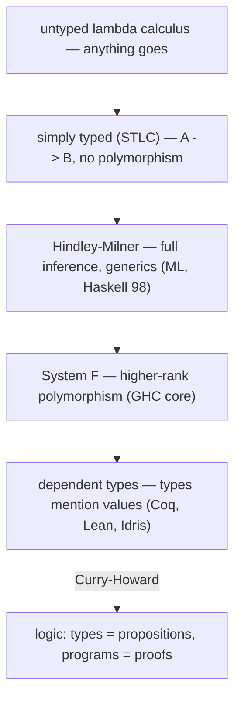

## In simple terms

A type system classifies values — `42` is an `Int`, `"hello"` is a `String` — and rejects programs that apply operations to the wrong kind of value (can't add a string to an integer). Type theory is the mathematical study of type systems: what types are, what type systems can express, and what properties they guarantee. At its core, it asks: what can we know about a program just from its types, before running it?

## The Visual Map

The ladder of type-system power, with the Curry-Howard bridge to logic alongside:



## More detail

**Levels of type systems:**

**Simply Typed Lambda Calculus (STLC):** the simplest typed system. Every term has exactly one type; functions have type `A → B`. Well-typed programs never get "stuck" (progress theorem) and types are preserved by evaluation (preservation). This is the core of most mainstream languages' type systems.

**Hindley-Milner type inference:** the type system of ML, Haskell, OCaml, and F#. Introduces **parametric polymorphism** — `identity : ∀a. a → a` works for any type `a`. The algorithm W infers the most general type of any expression without type annotations, making the language statically typed without requiring the programmer to write types. This is why Haskell rarely needs explicit type annotations despite having a very strong type system.

**Subtyping:** types form a hierarchy; a value of a subtype can be used wherever the supertype is expected. Java/C# class hierarchies, TypeScript's structural typing, and covariant/contravariant variance rules for generics are all subtyping. Combining subtyping with parametric polymorphism is theoretically complex (F-bounded quantification, variance annotations).

**Dependent types:** types that depend on values. In Haskell, `[Int]` is a list of integers of *any* length. With dependent types (Agda, Coq, Lean, Idris): `Vector Int n` is a list of exactly `n` integers, where `n` is a value. Functions can be typed as `append : ∀n m. Vector a n → Vector a m → Vector a (n+m)` — the type carries the proof that the output length equals the sum of the input lengths. This is the foundation of proof assistants: programs and proofs are the same thing (Curry-Howard).

**Curry-Howard correspondence:** a deep isomorphism:

| Type Theory | Logic |
|---|---|
| Type | Proposition |
| Term (program) | Proof |
| Function type `A → B` | Implication `A ⟹ B` |
| Product type `A × B` | Conjunction `A ∧ B` |
| Sum type `A + B` | Disjunction `A ∨ B` |
| Dependent type `Σx:A.B(x)` | Existential `∃x:A.B(x)` |
| β-reduction | Proof simplification |

A well-typed term *is* a proof. Type-checking *is* proof-checking. This unification means proof assistants like Coq and Lean are simultaneously programming languages and theorem provers.

**Practical type system features:**
- **Algebraic Data Types (ADTs):** sum types (`Option`, `Result`, `Either`) + product types (records, tuples). Force exhaustive handling of all cases.
- **Linear types / uniqueness types (Rust's ownership):** each value is used exactly once. Prevents use-after-free and data races, checked at compile time.
- **Effect types (Koka, Unison, OCaml 5):** types track computational effects — `IO`, `Exception`, `State`. Functions are pure unless the type says otherwise.

Type theory is the foundation of programming language design, formal verification, and the science of program correctness. Understanding it explains why TypeScript's types are structural (not nominal), why Rust's borrow checker works, why Haskell's monads are typed, and how proof assistants can verify both code and mathematics.

## Under the Hood

A complete type checker for the simply typed lambda calculus — the judgment `Γ ⊢ e : T` as twenty lines of Python:

```python
# terms: ("var", x) | ("lam", x, type, body) | ("app", f, arg) | ("int", n)
def typeof(term, env={}):
    match term:
        case ("int", _):
            return "Int"
        case ("var", x):
            return env[x]                          # look up in context Γ
        case ("lam", x, t, body):
            body_t = typeof(body, {**env, x: t})   # extend Γ with x : t
            return ("fun", t, body_t)              # type is t -> body_t
        case ("app", f, arg):
            ft, at = typeof(f, env), typeof(arg, env)
            match ft:
                case ("fun", param_t, ret_t) if param_t == at:
                    return ret_t
                case _:
                    raise TypeError(f"cannot apply {ft} to {at}")

inc = ("lam", "x", "Int", ("var", "x"))            # λx:Int. x
print(typeof(("app", inc, ("int", 5))))            # Int — well typed
print(typeof(("app", ("int", 3), ("int", 5))))     # TypeError: not a function
```

Each `case` is one inference rule from the textbook; the recursion *is* the derivation tree. Real compilers add inference, polymorphism, and better errors — but this skeleton is genuinely what runs inside them.

## Engineering Trade-offs

- **Expressiveness vs inference.** Hindley-Milner hits a sweet spot: full type inference with no annotations, decidably. Climb higher (higher-rank polymorphism, dependent types) and inference becomes undecidable — the programmer pays with annotations and proof obligations for every guarantee gained.
- **Static guarantees vs flexibility.** Stronger typing rejects more bad programs *and* more good ones; every sound type system forbids some correct code. Gradual typing (TypeScript, Python type hints) trades airtight guarantees for incremental adoption — with escape hatches (`any`, casts) that quietly punch holes in the proofs.
- **Proof power vs effort.** Dependent types can verify a sorting function returns a sorted permutation — at roughly 10× the development effort. Worth it for seL4 or CompCert; not for a CRUD app. The engineering question is which 1% of the system deserves machine-checked proof.
- **Compile-time cost.** Sophisticated type-level computation (Haskell type families, Rust trait resolution, TypeScript conditional types) can push compile times from seconds toward minutes — type checking is itself a program you're running.

## Real-world examples

- Haskell's GHC implements a stratified type system based on System F (rank-2 polymorphism, type classes).
- TypeScript implements a structural subtyping system with algebraic types and gradual typing.
- Rust's ownership system is an affine type system (values are used at most once, or explicitly shared).
- Coq's Calculus of Inductive Constructions (CIC) is a dependently typed lambda calculus used to prove theorems and verify seL4.

## Common misconceptions

- **"Strong typing means no type coercions."** Strong vs. weak typing is not a well-defined term. Python is "dynamically typed but strongly typed" (no implicit coercions); JavaScript is "dynamically and weakly typed" (many implicit coercions); Haskell is "statically and strongly typed."
- **"Type inference means dynamic typing."** Type inference (Hindley-Milner) infers types *at compile time* — Haskell, OCaml, and Rust use it. The distinction is static (compile-time) vs. dynamic (runtime) typing, not whether annotations are required.

## Try it yourself

Run the type checker from Under the Hood and watch it accept and reject programs without executing them:

```bash
python3 -c "
def typeof(term, env={}):
    match term:
        case ('int', _): return 'Int'
        case ('var', x): return env[x]
        case ('lam', x, t, body):
            return ('fun', t, typeof(body, {**env, x: t}))
        case ('app', f, arg):
            ft, at = typeof(f, env), typeof(arg, env)
            if ft[0] == 'fun' and ft[1] == at: return ft[2]
            raise TypeError(f'cannot apply {ft} to {at}')

inc = ('lam', 'x', 'Int', ('var', 'x'))
print(typeof(('app', inc, ('int', 5))))      # Int
try:
    typeof(('app', ('int', 3), ('int', 5)))  # 3(5) — nonsense
except TypeError as e:
    print('rejected:', e)
"
```

The second program never runs — it's rejected by pure symbol-pushing over types. That's the entire promise of static typing, in miniature.

## Learn next

- [Lambda calculus](/t/lambda-calculus) — the untyped core every type system is layered onto.
- [Type system](/t/type-system) — the practical, language-design view of these ideas.
- [Formal verification](/t/formal-verification) — dependent types deployed to prove real software correct.
