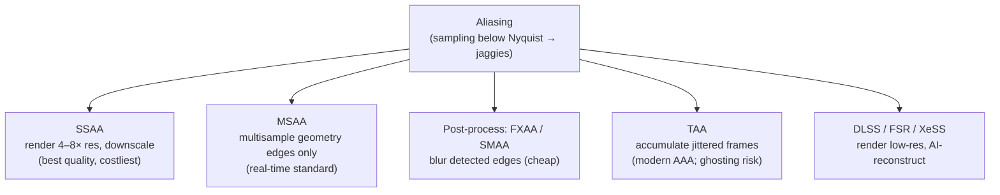

## In simple terms

A diagonal line on a digital display is made of square pixels that must approximate a continuous curve. The result is "jaggies" — a staircase-like edge that looks bad. Anti-aliasing smooths these edges by blending the edge pixel with a mix of foreground and background colour, making the transition look smooth even though the display is still pixel-based. Different techniques trade quality for performance: from simply rendering at 4× resolution (brute force) to clever post-processing filters to AI-based upscaling (DLSS).

## The Visual Map



## More detail

The **aliasing problem**: a signal sampled below its Nyquist frequency shows high-frequency detail folding back as low-frequency artefacts. A 1-pixel diagonal edge on a discrete grid contains frequencies above the display's Nyquist limit, producing the staircase. Techniques to fix it span a cost/quality spectrum:

- **Supersampling (SSAA)** — render at 2×–8× the output resolution and downscale; the highest quality (each pixel averages 4–64 subpixels) but cost scales with sample count, so it's used offline, rarely in real-time games.
- **Multisample (MSAA)** — the real-time standard: test geometry at multiple sample points per pixel but shade once per pixel, blending edge pixels by how many samples land inside. 4× MSAA adds ~30–50% GPU cost and handles geometry edges but not alpha-tested transparency.
- **Post-process (FXAA, SMAA)** — analyse the final image, find high-contrast edges, and blur them; very cheap (~1–2 ms) but can blur things it shouldn't (text, thin geometry).
- **Temporal (TAA)** — accumulate jittered samples across frames using motion vectors; near-8× SSAA quality at near-zero per-frame cost, the AAA standard since ~2016, at the cost of ghosting and blur.
- **AI upscaling (DLSS/FSR/XeSS)** — render at low internal resolution and reconstruct a high-res image; DLSS often looks better than native 4K with TAA while running much faster, and these are now the dominant AA approach in modern games. Path tracing also anti-aliases naturally, since many rays per pixel are themselves supersampling.

## Under the Hood

Anti-aliasing is fundamentally about **coverage**: instead of a pixel being fully in or out of a shape, compute the *fraction* it covers and shade proportionally. Supersampling does this by testing many sub-positions inside each pixel — the grey value is just the average:

```python
def covered(px, py, samples=4):
    # Edge: the shape is everything below the line y = x (a diagonal).
    # Sample an NxN grid inside the pixel and average coverage.
    inside = 0
    for sy in range(samples):
        for sx in range(samples):
            x = px + (sx + 0.5) / samples
            y = py + (sy + 0.5) / samples
            if y < x:                     # below the diagonal = inside the shape
                inside += 1
    return inside / (samples * samples)

ramp = " .:-=+*#%@"
for py in range(10):
    row = ""
    for px in range(20):
        c = covered(px * 1.0, py * 1.0)   # 0..1 coverage
        row += ramp[min(len(ramp)-1, int(c * len(ramp)))]
    print(row)
```

Aliased rendering would print only full `@` or blank; the partial coverage values are exactly the soft edge that makes the diagonal look smooth.

## Engineering Trade-offs

- **Quality vs GPU cost.** SSAA is the gold standard but multiplies pixel work 4–16×; MSAA limits the extra work to edges; post-process AA is nearly free but lower quality.
- **Sharpness vs stability.** FXAA/TAA remove jaggies but soften detail; TAA's temporal accumulation adds ghosting on fast motion in exchange for stable edges.
- **Native render vs AI reconstruction.** DLSS/FSR render fewer pixels and reconstruct, gaining big performance — at the risk of reconstruction artefacts and (for DLSS) vendor lock-in.
- **Memory bandwidth vs coverage accuracy.** More MSAA samples mean more depth/colour samples per pixel, trading bandwidth for smoother edges.

## Real-world examples

- Fortnite, Cyberpunk 2077, Hogwarts Legacy: all use DLSS as a default AA path, typically rendering at ~66% resolution then upscaling to 4K.
- Halo: The Master Chief Collection uses MSAA + TAA for its older titles.
- Minecraft (Java) offers FXAA; Minecraft RTX uses path tracing, which anti-aliases naturally.
- Web browsers use subpixel rendering for text anti-aliasing — a related but distinct technique.

## Common misconceptions

- **"More AA = always better."** TAA can blur and ghost; FXAA softens fine detail. The "best" method depends on content and performance budget.
- **"DLSS is just upscaling."** DLSS uses a trained neural network that reconstructs detail missing from the lower-resolution input — often adding detail that wasn't in the original render, not just interpolating pixels.

## Try it yourself

Anti-alias a diagonal edge by supersampling coverage and watch the soft grey transition appear (`python3` only):

```bash
python3 - <<'EOF'
def cov(px,py,n=4):
    return sum(1 for sy in range(n) for sx in range(n)
               if py+(sy+0.5)/n < px+(sx+0.5)/n)/(n*n)
ramp=" .:-=+*#%@"
for py in range(9):
    print("".join(ramp[min(9,int(cov(px,py)*10))] for px in range(18)))
EOF
```

## Learn next

- [Subpixel rendering](/t/subpixel-rendering) — a related anti-aliasing technique specialised for text on LCDs
- [Rasterization](/t/rasterization) — the stage where coverage and MSAA samples are computed
- [HDR](/t/hdr) — another axis of display quality, affecting how blended edges map to luminance
- [Color management](/t/color-management) — correct blending of edge colours depends on the right color space
