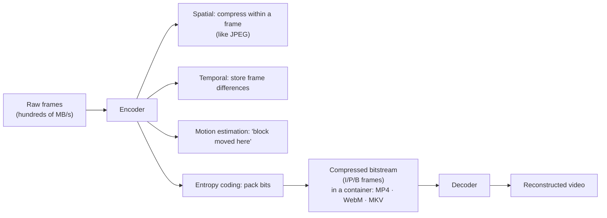

## In simple terms

Raw audio and video are huge. A second of 1080p60 raw video is hundreds of megabytes. A **codec** ("coder/decoder") is the algorithm that squeezes that down to a few megabits per second on the way out, and reconstructs a visually-similar copy on the way back in.

## The Visual Map



## More detail

Video codecs exploit **spatial redundancy** within a frame (like JPEG does for images), **temporal redundancy** between frames (most of one frame looks like the previous one, so encode the difference), **motion estimation** (describe how blocks of pixels moved between frames), and **entropy coding** (pack the bits efficiently). Frames come in types: **I-frames** (intra) are encoded from scratch and act as random-access points; **P-frames** (predicted) store differences from the previous frame; **B-frames** (bidirectional) reference both past and future.

Major video codecs form a generational ladder: **H.264/AVC** (universal compatibility, modest compression), **H.265/HEVC** (better, patent-encumbered, common on Apple devices), **AV1** (royalty-free, ~30% smaller than H.265 for the same quality, with hardware decode now common), **VP9** (royalty-free, the YouTube workhorse and AV1's predecessor), and **H.266/VVC** (next-gen, rolling out). Audio codecs include Opus (modern, free), AAC (Apple/streaming), MP3 (legacy), and FLAC (lossless). Codecs are wrapped in **containers** — MP4, WebM, MKV, MOV — that hold the video, audio, subtitles, and metadata; the codec is what's *inside*. The move toward royalty-free codecs (AV1, Opus) is a major industry trend.

## Under the Hood

The biggest win in any video codec is **temporal prediction**: instead of storing each frame in full, store one full keyframe and then only the *differences*. On footage where little changes between frames, the difference frames are mostly zeros — and zeros compress to almost nothing:

```python
import zlib

# Three 8-pixel greyscale "frames": a small object shifts right by one pixel
f0 = bytes([0, 0, 40, 40, 0, 0, 0, 0])
f1 = bytes([0, 0, 0, 40, 40, 0, 0, 0])
f2 = bytes([0, 0, 0, 0, 40, 40, 0, 0])

# Naive: store every frame in full
full = zlib.compress(f0 + f1 + f2, 9)

# Codec way: I-frame f0, then per-pixel deltas for P-frames
def delta(a, b): return bytes((y - x) & 0xFF for x, y in zip(a, b))
pframes = zlib.compress(f0 + delta(f0, f1) + delta(f1, f2), 9)

print(f"store full frames : {len(full)} bytes")
print(f"I-frame + deltas  : {len(pframes)} bytes")
```

Real codecs add motion vectors (so a moving block costs a tiny "+1 pixel right" instead of a full delta) and a DCT on the residual, but the core idea is this: encode change, not repetition.

## Engineering Trade-offs

- **Bitrate vs quality.** Lower bitrate means smaller files and cheaper streaming but visible blocking and smearing; the encoder's job is to spend bits where the eye notices.
- **Encode cost vs decode cost.** Newer codecs (AV1, VVC) compress far better but encode much slower; decode must stay cheap enough for battery-powered playback, hence hardware decoders.
- **Compression efficiency vs compatibility/royalties.** HEVC and AV1 beat H.264 substantially but carry licensing complexity or limited old-device support; H.264 remains the safe universal floor.
- **Latency vs efficiency.** B-frames and large GOPs improve compression but add buffering delay — unacceptable for video calls, which favour low-latency, keyframe-heavy configs.

## Real-world examples

- Netflix streams in AV1 (and HEVC) to save bandwidth.
- A WhatsApp voice note uses Opus.
- YouTube delivers different codecs to different devices based on what they can decode in hardware.
- A single Netflix title is encoded into dozens of variants (codecs, bitrates, resolutions) so adaptive streaming can pick the right one for each viewer.

## Common misconceptions

- **"MP4 is a codec."** MP4 is a container. The video inside it is usually H.264 or HEVC.
- **"Lossless video is just impractical."** It's used in production and archiving; broadcast and streaming use lossy codecs because the size difference is enormous.

## Try it yourself

See temporal compression in action — store three near-identical frames in full versus as keyframe + deltas (`python3` only):

```bash
python3 - <<'EOF'
import zlib
f0=bytes([0,0,40,40,0,0,0,0]); f1=bytes([0,0,0,40,40,0,0,0]); f2=bytes([0,0,0,0,40,40,0,0])
d=lambda a,b: bytes((y-x)&0xFF for x,y in zip(a,b))
print("full frames     :", len(zlib.compress(f0+f1+f2,9)), "bytes")
print("I-frame + deltas:", len(zlib.compress(f0+d(f0,f1)+d(f1,f2),9)), "bytes")
EOF
```

## Learn next

- [Video codec](/t/video-codec) — codecs specialised for the temporal structure of video
- [Image format](/t/image-format) — the still-image equivalent of the compress/decompress trade
- [JPEG](/t/jpeg) — the DCT-based spatial compression a codec reuses inside each frame
- [Pixel](/t/pixel) — the raw data codecs ultimately reconstruct

