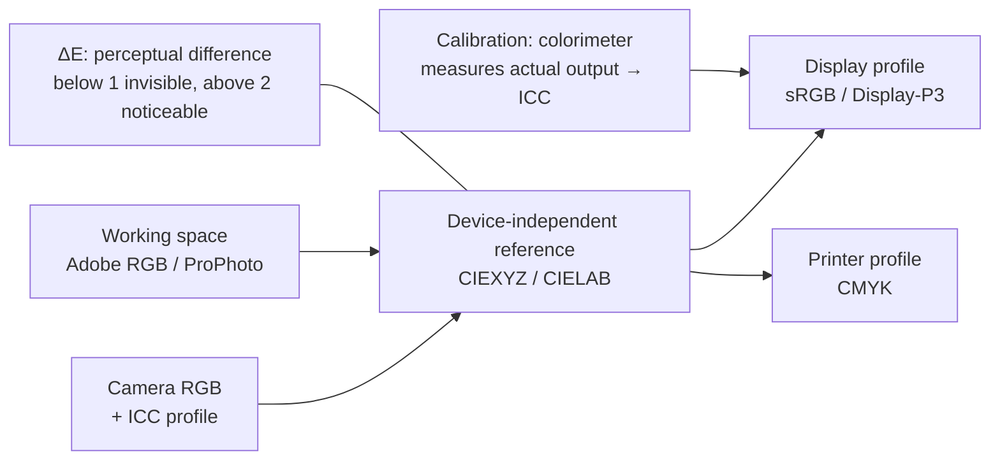

## In simple terms

The value (255, 0, 0) for red does not describe an absolute colour — it means "maximum red according to this device." Different devices define "maximum red" differently: a camera's red is not the same red as a monitor's, which is different again from a printer's. Colour management solves this by labelling colours with their device-specific context (an ICC profile), then converting between devices through a device-independent reference (CIELAB or CIEXYZ), so a photo looks the same on a calibrated monitor as it will in print.

## The Visual Map



## More detail

**The problem:** every device has its own gamut (range of reproducible colours) and its own transfer curve. `(255, 0, 0)` in sRGB is a specific shade of red; the same value in Adobe RGB 1998 is a deeper, more saturated red. Display an Adobe RGB image on an sRGB monitor without conversion and the colours look wrong.

Common spaces: **sRGB** (the web/consumer default, ~35% of visible colours, gamma ≈ 2.2); **Adobe RGB 1998** (wider, especially greens/cyans, for pro photography); **Display-P3** (Apple's display space based on DCI-P3, ~45% wider than sRGB in reds/greens, standard on Apple displays, with CSS `color(display-p3 1 0 0)`); **Rec. 2020** (the HDR target, ~75% of visible colours); and **CIELAB** (a device-independent *perceptual* space used as the reference for conversions). **ICC profiles** (International Color Consortium) describe a device's colour characteristics by mapping its RGB/CMYK to CIELAB; they're embedded in images, attached to displays by OS calibration, and used by printers.

The **workflow**: a camera captures in its native space and tags an ICC profile; a colour-managed app converts to a working space; the display renders by converting from the working space to the display's ICC profile (measured by a colorimeter); and at export/print another conversion targets the output device (sRGB for web, CMYK for press). Operating systems provide this (macOS **ColorSync**, Windows **ICM/WCS**), and Chrome/Safari colour-manage images with ICC profiles. **ΔE (Delta E)** quantifies perceptual difference — below 1 is invisible to most people, above 2 is noticeable, above 5 obvious; professional grading targets ΔE below 2 from source to output. Colour management is invisible when correct and catastrophic when wrong: a UI designed on a P3 MacBook looks oversaturated on an sRGB monitor if unmanaged.

## Under the Hood

The reason `(255,0,0)` is ambiguous becomes concrete when you convert it to **CIEXYZ** (an absolute, device-independent space) through two different displays' primaries. Same code in, different physical colour out — which is exactly what a colour-managed pipeline corrects for:

```python
# Each row maps linear R,G,B → CIE XYZ for that display's primaries (D65)
SRGB = [[0.4124, 0.3576, 0.1805],
        [0.2126, 0.7152, 0.0722],
        [0.0193, 0.1192, 0.9505]]
P3   = [[0.4866, 0.2657, 0.1982],     # Display-P3: redder, wider gamut
        [0.2290, 0.6917, 0.0793],
        [0.0000, 0.0451, 1.0439]]

def to_xyz(M, rgb):
    return [sum(M[i][j]*rgb[j] for j in range(3)) for i in range(3)]

red = [1.0, 0.0, 0.0]                 # "maximum red" in linear RGB
print("pure red (1,0,0) as absolute XYZ:")
print("  on sRGB display  :", [round(v, 3) for v in to_xyz(SRGB, red)])
print("  on Display-P3    :", [round(v, 3) for v in to_xyz(P3, red)])
print("Different XYZ -> physically different reds for the SAME code.")
```

A colour-managed app reads each image's ICC profile, converts its values into this shared XYZ/Lab reference, then out to the display's profile — so the *physical* colour stays constant across devices.

## Engineering Trade-offs

- **Wide gamut vs compatibility.** P3/Rec. 2020 displays show richer colour, but content shipped untagged looks oversaturated on the sRGB devices that assume sRGB.
- **Accuracy vs cost.** Hardware calibration with a colorimeter and factory-calibrated panels achieves ΔE below 2 but costs money; consumer panels vary by ΔE 3–10 uncalibrated.
- **Per-step management vs simplicity.** Tracking and converting colour at every stage is correct but complex; assuming sRGB everywhere is simple and increasingly wrong on modern displays.
- **Tagging discipline vs convenience.** Always embedding/declaring colour spaces guarantees fidelity but adds metadata and process; untagged files force software to guess (usually sRGB).

## Real-world examples

- Apple's Photos on iOS is fully colour-managed: P3 images display correctly on P3 screens; sRGB images are converted up to P3.
- Netflix masters in DCI-P3 (or Rec. 2020 for HDR); colour management keeps it correct on both SDR sRGB monitors and HDR P3 TVs.
- Chrome on macOS applies colour management to images with embedded ICC profiles; untagged images are assumed sRGB.
- Print production runs sRGB → Adobe RGB → press CMYK; mismanaged conversions cause expensive colour shifts.

## Common misconceptions

- **"PNG and JPEG are always sRGB."** Only if tagged as sRGB. An untagged file has no declaration — software must assume a space (usually sRGB).
- **"Colour management is only for professionals."** Wide-gamut mobile displays (all recent iPhones, most flagship Androids) make it essential for app and web developers.

## Try it yourself

Show that an RGB triplet is meaningless without a colour space — convert pure red through two displays' primaries and get two different absolute colours (`python3` only):

```bash
python3 - <<'EOF'
SRGB=[[0.4124,0.3576,0.1805],[0.2126,0.7152,0.0722],[0.0193,0.1192,0.9505]]
P3  =[[0.4866,0.2657,0.1982],[0.2290,0.6917,0.0793],[0.0000,0.0451,1.0439]]
xyz=lambda M,c:[round(sum(M[i][j]*c[j] for j in range(3)),3) for i in range(3)]
red=[1,0,0]
print("red on sRGB :", xyz(SRGB,red))
print("red on P3   :", xyz(P3,red), "<- same code, different real colour")
EOF
```

## Learn next

- [Color space](/t/color-space) — the spaces colour management converts between
- [HDR](/t/hdr) — needs wide colour spaces and colour-managed tone mapping
- [Anti-aliasing](/t/anti-aliasing) — correct edge blending depends on the right colour space
- [Subpixel rendering](/t/subpixel-rendering) — where managed colours meet physical subpixels
