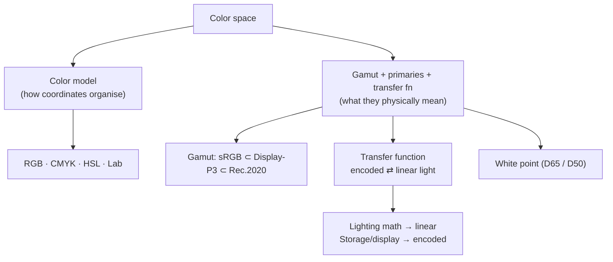

## In simple terms

The same triplet `(255, 0, 0)` can mean a different shade of red depending on which **color space** it's in. A color space defines what every numeric value actually corresponds to as light hitting your eye. Get this wrong and your reds look orange, your skin tones look ill, and your HDR video looks washed out.

## The Visual Map



## More detail

Color spaces have two parts: a **color model** (how coordinates are organised — RGB for screens, CMYK for printing, HSL/HSV for intuitive editing, Lab for perceptual work) and a **gamut + primaries + transfer function** that say what those coordinates *physically mean*.

Common RGB color spaces include **sRGB** (the long-standing web/desktop default, limited gamut, gamma ≈ 2.2), **Display-P3** (wider gamut, the default on modern Apple displays, ~25% larger than sRGB), **Adobe RGB** (print/photo working space), **Rec. 709** (HDTV, essentially sRGB), **Rec. 2020 / Rec. 2100** (UHD/HDR), and **DCI-P3** (cinema). Three details matter at every step: the **transfer function** (gamma/PQ/HLG) converts between linear light and the encoded value — real lighting math must be done in linear, while the stored value is non-linear; the **white point** defines what "white" looks like (D65 for most displays, D50 for print); and **wide-gamut/HDR** require not just more bits but knowing the color space at every stage of the pipeline.

If color-space metadata is lost or wrong, software typically assumes sRGB — which is why HDR videos often look flat in old apps and modern photos look oversaturated in old browsers. Color accuracy underpins design, photography, video, and any UI that must look the same across devices.

## Under the Hood

The single most consequential operation is the **transfer function**: sRGB stores a *gamma-encoded* value, but blending, resizing, and lighting are only correct in *linear* light. Decode to linear, do the math, re-encode — skip this and your gradients and blends come out visibly wrong:

```python
def srgb_to_linear(c):           # c in 0..1
    return c / 12.92 if c <= 0.04045 else ((c + 0.055) / 1.055) ** 2.4

def linear_to_srgb(c):
    return c * 12.92 if c <= 0.0031308 else 1.055 * c ** (1 / 2.4) - 0.055

# Average black (0) and white (1) — the "50% grey" question
a, b = 0.0, 1.0
naive = (a + b) / 2                              # blend in gamma space
correct = linear_to_srgb((srgb_to_linear(a) + srgb_to_linear(b)) / 2)
print(f"naive  midpoint (wrong): {naive*255:.0f}/255")    # 128 — too dark
print(f"linear midpoint (right): {correct*255:.0f}/255")  # ~188 — perceptually mid
```

The "wrong" answer (128) is why naively-resized images and CSS gradients can look muddy: the blend happened in the encoded space instead of linear light.

## Engineering Trade-offs

- **Wide gamut vs compatibility.** Display-P3/Rec. 2020 show richer colours, but content shipped without correct tags looks oversaturated on the many sRGB devices that assume sRGB.
- **Linear vs encoded storage.** Linear light is correct for math but wastes bits on bright values the eye can't distinguish; gamma/PQ encoding allocates bits where vision is sensitive at the cost of needing decode/encode steps.
- **Bit depth vs banding.** 8-bit is compact but bands on smooth gradients in wide-gamut/HDR; 10–12 bit fixes banding at higher storage and bandwidth cost.
- **Per-step color management vs simplicity.** Tracking the color space at every pipeline stage is correct but complex; assuming sRGB everywhere is simple and usually wrong on modern displays.

## Real-world examples

- Editing an HDR video in an sRGB tool yields washed-out, clipped highlights.
- A web design that looks great on a Display-P3 MacBook can look dull on an sRGB monitor — and vice versa.
- ICC profiles are how operating systems tell apps the exact characteristics of a display.
- Apple's ProRes RAW and Sony's V-Log capture in very wide color spaces (Rec. 2020, S-Gamut3) so colourists can grade into Rec. 709 for delivery without clipping.

## Common misconceptions

- **"RGB is RGB."** Every RGB triplet is *meaningless* without a color space.
- **"More bits = better color."** Bit depth helps with banding; gamut and accuracy come from the color space, not the bit count.

## Try it yourself

Prove gamma matters: blend black and white correctly (in linear light) versus naively, and see the two greys differ (`python3` only):

```bash
python3 - <<'EOF'
to_lin = lambda c: c/12.92 if c<=0.04045 else ((c+0.055)/1.055)**2.4
to_srgb= lambda c: c*12.92 if c<=0.0031308 else 1.055*c**(1/2.4)-0.055
naive = 0.5
correct = to_srgb((to_lin(0.0)+to_lin(1.0))/2)
print(f"blend black+white  naive: {round(naive*255)}/255   linear-correct: {round(correct*255)}/255")
EOF
```

## Learn next

- [Pixel](/t/pixel) — the element whose RGB numbers a color space interprets
- [Image format](/t/image-format) — where color-space tags (ICC profiles) get stored
- [Color management](/t/color-management) — the system that converts between color spaces across devices
- [HDR](/t/hdr) — wide color spaces and transfer functions taken to high dynamic range
