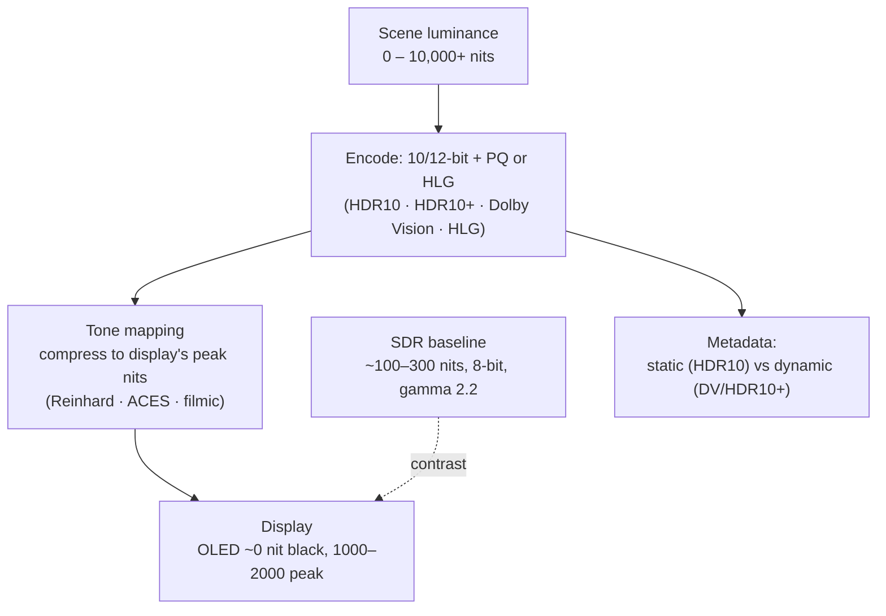

## In simple terms

A candle flame and a snow-covered landscape on a sunny day differ in brightness by about a factor of one million. A standard (SDR) display can only show a factor of about 1,000. High Dynamic Range (HDR) displays show up to a factor of one million — a much closer approximation of what eyes see in reality. A candle in a dark room actually looks like a point of fire rather than a washed-out blob. HDR requires new display hardware (local-dimming LCD or OLED), new content formats (HDR10, Dolby Vision), and new software to correctly map the wide range of brightness values to what each display can show.

## The Visual Map



## More detail

**Dynamic range** is the ratio of brightest to darkest luminance a display can show simultaneously, measured in nits (cd/m²). SDR is typically 100–300 nits peak with ~1000:1 contrast; HDR reaches 600–10,000+ nits peak (OLED ~1000–2000 with near-0 black, giving ~1,000,000:1 contrast). HDR also needs more **bit depth** — 10-bit (1024 levels) or 12-bit instead of SDR's 8-bit — to span that range without visible banding.

**Standards** include **HDR10** (open, royalty-free, PQ transfer function, 10-bit, *static* metadata describing the whole programme), **HDR10+** (Samsung's open standard with *dynamic* per-scene metadata), **Dolby Vision** (proprietary, 12-bit, dynamic per-frame metadata, licensed displays), and **HLG** (broadcast-oriented, backward-compatible with SDR, no metadata). **Transfer functions** differ from SDR's gamma 2.2: HDR uses **PQ** (SMPTE ST 2084), a perceptually-uniform curve with absolute luminance values, or HLG's log-gamma hybrid that degrades gracefully to SDR.

**Tone mapping** is the crucial step: when 10,000-nit content is shown on a 1000-nit TV, the brightness must be compressed — algorithms like ACES, Reinhard, and filmic preserve highlight and shadow detail differently. Games render into a floating-point (FP16) buffer internally and map to the display's PQ signal on output. The recurring problems are that content mastered on a 4000-nit reference monitor looks different on a 600-nit consumer panel (dynamic metadata helps), and that the same "HDR" label spans wildly different hardware capabilities.

## Under the Hood

Tone mapping is where HDR meets the limits of real hardware. The Reinhard operator — `L / (1 + L)` — is the classic compressor: it leaves dark detail almost untouched while gently rolling very bright values toward the display's peak, so nothing simply clips to white:

```python
def reinhard(L):                 # L = scene luminance (relative)
    return L / (1 + L)           # maps [0, ∞) → [0, 1)

def reinhard_extended(L, Lwhite):    # lets values up to Lwhite reach full white
    return L * (1 + L / (Lwhite * Lwhite)) / (1 + L)

print(f"{'scene L':>8}{'Reinhard':>12}{'extended(8)':>14}")
for L in [0.1, 0.5, 1, 2, 4, 8, 20, 100]:
    print(f"{L:>8.1f}{reinhard(L):>12.3f}{reinhard_extended(L, 8):>14.3f}")
```

Notice dark values (0.1 → ~0.09) pass through nearly linearly while bright values (100 → ~0.99) are squeezed into the top of the range — preserving shadow detail and highlight separation instead of blowing out.

## Engineering Trade-offs

- **Peak brightness vs panel cost/power.** Higher nits and local dimming make highlights pop but cost panel complexity, power, and heat; cheap "HDR" panels accept a signal they can't actually display.
- **Static vs dynamic metadata.** HDR10's single metadata set is simple and universal but tone-maps every scene the same; Dolby Vision/HDR10+ adapt per scene at the cost of licensing or limited support.
- **Bit depth vs bandwidth.** 10–12 bit removes banding across the wide range but increases data rate and pipeline width versus 8-bit SDR.
- **Authoring control vs consistency.** Mastering for a bright reference monitor maximises impact but looks different across the fragmented field of consumer displays.

## Real-world examples

- Netflix serves Dolby Vision to capable TVs with HDR10 as the fallback.
- Apple's Extended Dynamic Range (EDR) on macOS and the Pro Display XDR support up to ~1600 nits sustained for HDR reference work.
- Xbox Series X and PlayStation 5 support HDR10 and Dolby Vision; most modern games ship HDR rendering paths.
- iPhone Pro models record video in HDR (HLG/Dolby Vision) and have ~2000-nit displays.

## Common misconceptions

- **"Any HDR badge means better quality."** Many cheap "HDR" monitors lack local dimming or sufficient peak brightness; they accept an HDR signal but can't render the wide range. Look for DisplayHDR 1000+ or OLED.
- **"HDR is only for movies."** Game HDR, professional UI (Apple's EDR), and medical imaging all use HDR for different reasons.

## Try it yourself

Apply Reinhard tone mapping and watch huge scene luminances fold into a displayable 0–1 range without clipping (`python3` only):

```bash
python3 - <<'EOF'
reinhard = lambda L: L/(1+L)
print(f"{'scene nits (rel)':>16}{'displayed (0-1)':>16}")
for L in [0.05, 0.2, 1, 3, 10, 50, 500]:
    print(f"{L:>16.2f}{reinhard(L):>16.3f}")
EOF
```

## Learn next

- [Color management](/t/color-management) — HDR needs wide color spaces (Rec. 2020, P3) and accurate conversions
- [Color space](/t/color-space) — the primaries and transfer functions (PQ/HLG) HDR depends on
- [Anti-aliasing](/t/anti-aliasing) — another facet of display image quality
- [Subpixel rendering](/t/subpixel-rendering) — a related display-precision technique for text
