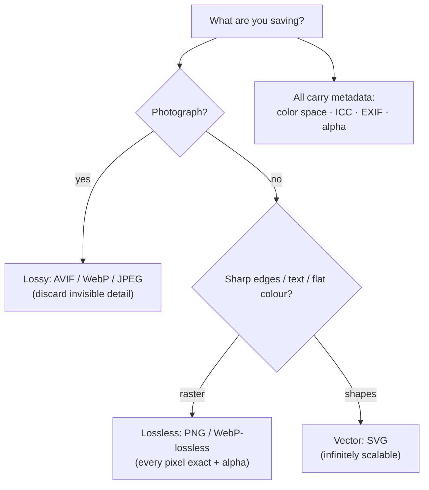

## In simple terms

Two pictures with the same pixels can take dramatically different amounts of disk space depending on the **image format** you save them in. Each format is a compromise: how small is the file, how good does it look, does it support animation, does it preserve every pixel exactly, can old software read it?

## The Visual Map



## More detail

Major formats trade compression against features. **JPEG** is lossy and universal — great for photos, big at low compression. **PNG** is lossless — great for UI, screenshots, and sharp edges. **GIF** is a lossless 256-colour palette format with animation, largely superseded. **WebP** offers both lossy and lossless modes with better compression than JPEG/PNG across nearly all browsers. **AVIF** is modern with much better compression than WebP. **HEIC** is Apple's default, built on HEVC video compression. **SVG** stores lines and shapes rather than pixels and scales infinitely. **JPEG XL** is a high-quality successor with uneven adoption.

For the web the practical guidance is: photos → AVIF (with WebP/JPEG fallback); UI graphics → SVG when vector, PNG when raster; animation → WebM/AVIF/MP4 video, rarely GIF. **Lossless ≠ uncompressed**: PNG and WebP-lossless both apply lossless compression. Lossy discards information you probably won't see; lossless keeps every bit. Formats also carry metadata — color space (sRGB vs Display-P3), ICC profile, EXIF camera info, animation frames, alpha channel. Image weight is one of the biggest factors in page load time, and choosing the right format and quality can shrink a site by 50%+ with no visible difference.

## Under the Hood

The whole "lossless vs lossy" split comes down to **how compressible the pixels are**. Lossless coders exploit *redundancy* — repeated or predictable bytes. A flat logo is hugely redundant and shrinks enormously; a noisy photograph has little redundancy, so lossless barely helps and lossy compression earns its keep. `zlib` (the DEFLATE engine inside PNG) makes this measurable:

```python
import zlib, random
random.seed(0)

W = H = 256
flat  = bytes([200, 50, 50] * (W * H))                       # solid colour
noise = bytes(random.randrange(256) for _ in range(W*H*3))   # random pixels

for name, raw in [("flat logo", flat), ("photo-like noise", noise)]:
    comp = zlib.compress(raw, 9)
    print(f"{name:18}: {len(raw):>7}B -> {len(comp):>7}B  "
          f"({len(raw)/len(comp):5.1f}x lossless)")
```

The flat image compresses hundreds of times over; the noisy one barely at all — which is exactly why PNG is tiny for logos and bloated for photographs, and why photos need lossy formats.

## Engineering Trade-offs

- **Lossy vs lossless.** Lossy (JPEG/AVIF) shrinks photos 10×+ by discarding imperceptible detail but degrades on re-save and smears sharp edges; lossless (PNG) is pixel-perfect but large for photos.
- **Compression ratio vs CPU/compat.** Newer codecs (AVIF) encode far smaller but cost more CPU to encode and may not decode on old clients; JPEG is bulky but universal and instant.
- **Raster vs vector.** SVG is resolution-independent and tiny for shapes but unsuitable for photographic content; raster is universal but fixed-resolution.
- **Quality knob vs predictability.** A lower JPEG/AVIF quality setting saves bytes but introduces artefacts; the right point is content-dependent and only verifiable by eye.

## Real-world examples

- A 2 MB JPEG often re-encodes to a 400 KB AVIF with no visible loss.
- A PNG used for a JPEG-friendly photo can be 5–10× larger than necessary.
- SVG is the right answer for icons and logos at any size.
- AVIF now matches HEIC quality at smaller sizes and is royalty-free, which is why YouTube and Netflix shifted thumbnails and previews onto it.

## Common misconceptions

- **"PNG is always best quality."** PNG is lossless for raster; for photos, a high-quality WebP/AVIF is visually identical and far smaller.
- **"AVIF is too new."** Browser support is now near-universal.

## Try it yourself

Measure why format choice matters — compress a flat region versus photographic noise and watch the ratios diverge (`python3` only):

```bash
python3 - <<'EOF'
import zlib, random
random.seed(1)
N = 256*256*3
flat  = bytes([180,180,180])*(N//3)
noise = bytes(random.randrange(256) for _ in range(N))
for name, raw in [("flat (PNG wins)", flat), ("noise (needs lossy)", noise)]:
    c = zlib.compress(raw, 9)
    print(f"{name:22} {len(raw)//1024}KB -> {len(c)//1024 or 1}KB  ({len(raw)/len(c):.0f}x)")
EOF
```

## Learn next

- [Pixel](/t/pixel) — the raw data an image format encodes
- [Color space](/t/color-space) — the metadata a format must carry to render colours correctly
- [JPEG](/t/jpeg) — the dominant lossy format for photographs
- [PNG](/t/png) — the dominant lossless format for graphics and text
