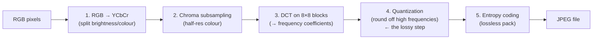

## In simple terms

**JPEG** is the format behind most photographs you see online. Its trick is **lossy compression**: it permanently throws away some image detail to make the file far smaller — but it throws away the details your eyes are least likely to notice, so a JPEG can be a fraction of the original size while still looking fine. That trade-off is why a photo that would be tens of megabytes raw becomes a couple hundred kilobytes as a JPEG, making photography on the web practical.

## The Visual Map



## More detail

JPEG (named for the Joint Photographic Experts Group, 1992) compresses by exploiting limits of human vision in roughly five steps: **(1) Color transform** to a brightness + colour representation (YCbCr), separating luminance from chrominance; **(2) Chroma subsampling**, storing colour at lower resolution than brightness because eyes are far more sensitive to brightness detail; **(3) Discrete Cosine Transform (DCT)**, breaking the image into 8×8 blocks and expressing each as a sum of frequency patterns; **(4) Quantization**, aggressively rounding off the high-frequency (fine-detail) components — this is where data is actually discarded, controlled by a "quality" setting; and **(5) Entropy coding**, losslessly packing what remains.

Two consequences follow. It's **lossy and generational** — each re-save discards more detail, so repeatedly editing and re-saving degrades the image ("generation loss"), and at high compression you see **artifacts** (blocky 8×8 regions and "ringing" around sharp edges). And it's **bad at sharp edges and text** — the frequency-based approach suits smooth photographic gradients but smears crisp lines, which is exactly where [PNG](/t/png) wins. JPEG has no transparency; successors (JPEG 2000, WebP, AVIF, JPEG XL) compress better, but classic JPEG remains nearly universal, and its DCT-based approach is the same family of techniques used in [video codecs](/t/video-codec).

## Under the Hood

The heart of JPEG is the DCT plus quantization. A DCT turns an 8×8 block of pixels into 8×8 *frequency coefficients*, concentrating most energy in the top-left (low frequencies). Zeroing the small high-frequency coefficients — what quantization does — throws away detail the eye barely sees while leaving the block recognisable:

```python
import math

N = 8
def dct2(block):                       # naive separable 2D DCT
    out = [[0.0]*N for _ in range(N)]
    for u in range(N):
        for v in range(N):
            s = 0.0
            for x in range(N):
                for y in range(N):
                    s += block[x][y]*math.cos((2*x+1)*u*math.pi/16)\
                                    *math.cos((2*y+1)*v*math.pi/16)
            cu = (1/math.sqrt(2)) if u==0 else 1
            cv = (1/math.sqrt(2)) if v==0 else 1
            out[u][v] = 0.25*cu*cv*s
    return out

# A smooth gradient block (typical photo content)
block = [[x*8 + y*4 for y in range(N)] for x in range(N)]
coeffs = dct2(block)
kept = sum(1 for r in coeffs for c in r if abs(c) > 5)
print(f"DCT coefficients with |value| > 5: {kept} of {N*N}")
print(f"DC (average) term: {coeffs[0][0]:.1f}   most energy is here")
```

Only a handful of coefficients carry real energy — JPEG stores those precisely and rounds the rest toward zero, which is why photographic blocks compress so well.

## Engineering Trade-offs

- **Quality vs size.** The quantization "quality" knob trades file size against artifacts directly — high quality is near-transparent but large; low quality is tiny but blocky.
- **Lossy compaction vs sharp detail.** DCT excels on smooth gradients but rings around hard edges and text — great for photos, poor for screenshots and line art.
- **Generation loss vs convenience.** Re-saving is easy but each cycle re-quantizes and degrades; lossless editing needs a different master format.
- **Universality vs efficiency.** JPEG decodes everywhere instantly, but AVIF/WebP/JPEG XL reach the same quality at far smaller sizes — at the cost of compatibility and encode time.

## Real-world examples

- Practically every photo on a website or shared by phone is a JPEG.
- A camera's "quality" setting trades file size against compression artifacts — both are the JPEG quantization step in action.
- Over-compressed images showing blocky squares and halos around edges are classic JPEG artifacts.

## Common misconceptions

- **"JPEG is lossless if I set quality to 100."** Even at maximum quality, JPEG's chroma subsampling and DCT rounding usually discard *some* data; for truly lossless images use [PNG](/t/png).
- **"Re-saving a JPEG doesn't hurt it."** Each save re-compresses and loses more detail; repeated edit-and-save cycles visibly degrade the image.

## Try it yourself

Watch energy compaction — run a DCT on a smooth block and see almost all the signal land in a few low-frequency coefficients (`python3` only):

```bash
python3 - <<'EOF'
import math
N=8
def dct2(b):
    o=[[0.0]*N for _ in range(N)]
    for u in range(N):
        for v in range(N):
            s=sum(b[x][y]*math.cos((2*x+1)*u*math.pi/16)*math.cos((2*y+1)*v*math.pi/16)
                  for x in range(N) for y in range(N))
            cu=1/math.sqrt(2) if u==0 else 1; cv=1/math.sqrt(2) if v==0 else 1
            o[u][v]=0.25*cu*cv*s
    return o
block=[[100+x*5+y*3 for y in range(N)] for x in range(N)]
c=dct2(block)
big=[(u,v) for u in range(N) for v in range(N) if abs(c[u][v])>3]
print(f"{len(big)} of {N*N} coefficients matter; rest round to ~0 (the lossy step)")
EOF
```

## Learn next

- [Image format](/t/image-format) — where JPEG sits among the format choices
- [PNG](/t/png) — JPEG's lossless counterpart for sharp graphics and text
- [Video codec](/t/video-codec) — extends JPEG's DCT idea across frames over time
- [Fourier transform](/t/fourier-transform) — the frequency-domain mathematics the DCT belongs to
