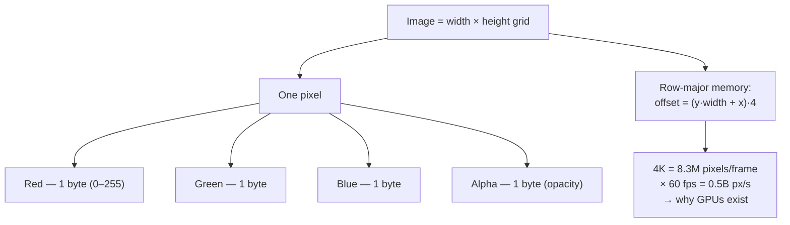

## In simple terms

A pixel ("picture element") is one tiny dot of colour on a screen. A picture is a grid of pixels. The more pixels there are per inch, the sharper the picture looks.

## The Visual Map



## More detail

A pixel's colour is stored as numbers — typically three: how much **red**, **green**, and **blue** it has. With 8 bits per channel that's 256 levels each and about 16.7 million possible colours per pixel. Many displays now use 10 bits per channel ("HDR") for smoother gradients.

A common pixel layout in memory packs the channels as consecutive bytes — Red, Green, Blue, then Alpha (opacity). An "image" is then a width × height grid of these. At 4K (3840 × 2160) that's just over 8 million pixels per frame; at 60 frames per second it's half a billion pixels per second. That is why GPUs exist. Pixels are the unit of every photo you take, every video you watch, and every UI you tap on — the entry point to graphics, compression, and display technology.

## Under the Hood

An image in memory is just a flat array of bytes; the only trick is the **address arithmetic** that turns an `(x, y)` coordinate into an offset. Row-major layout makes that one multiply-add, which is exactly what a GPU does billions of times per second:

```python
W, H, CH = 4, 3, 4              # 4×3 RGBA image
buf = bytearray(W * H * CH)     # all zeros = transparent black

def set_px(x, y, r, g, b, a=255):
    off = (y * W + x) * CH      # row-major offset
    buf[off:off+CH] = bytes((r, g, b, a))

def get_px(x, y):
    off = (y * W + x) * CH
    return tuple(buf[off:off+CH])

set_px(2, 1, 255, 0, 0)         # a red pixel at column 2, row 1
print("pixel (2,1) =", get_px(2, 1))
print("byte offset =", (1 * W + 2) * CH)   # 24
print("total bytes =", len(buf))           # 4*3*4 = 48
```

A GPU's framebuffer is this same flat buffer; texture sampling and rasterisation are elaborate ways of choosing which offsets to read and write.

## Engineering Trade-offs

- **Resolution vs memory/bandwidth.** Doubling each dimension quadruples the pixel count — and the RAM, bandwidth, and shading cost. 4K is 4× the pixels of 1080p.
- **Bit depth vs size.** 8 bits/channel fits 16.7M colours in 3–4 bytes; 10-bit HDR smooths gradients (kills banding) but costs more bits and a wider pipeline.
- **Logical vs physical pixels.** On HiDPI/Retina displays one CSS "pixel" maps to 2×2 (or more) hardware pixels — crisper, but every image must ship at higher density.
- **Premultiplied vs straight alpha.** Premultiplying colour by alpha speeds compositing but loses precision in nearly-transparent pixels — a storage/quality trade.

## Real-world examples

- A 12-megapixel phone camera produces images that are 4032 × 3024 pixels.
- A 4K monitor packs 3840 × 2160 ≈ 8.3 million pixels.
- JPEG and PNG are different ways of compressing those pixels into smaller files.
- A modern smartphone OLED can selectively turn off individual pixels, which is why dark mode genuinely saves battery on those displays (LCD backlighting is always on regardless).

## Common misconceptions

- **"Pixels are little dots of light on the screen."** They are an abstraction in your image. The actual screen subpixels (red/green/blue stripes) are different from the logical pixels in your file.
- **"More megapixels = better camera."** Sensor size, lens quality, and processing usually matter more.

## Try it yourself

Write a real image file by hand — a colour gradient as a PPM (a plain-text image format every viewer understands), no libraries needed:

```bash
python3 - <<'EOF' > gradient.ppm
W, H = 64, 32
print("P3"); print(W, H); print(255)          # PPM ascii header
for y in range(H):
    row = []
    for x in range(W):
        r = x * 255 // (W - 1)                 # red ramps left→right
        b = y * 255 // (H - 1)                 # blue ramps top→bottom
        row += [r, 0, b]
    print(" ".join(map(str, row)))
EOF
head -c 60 gradient.ppm; echo "  ... wrote $(wc -c < gradient.ppm) bytes"
```

Open `gradient.ppm` in any image viewer (or GIMP) to see the gradient you built pixel by pixel.

## Learn next

- [Rasterization](/t/rasterization) — how shapes get turned into grids of pixels
- [Color space](/t/color-space) — what a pixel's RGB numbers actually mean as light
- [Image format](/t/image-format) — how a grid of pixels is compressed into a file
- [Bits](/t/bits) — the binary units a pixel's channels are built from
