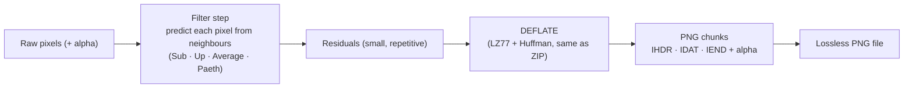

## In simple terms

**PNG** is the format you use when every pixel has to stay exactly right. Unlike [JPEG](/t/jpeg), which throws away detail to shrink photos, PNG is **lossless** — it compresses the file *without* changing a single pixel, so what you save is exactly what you get back. It also supports **transparency**, letting parts of an image be see-through. That makes PNG the natural choice for logos, icons, screenshots, diagrams, and anything with sharp edges or text — the cases where JPEG would introduce ugly smearing.

## The Visual Map



## More detail

PNG (1996) was created partly as a free, patent-unencumbered replacement for the older GIF format. Its key properties are **lossless compression** using the DEFLATE algorithm (the same one in ZIP), usually preceded by a "filter" step that predicts each pixel from its neighbours so the data compresses better — you can save and re-save endlessly with no quality loss; **alpha transparency**, where a full alpha channel gives each pixel a transparency level for smooth edges that blend onto any background (a big improvement over GIF's single transparent colour); and being **sharp-edge friendly**, because without lossy frequency compression, crisp lines, text, and flat colour regions stay perfectly clean.

The trade-off is the mirror image of JPEG: PNG files are **much larger for photographs**, because lossless compression can't exploit the "throw away invisible detail" trick that makes photos compress so well. So the rule of thumb is **photos → JPEG, graphics/logos/screenshots → PNG**. PNG handles flat colour regions extremely well (a solid-colour logo compresses tiny) but struggles to shrink complex photographic gradients. Modern formats like WebP and AVIF offer both lossy and lossless modes, but PNG remains the universal default for lossless web graphics.

## Under the Hood

PNG's secret weapon is the **filter**: before compressing, it replaces each byte with its *difference from a predicted value* (often the pixel to its left). On smooth or repetitive data those differences are tiny and repetitive, so DEFLATE packs them far tighter than the raw pixels. This is the Sub filter and its payoff:

```python
import zlib

# One row of a smooth horizontal gradient
row = bytes(min(x, 255) for x in range(0, 256, 1))

# Sub filter: each byte minus the previous byte (delta encoding)
sub = bytes([(row[i] - (row[i-1] if i else 0)) & 0xFF for i in range(len(row))])

raw_c  = zlib.compress(row, 9)
filt_c = zlib.compress(sub, 9)
print(f"unfiltered: {len(row)}B -> {len(raw_c)}B")
print(f"Sub filter: {len(row)}B -> {len(filt_c)}B   (smaller: residuals repeat)")
```

A real PNG encoder tries several predictors (Sub, Up, Average, Paeth) per row and keeps whichever compresses best — but the principle is always "compress the prediction error, not the pixels".

## Engineering Trade-offs

- **Lossless fidelity vs photo size.** PNG guarantees every pixel but produces files 5–10× larger than JPEG/AVIF on photographs, where the lossless guarantee buys nothing visible.
- **Filter choice vs encode time.** Trying all predictors per row maximises compression but costs CPU; a fixed filter is faster but larger.
- **Alpha transparency vs weight.** A full alpha channel enables clean compositing on any background but adds a fourth channel of data.
- **Compatibility vs modern efficiency.** PNG decodes everywhere, but WebP-lossless and AVIF-lossless usually beat it — at the cost of universal support.

## Real-world examples

- App icons, website logos, and UI buttons are PNGs, using transparency to sit on any background.
- A **screenshot** saved as PNG keeps text crisp and readable, whereas JPEG would blur it.
- A diagram or chart with flat colours and sharp lines compresses to a small, pixel-perfect PNG.

## Common misconceptions

- **"PNG is always better than JPEG because it's lossless."** For photographs, PNG produces far larger files for no visible benefit; JPEG is the right tool there. "Better" depends entirely on the image type.
- **"PNG supports animation."** Standard PNG is a single image; animation needs the separate APNG extension (or GIF/WebP). The base format is static.

## Try it yourself

Prove the filter earns its keep — compress a gradient raw versus delta-filtered and compare (`python3` only):

```bash
python3 - <<'EOF'
import zlib
row = bytes((x*7) % 256 for x in range(4096))           # smooth-ish ramp
sub = bytes([(row[i]-(row[i-1] if i else 0)) & 0xFF for i in range(len(row))])
print("raw  ->", len(zlib.compress(row,9)), "bytes")
print("Sub  ->", len(zlib.compress(sub,9)), "bytes  (PNG filters before DEFLATE)")
EOF
```

## Learn next

- [Image format](/t/image-format) — where PNG fits among lossy and lossless choices
- [JPEG](/t/jpeg) — the lossy counterpart for photographs
- [Color space](/t/color-space) — the colour metadata a PNG can embed (ICC, gamma)
- [Pixel](/t/pixel) — the exact data PNG promises to preserve
