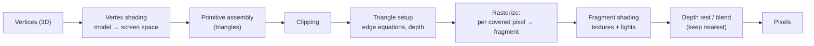

## In simple terms

**Rasterization** is figuring out which pixels are covered by a shape and what colour each one should be. Given a triangle in 3D space, the rasterizer projects it onto the screen and decides which pixels are inside the projection.

## The Visual Map



## More detail

A simplified rasterization pipeline for a single triangle runs: **vertex shading** (transform each vertex from model space to screen space and compute per-vertex attributes); **primitive assembly** (group vertices into triangles); **clipping** (discard or split triangles outside the view); **triangle setup** (compute edge equations and depth gradients); **rasterization proper** (for each pixel inside the triangle, generate a *fragment*); **fragment/pixel shading** (compute final colour, sampling textures and evaluating lights); and **depth test/blending** (keep the nearest fragment, blend transparency). Modern GPUs run this pipeline in massive parallel at billions of triangles per second through APIs like Vulkan, DirectX 12, Metal, and WebGPU.

Rasterization is fast but it answers only "what is at this pixel?" without thinking about light bouncing around. [Ray tracing](/t/ray-tracing) answers visibility and lighting more accurately at a much higher cost, so modern engines blend the two — rasterize the bulk and ray-trace reflections, shadows, or ambient occlusion selectively. Real-time graphics — games, mapping, design tools, virtual production — is fundamentally rasterization: the technique that turns geometry into the pixels you see at 60 or 120 frames per second.

## Under the Hood

The core test is the **edge function**: for each pixel centre, a triangle's three edges each give a signed value, and the pixel is inside when all three share the same sign. Those same edge values double as **barycentric coordinates** for interpolating colour, depth, and texture across the triangle:

```python
def edge(ax, ay, bx, by, px, py):
    return (px - ax) * (by - ay) - (py - ay) * (bx - ax)

# Triangle vertices
A, B, C = (1, 0), (6, 1), (2, 6)
W, H = 8, 8
for y in range(H):
    line = ""
    for x in range(W):
        w0 = edge(*B, *C, x, y)
        w1 = edge(*C, *A, x, y)
        w2 = edge(*A, *B, x, y)
        inside = (w0 >= 0 and w1 >= 0 and w2 >= 0) or (w0 <= 0 and w1 <= 0 and w2 <= 0)
        line += "#" if inside else "."
    print(line)
```

A GPU runs this edge test for thousands of pixels per triangle in parallel; the only additions in real hardware are perspective-correct interpolation and a depth buffer to resolve which triangle is in front.

## Engineering Trade-offs

- **Speed vs lighting accuracy.** Rasterization is extremely fast but only answers coverage — reflections, shadows, and global illumination must be faked, which is where ray tracing wins at far higher cost.
- **Overdraw vs simplicity.** Drawing triangles back-to-front blends transparency correctly but shades hidden pixels wastefully; depth pre-passes and sorting cut overdraw at the cost of complexity.
- **Geometry detail vs throughput.** More triangles add detail until they shrink below pixel size, after which they only cost throughput and alias.
- **Anti-aliasing quality vs cost.** MSAA samples coverage multiple times per pixel for smooth edges, trading memory bandwidth and fill rate for image quality.

## Real-world examples

- A AAA game renders millions of triangles per frame via rasterization.
- A SaaS dashboard with a 3D chart in WebGL uses rasterization under the hood.
- The font on this page is rasterized from vector outlines.
- Real-time path-traced lighting (Cyberpunk 2077's Overdrive mode, Alan Wake 2) finally lets games go *beyond* rasterization for primary visibility — but only with hardware ray-tracing acceleration.

## Common misconceptions

- **"Rasterization is being replaced by ray tracing."** Hybrid pipelines dominate. Pure ray tracing at game frame rates is still a high-end-GPU luxury.
- **"More polygons = better image."** Past a screen-pixel-density threshold, additional geometry stops being visible.

## Try it yourself

Rasterize a triangle to ASCII using edge functions — the exact inside/outside test a GPU runs per pixel (`python3` only):

```bash
python3 - <<'EOF'
def edge(ax,ay,bx,by,px,py): return (px-ax)*(by-ay)-(py-ay)*(bx-ax)
A,B,C=(1,0),(6,1),(2,6)
for y in range(8):
    print("".join("#" if all(e>=0 for e in
        (edge(*B,*C,x,y),edge(*C,*A,x,y),edge(*A,*B,x,y))) else "." for x in range(8)))
EOF
```

## Learn next

- [Pixel](/t/pixel) — the output unit rasterization fills
- [Ray tracing](/t/ray-tracing) — the accuracy-first alternative for lighting and reflections
- [Shader](/t/shader) — the GPU programs that shade each rasterized fragment
- [GPU](/t/gpu) — the parallel hardware that runs the pipeline at billions of triangles per second
