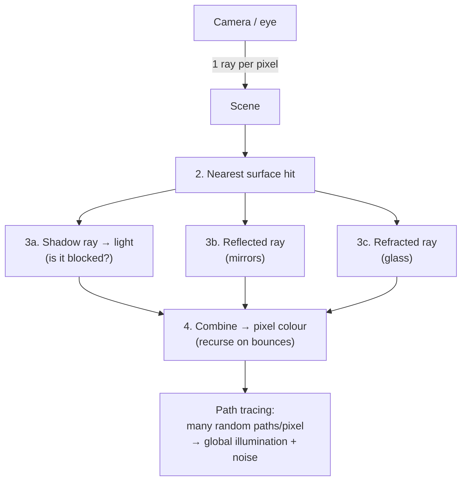

## In simple terms

**Ray tracing** renders images by imitating how light actually behaves. For each [pixel](/t/pixel) on screen, it traces a ray *backwards* from the eye into the scene, finds what that ray hits, and works out how light reaches that point — bouncing off mirrors, passing through glass, casting shadows. Because it simulates the physics of light, ray tracing produces stunningly realistic reflections, refractions, and soft shadows that older methods fake with tricks. The catch is cost: simulating all that light is enormously expensive to compute.

## The Visual Map



## More detail

The contrast with [rasterization](/t/rasterization) is the key. Rasterization asks, for each triangle, "which pixels does this cover?" — fast, but lighting effects like reflections and shadows have to be approximated with clever hacks. Ray tracing instead asks, for each pixel, "what light arrives here?" — slower, but physically grounded. The basic algorithm: shoot a ray from the camera through each pixel; find the nearest surface it intersects; from that point cast more rays — toward light sources (for shadows) and in reflected/refracted directions (for mirrors and glass); then combine the results to compute the pixel's colour, recursing as rays bounce.

**Path tracing** is the modern, more complete form: it traces many random light paths per pixel and averages them to capture **global illumination** — the subtle way light bounces between surfaces — at the cost of noise that must be denoised. It's what film studios have used for offline rendering for years, where a single frame can take hours. The recent shift is **real-time ray tracing**: dedicated hardware (NVIDIA's RTX "RT cores", and support in modern consoles) plus AI denoising and upscaling now make limited ray tracing feasible at interactive frame rates, usually *combined* with rasterization in a hybrid pipeline rather than replacing it.

## Under the Hood

The atomic operation is **ray-surface intersection**. For a sphere it's a quadratic in the ray parameter `t`; if it has a real root, the ray hits. Add a simple Lambert shade (surface brightness ∝ how directly it faces the light) and you can render a lit sphere with no graphics library at all:

```python
import math

def normalize(v):
    m = math.sqrt(sum(c*c for c in v)); return [c/m for c in v]

# Sphere at (0,0,-5), radius 1.5; light direction; camera at origin looking -z
cx, cy, cz, R = 0, 0, -5, 1.5
light = normalize([-1, 1, 1])
shades = " .:-=+*#%@"

for sy in range(12):
    row = ""
    for sx in range(24):
        # ray through this pixel (aspect-corrected)
        dir = normalize([(sx/24-0.5)*4, (0.5-sy/12)*2.5, -1])
        oc = [-cx, -cy, -cz]
        b = 2*sum(d*o for d, o in zip(dir, oc))
        c = sum(o*o for o in oc) - R*R
        disc = b*b - 4*c
        if disc < 0:
            row += " "; continue
        t = (-b - math.sqrt(disc)) / 2                  # nearest hit
        hit = [t*d for d in dir]
        normal = normalize([hit[0]-cx, hit[1]-cy, hit[2]-cz])
        lam = max(0.0, sum(n*l for n, l in zip(normal, light)))   # Lambert
        row += shades[min(len(shades)-1, int(lam*len(shades)))]
    print(row)
```

A production renderer swaps the sphere for a BVH-accelerated mesh and shoots shadow/reflection rays from each hit, but every one of those rays runs this same intersect-and-shade kernel.

## Engineering Trade-offs

- **Physical accuracy vs cost.** Ray tracing gets reflections, refractions, and soft shadows "for free" from the physics, but each pixel may cast many rays — orders of magnitude more work than rasterization.
- **Noise vs render time.** Path tracing converges by averaging random samples; few samples are fast but noisy, many are clean but slow — hence AI denoisers that fake convergence.
- **Real-time vs offline.** Film accepts hours per frame for full path tracing; games ray-trace only select effects atop a rasterized base to hit 60 fps.
- **Acceleration structure vs memory.** A BVH makes intersection logarithmic instead of linear in triangle count, at the cost of building and storing the tree and rebuilding it for animation.

## Real-world examples

- **Pixar and visual-effects studios** render films with path tracing, accepting hours per frame for photorealism.
- **Modern games** (and consoles like the PS5/Xbox Series) use real-time ray tracing for reflections and shadows, often hybridised with rasterization.
- **NVIDIA RTX** GPUs include dedicated ray-tracing cores plus AI denoising to make it interactive.

## Common misconceptions

- **"Ray tracing replaced rasterization."** In real time it usually *augments* it — a hybrid pipeline rasterizes most of the scene and ray-traces specific effects, because full ray tracing is still too expensive for everything.
- **"Ray tracing is new."** The technique dates to the 1970s–80s and has long been standard for offline film rendering; what's new is doing it fast enough for *real-time* graphics.

## Try it yourself

Render a shaded sphere in your terminal with nothing but ray-sphere intersection and Lambert lighting (`python3` only):

```bash
python3 - <<'EOF'
import math
norm=lambda v:[c/math.sqrt(sum(k*k for k in v)) for c in v]
light=norm([-1,1,1]); sh=" .:-=+*#%@"
for sy in range(11):
    line=""
    for sx in range(22):
        d=norm([(sx/22-0.5)*4,(0.5-sy/11)*2.5,-1]); oc=[0,0,5]
        b=2*sum(p*q for p,q in zip(d,oc)); c=sum(q*q for q in oc)-1.5**2
        disc=b*b-4*c
        if disc<0: line+=" "; continue
        t=(-b-math.sqrt(disc))/2; h=[t*k for k in d]
        n=norm([h[0],h[1],h[2]+5]); lam=max(0.0,sum(a*b for a,b in zip(n,light)))
        line+=sh[min(9,int(lam*10))]
    print(line)
EOF
```

## Learn next

- [Rasterization](/t/rasterization) — the faster, coverage-based alternative it hybridises with
- [Shader](/t/shader) — the GPU programs that evaluate ray-traced lighting
- [GPU](/t/gpu) — the hardware (RT cores) that makes real-time ray tracing possible
- [Pixel](/t/pixel) — the per-pixel rays this technique traces
