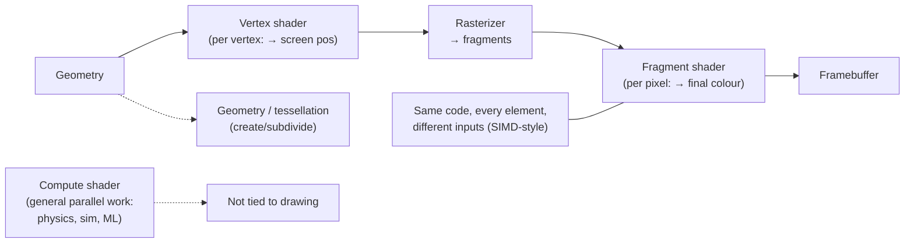

## In simple terms

A **shader** is a small program you write that runs on the [GPU](/t/gpu) to decide how something is drawn. Despite the name, shaders do far more than shading: they compute where each vertex of a 3D model ends up on screen, what colour each [pixel](/t/pixel) becomes, how light reflects, and every visual effect from water ripples to motion blur. The magic is *scale* — a shader runs simultaneously across millions of pixels or vertices, which is exactly what the GPU's thousands of parallel cores are built for.

## The Visual Map



## More detail

In the graphics pipeline, different **shader stages** handle different jobs: a **vertex shader** runs once per vertex, transforming 3D model coordinates into screen positions; a **fragment (pixel) shader** runs once per pixel-sized fragment, computing its final colour including texture lookups and lighting; **geometry/tessellation shaders** optionally create or subdivide geometry on the fly; and **compute shaders** are general-purpose GPU programs not tied to drawing at all (physics, simulation, image processing — the gateway to GPGPU computing).

Shaders are written in specialised languages — **GLSL** (OpenGL/Vulkan), **HLSL** (DirectX), **WGSL** (WebGPU), or Apple's **Metal Shading Language** — and compiled to run on the GPU. They're written to be **data-parallel**: the same shader code runs on every element with different inputs, mirroring the GPU's [SIMD](/t/simd)-style architecture. That flexibility made modern real-time graphics possible — instead of a fixed set of built-in effects, developers and artists can program *arbitrary* visual behaviour, and both [rasterization](/t/rasterization) and [ray tracing](/t/ray-tracing) pipelines rely on shaders to compute final appearance. Because compute shaders let the GPU run general parallel programs, the same mechanism became a foundation for GPU computing far beyond graphics — including the matrix math behind machine learning.

## Under the Hood

A fragment shader is just a pure function from a pixel's coordinates to a colour, called once per pixel. The key idea is that this function is *independent* per pixel, so the GPU runs millions of copies at once. Here a CPU stands in for the GPU, calling the same `shade()` over every pixel of a small image:

```python
import math

def shade(u, v, t=0.0):
    # u,v are normalized 0..1 pixel coords — a animated plasma pattern
    val = (math.sin(u*10 + t) + math.sin(v*10) + math.sin((u+v)*8)) / 3
    return (val + 1) / 2            # brightness 0..1

W, H = 40, 16
ramp = " .:-=+*#%@"
for y in range(H):
    line = ""
    for x in range(W):
        b = shade(x/W, y/H, t=1.2)            # GPU runs this per-pixel in parallel
        line += ramp[min(len(ramp)-1, int(b*len(ramp)))]
    print(line)
```

On a real GPU there is no `for` loop — the hardware schedules thousands of `shade()` invocations across its cores simultaneously, which is why a 4K frame (8 million pixels) shades in milliseconds.

## Engineering Trade-offs

- **Parallel throughput vs branch divergence.** GPUs excel when every element runs the same path; an `if` that sends neighbouring pixels down different branches serialises the warp and wastes cores.
- **Per-pixel cost vs frame rate.** A richer fragment shader (more texture taps, more lights) looks better but multiplies by millions of pixels — small per-pixel costs become large frame costs.
- **Precision vs speed.** Dropping to 16-bit floats in shaders doubles throughput and halves memory but can introduce banding or artefacts in sensitive math.
- **Generality vs fixed-function.** Programmable shaders unlock arbitrary effects but are slower than the dedicated fixed-function hardware they replaced for the few things it did.

## Real-world examples

- A water surface with realistic reflections and ripples is a fragment shader doing per-pixel lighting math.
- **ShaderToy** is a popular site where people create entire animated scenes in a single fragment shader.
- A **compute shader** running a particle simulation or image filter entirely on the GPU, with no drawing involved.

## Common misconceptions

- **"Shaders only do shading/color."** They control vertex positions, geometry, lighting, post-processing, and general computation — "shader" is a historical name for what are really general GPU programs.
- **"Shaders are just for games."** Compute shaders do physics, simulation, video processing, and scientific computing; the programmable GPU is a general parallel processor.

## Try it yourself

Emulate a fragment shader on the CPU — define one per-pixel function and run it across a grid to make a pattern (`python3` only):

```bash
python3 - <<'EOF'
import math
shade=lambda u,v:(math.sin(u*12)+math.sin(v*9)+math.sin((u+v)*7))/3*0.5+0.5
ramp=" .:-=+*#%@"
for y in range(14):
    print("".join(ramp[min(9,int(shade(x/38,y/14)*10))] for x in range(38)))
EOF
```

## Learn next

- [GPU](/t/gpu) — the massively parallel hardware shaders run on
- [Rasterization](/t/rasterization) — the pipeline whose fragments the shader colours
- [Ray tracing](/t/ray-tracing) — the other pipeline that uses shaders to evaluate lighting
- [SIMD](/t/simd) — the data-parallel execution model shaders mirror
