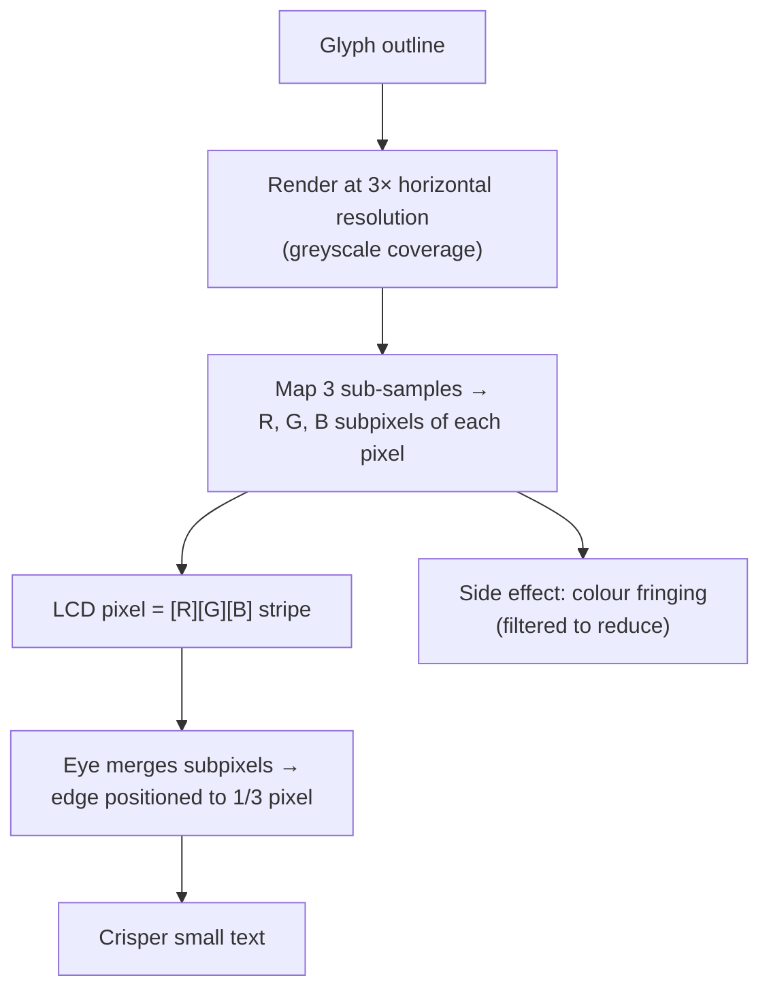

## In simple terms

An LCD pixel is actually three separate coloured subpixels: red, green, and blue, arranged in a horizontal strip. At typical reading distances, the eye cannot resolve these subpixels individually — it merges them into a single colour. Subpixel rendering exploits this: by independently controlling R, G, and B subpixels, text rendering can achieve three times the horizontal resolution of the physical pixel grid. A font designed for 14px can be rendered as if the display had 42 subpixels of horizontal resolution. The result is dramatically crisper text — especially at small sizes.

## The Visual Map



## More detail

A standard LCD pixel is three subpixels — R, G, B (or B, G, R on some panels) — arranged left-to-right. When the OS renders a glyph it: renders it at 3× horizontal resolution onto a greyscale image; maps the three "logical sub-samples" of each physical pixel to that pixel's R, G, and B channels; and the hardware displays them as physical subpixels, which the eye merges with correct apparent positioning. The payoff is **subpixel positioning** of edges — a vertical stroke at x = 4.33 shifts slightly into pixel 4's green and blue subpixels, moving the apparent edge by a third of a pixel rather than snapping to the nearest whole one.

**Implementations** differ. **ClearType** (Microsoft, 2000, default since Windows XP) made LCD text dramatically clearer and was extended in DirectWrite with RGB/BGR orders and greyscale fallback. **FreeType** (Linux, older Android, embedded) supports configurable subpixel filtering. **macOS** took a different path — greyscale anti-aliasing with heavy hinting, no subpixel rendering (removed entirely in Mojave) — reasoning that its higher-DPI Retina displays gain little from it and avoid colour fringing. Subpixel rendering **fails or helps less** on HiDPI/Retina (each logical pixel is already 2×2 physical, so greyscale AA looks equally crisp), on non-stripe layouts (triangular/RGBW), on OLED PenTile patterns (which need panel-specific rendering), and on non-horizontal text. It also introduces **colour fringing** — a faint red/blue tinge visible at an angle or under coloured light, which ClearType's tuner lets you calibrate. With HiDPI displays now ubiquitous it matters less than in the 2000s, but on 1080p/1440p monitors at 100% scaling it remains the most legible option for small text.

## Under the Hood

The trick is that each subpixel is sampled at a slightly different horizontal position. Render the glyph's coverage at 3× horizontal resolution, then assign sub-sample 0 → red, 1 → green, 2 → blue of each pixel. The edge can now land between whole pixels:

```python
# Coverage of a vertical stroke with a fractional left edge, at 3x horizontal res.
def subpixel_row(edge_x, width, pixels=6):
    out = []
    for px in range(pixels):
        chans = []
        for s in range(3):                       # R, G, B sub-samples
            sample_x = px + (s + 0.5) / 3         # position within the pixel
            inside = edge_x <= sample_x < edge_x + width
            chans.append(255 if inside else 0)
        out.append(tuple(chans))                  # (R, G, B) for this pixel
    return out

# A 1-pixel-wide stroke whose left edge is at x = 2.33 (not on a pixel boundary)
for px, (r, g, b) in enumerate(subpixel_row(2.33, 1.0)):
    bar = f"R{r:>3} G{g:>3} B{b:>3}"
    print(f"pixel {px}: {bar}  {'<- partial subpixel coverage' if 0 in (r,g,b) and 255 in (r,g,b) else ''}")
```

Greyscale anti-aliasing would force the edge to a whole-pixel grey; subpixel rendering instead lights only some of a pixel's R/G/B channels, so the perceived edge sits at 1/3-pixel precision.

## Engineering Trade-offs

- **Sharpness vs colour fringing.** Exploiting subpixels triples horizontal precision but introduces red/blue edge tinting; filtering reduces fringing at the cost of some sharpness.
- **Benefit vs display DPI.** On 1080p/1440p the legibility gain is real; on Retina/4K it's negligible while the fringing risk remains, so HiDPI platforms prefer greyscale AA.
- **Layout dependence vs generality.** It only works for horizontal RGB stripes — rotated text, vertical layouts, and PenTile/RGBW panels break it, so engines need a greyscale fallback.
- **Per-panel calibration vs simplicity.** Matching RGB vs BGR order to the actual panel maximises clarity but adds configuration; getting it wrong makes text *worse*.

## Real-world examples

- Windows Terminal uses DirectWrite with ClearType; RGB vs BGR order matters for clarity on different monitors.
- VS Code (Electron) renders text via Chromium — DirectWrite (subpixel) on Windows, Core Text (greyscale) on macOS.
- iOS vs Android text: iOS uses Core Text; Android historically used FreeType without subpixel rendering; both are now mostly greyscale on HiDPI panels.
- The same PDF looks different on Windows (ClearType) and macOS (Core Text greyscale).

## Common misconceptions

- **"Subpixel rendering always looks better."** On HiDPI (Retina, 4K) displays, greyscale AA is equally crisp with no colour fringing; subpixel rendering mainly helps at normal-DPI 1080p/1440p.
- **"Turning off ClearType makes text blurry."** On 1080p it reverts to greyscale AA, slightly softer for some small fonts; on 4K the difference is negligible.

## Try it yourself

Position a glyph edge to one-third of a pixel by lighting individual R/G/B subpixels (`python3` only):

```bash
python3 - <<'EOF'
def row(edge, width=1.0, pixels=6):
    for px in range(pixels):
        ch=[255 if edge<=px+(s+0.5)/3<edge+width else 0 for s in range(3)]
        print(f"pixel {px}: R{ch[0]:>3} G{ch[1]:>3} B{ch[2]:>3}")
print("stroke left edge at x=2.33 (between pixels):")
row(2.33)
EOF
```

## Learn next

- [Anti-aliasing](/t/anti-aliasing) — the general edge-smoothing family this specialises for text
- [Color management](/t/color-management) — determines how subpixel colours map to actual output
- [Pixel](/t/pixel) — the logical unit whose physical R/G/B subpixels this exploits
- [HDR](/t/hdr) — another display-precision concern that changes the rendering baseline
