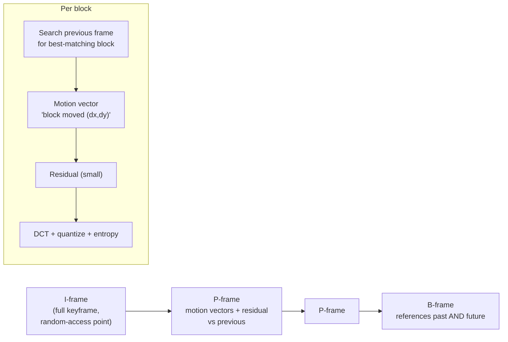

## In simple terms

A **video codec** is the technology that squeezes video down to a manageable size. Raw video is astronomically large — uncompressed 4K can be gigabytes *per second*. A video codec compresses that by a factor of hundreds, mostly by noticing that video is enormously repetitive: each frame looks a lot like the one before it, and within a frame, neighbouring areas look similar. By storing mainly the *differences* rather than every full frame, codecs make streaming, downloading, and storing video possible. Without them, there is no Netflix, no YouTube, no video calls.

## The Visual Map



## More detail

A video codec combines two kinds of compression. **Spatial (intra-frame)** compresses a single frame much like [JPEG](/t/jpeg), using frequency transforms to discard fine detail. **Temporal (inter-frame)** is the big win: instead of storing every frame fully, it stores occasional complete **keyframes (I-frames)** and, in between, only the *changes* — described as **motion vectors** ("this block moved here") plus small corrections (**P-** and **B-frames**). A mostly-static scene compresses dramatically, which is why a fast-moving, scene-cutting action sequence needs far more bitrate than a talking head against a still background.

Codecs are **lossy** and tunable — a **bitrate** setting trades quality against file size, and over-compression produces blocking and smearing. The major codecs form a generational ladder: **H.264/AVC** (long-dominant, near-universal), **H.265/HEVC** and **VP9** (roughly half the bitrate for the same quality, though HEVC carries licensing complexity), and **AV1** (royalty-free, more efficient still, increasingly used by streaming services). Encoding is far more expensive than decoding, so modern devices include **hardware encoders/decoders** that let phones record and play 4K without draining the battery. Each codec generation that halves the bitrate directly cuts streaming costs and enables higher resolutions.

## Under the Hood

The defining operation is **motion estimation**: for each block in the new frame, search the previous frame for the location that matches best, and store just that displacement (a motion vector) plus a tiny residual. Block-matching by sum-of-absolute-differences is the textbook approach:

```python
prev = [0, 0, 0, 9, 9, 9, 0, 0, 0, 0]    # an object at positions 3-5
curr = [0, 0, 0, 0, 0, 9, 9, 9, 0, 0]    # same object, shifted +2

def block(seq, start, size=3):
    return seq[start:start+size]

def find_motion(curr, prev, pos, search=4):
    target = block(curr, pos)
    best_mv, best_cost = 0, None
    for dx in range(-search, search + 1):           # search window
        ref = block(prev, pos + dx)
        if len(ref) < len(target): continue
        cost = sum(abs(a - b) for a, b in zip(target, ref))   # SAD
        if best_cost is None or cost < best_cost:
            best_cost, best_mv = cost, dx
    return best_mv, best_cost

mv, cost = find_motion(curr, prev, pos=5)
print(f"best motion vector: {mv:+d}  (residual error {cost})")
print("Codec stores '+{} shift' instead of the whole block.".format(mv))
```

The encoder finds `dx = -2` (the block came from two pixels left) at zero residual — so a moving region costs a couple of bytes instead of a full re-encode. This search is exactly why encoding is so much costlier than decoding.

## Engineering Trade-offs

- **Bitrate vs quality.** Lower bitrate streams cheaper and faster but blocks and smears; the encoder spends its bit budget where motion and detail are highest.
- **Encode time vs efficiency.** Wider motion-search and B-frames compress better but cost far more CPU/time to encode — fine for VOD, too slow for live.
- **Latency vs compression.** B-frames reference future frames and need buffering; video calls drop them to stay real-time, accepting larger streams.
- **Efficiency vs licensing/compatibility.** AV1 beats HEVC and is royalty-free but encodes slowly and isn't decodable on older hardware; H.264 is the universal, cheap-to-encode fallback.

## Real-world examples

- **Netflix and YouTube** encode each video into multiple codecs and bitrates, adapting to your device and connection.
- **Video calls** (Zoom, FaceTime) rely on real-time codecs that prioritise low latency over perfect quality.
- A phone recording 4K uses a **hardware H.265/AV1 encoder** to compress on the fly without overheating.

## Common misconceptions

- **"A video codec is the same as a file format like MP4."** The codec is the *compression algorithm* (H.264, AV1); the container (MP4, MKV) wraps the compressed video with audio and metadata.
- **"Higher resolution is all that matters for quality."** Bitrate and codec efficiency matter just as much — a well-encoded 1080p stream can look better than a starved, over-compressed 4K one.

## Try it yourself

Implement block-matching motion estimation and watch it recover the shift of a moving object (`python3` only):

```bash
python3 - <<'EOF'
prev=[0,0,0,9,9,9,0,0,0,0]; curr=[0,0,0,0,0,9,9,9,0,0]
def sad(a,b): return sum(abs(x-y) for x,y in zip(a,b))
pos=5; target=curr[pos:pos+3]; best=(0,1e9)
for dx in range(-4,5):
    ref=prev[pos+dx:pos+dx+3]
    if len(ref)==3:
        c=sad(target,ref); best=min(best,(dx,c),key=lambda t:t[1])
print(f"motion vector {best[0]:+d}, residual {best[1]} -> store the shift, not the block")
EOF
```

## Learn next

- [Codec](/t/codec) — the general compress/decompress idea a video codec specialises
- [JPEG](/t/jpeg) — the intra-frame (spatial) compression reused inside each frame
- [Image format](/t/image-format) — the still-image side of the same trade-offs
- [GPU](/t/gpu) — where hardware encode/decode blocks live to make 4K feasible
