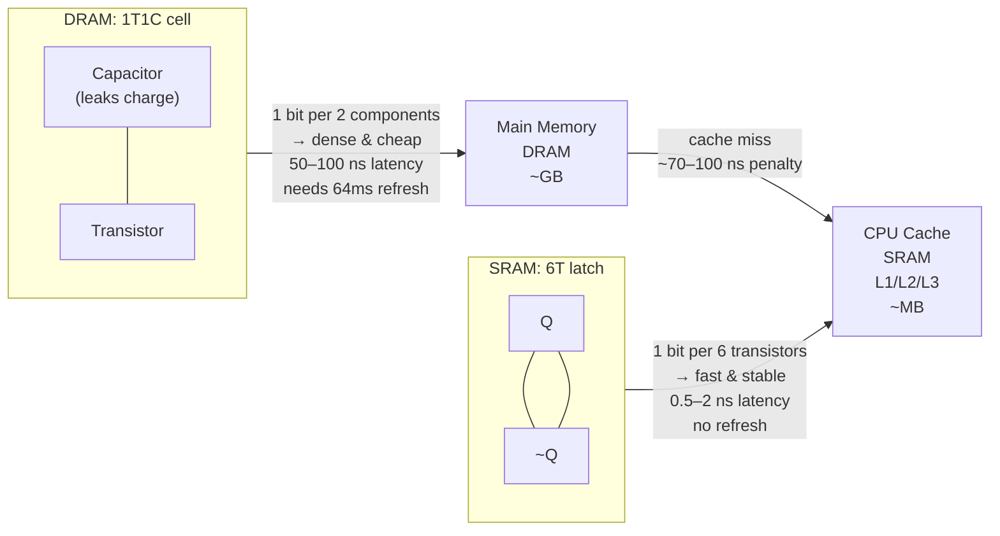

## In simple terms

There are two main technologies for the fast, volatile [memory](/t/memory) inside a computer, and they make opposite trade-offs. **DRAM** (dynamic RAM) is cheap and dense — it's what your gigabytes of main memory are made of — but it's relatively slow and has to be constantly "refreshed" to avoid forgetting. **SRAM** (static RAM) is much faster and doesn't need refreshing, but it's bulky and expensive, so it's used only where speed is critical and the amount is small — chiefly the [cache](/t/cache) right next to the CPU.

## The Visual Map



## More detail

The difference comes down to how each technology stores a single bit:

- **DRAM** stores each bit as charge in a **single tiny capacitor** (plus one access transistor). Capacitors leak charge over time, so DRAM must be **refreshed** thousands of times per second — the memory controller periodically rewrites every row before it forgets. The upside: one capacitor + one transistor per bit is *tiny*, so you can pack billions of bits cheaply. DDR5 DIMM: 32 GB for ~$80.

- **SRAM** stores each bit in a **cross-coupled latch of six transistors** that actively holds its value as long as it has power — no refresh needed, and access is very fast (0.5–2 ns). The downside: six transistors per bit means far more chip area, much higher cost, and far lower density. A 32 MB L3 SRAM cache on the CPU die costs more area than most of the core logic.

This is exactly why the [memory hierarchy](/t/memory-hierarchy) exists. You can't make all memory SRAM (too expensive and area-intensive) or all DRAM (too slow for the CPU, which needs data in 1–2 ns). So computers layer them: a small amount of blazing-fast SRAM as cache, backed by a large pool of cheaper DRAM as main memory.

Both are **volatile** — they lose their contents when power is removed — which distinguishes them from [flash memory](/t/flash-memory).

**Comparison at a glance:**

| Property | DRAM | SRAM |
|---|---|---|
| Cell size | 1T + 1C | 6T |
| Density | Very high | Low |
| Cost (2026) | ~$3/GB | ~$3,000/GB (embedded) |
| Latency | 50–100 ns | 0.5–2 ns |
| Needs refresh | Yes (every 64 ms) | No |
| Typical use | Main memory | CPU cache |

## Under the Hood

The DRAM refresh problem in code — a controller must re-read and re-write every row before the charge leaks away:

```python
import time

# Simulate DRAM: cells that decay and need periodic refresh
class DRAMBank:
    REFRESH_INTERVAL_MS = 64      # standard: refresh every 64ms
    ROWS = 8

    def __init__(self):
        self.cells = [1.0] * self.ROWS    # 1.0 = fully charged
        self.last_refresh = time.monotonic()

    def decay(self, elapsed_ms: float):
        decay_rate = 0.02   # simplified linear decay per ms
        self.cells = [max(0.0, c - decay_rate * elapsed_ms) for c in self.cells]

    def refresh(self):
        self.cells = [1.0] * self.ROWS    # re-charge all rows
        self.last_refresh = time.monotonic()

    def read(self, row: int) -> int:
        return 1 if self.cells[row] > 0.5 else 0   # 0.5V threshold

# Simulate 100ms with periodic refresh every 64ms
bank = DRAMBank()
print(f"{'Time (ms)':>10}  {'Charges':<55}  {'Refresh?'}")
print("-" * 80)
for ms in range(0, 110, 10):
    bank.decay(10)
    needs = any(bank.cells[r] < 0.5 for r in range(bank.ROWS))
    if needs or ms % bank.REFRESH_INTERVAL_MS == 0:
        bank.refresh()
        refreshed = " REFRESH"
    else:
        refreshed = ""
    charges = " ".join(f"{c:.2f}" for c in bank.cells)
    print(f"{ms:>10}  {charges}{refreshed}")
```

## Engineering Trade-offs

**SRAM vs. DRAM — why not all SRAM?**
- Cost: SRAM costs ~1,000× more per bit than DRAM. A 32 GB SRAM main memory would cost ~$96,000; a 32 GB DDR5 DIMM costs ~$80.
- Area: SRAM cells are ~50–100× larger than DRAM cells. A 32 GB SRAM chip would be physically enormous.
- Power: SRAM holds state actively (cross-coupled inverters always consume leakage current); DRAM's static power is lower.

**DRAM trade-offs:**
- Refresh overhead consumes ~2–5% of DRAM bandwidth — time the memory bus is busy doing maintenance, not serving the CPU.
- Row buffer policy: the DRAM controller exploits spatial locality by keeping a full row (typically 8–16 KB) open in a "row buffer" (essentially a tiny SRAM). Sequential access is fast (hits the open row); random access repeatedly opens new rows (row miss penalty: ~30 ns extra).

**Technology evolution:**
- DDR5 uses on-die ECC to correct single-bit errors within the DRAM chip itself — partially offsetting DRAM's higher error rate vs. SRAM.
- 3D stacking (HBM — High Bandwidth Memory): DRAM dies stacked vertically with very wide buses, closing the gap between DRAM bandwidth and SRAM bandwidth.

## Real-world examples

- The "16 GB RAM" in a laptop is DRAM; the "32 MB L3 cache" on its CPU is SRAM.
- A CPU's L1/L2/L3 caches are SRAM precisely because they must keep up with the processor's clock — L1 has &lt;1 ns latency.
- AMD's 3D V-Cache (2022): stacks SRAM directly on top of the CPU die, adding 192 MB of L3 at ~1.4 GB/mm² density — smaller and faster than using separate DRAM.

## Common misconceptions

- **"SRAM is just better than DRAM."** It's faster, but far more expensive and less dense — which is why we use a little of it (cache) and a lot of DRAM (main memory), not all SRAM.
- **"SRAM is non-volatile because it's 'static.'"** "Static" only means it doesn't need refreshing. Both DRAM and SRAM are volatile and lose everything when power is removed.

## Try it yourself

Demonstrate the performance difference between cache-friendly (SRAM speed) and cache-unfriendly (DRAM speed) memory access:

```bash
python3 - <<'EOF'
import time, random

N = 5_000_000
arr = list(range(N))

def sequential(arr, n=200_000):
    s = 0
    for i in range(n): s += arr[i]
    return s

def stride_random(arr, n=200_000):
    s = 0
    indices = random.sample(range(len(arr)), n)
    for i in indices: s += arr[i]
    return s

n = 200_000
t0 = time.perf_counter_ns()
r1 = sequential(arr, n)
t1 = time.perf_counter_ns()
r2 = stride_random(arr, n)
t2 = time.perf_counter_ns()

seq_ms  = (t1 - t0) / 1e6
rand_ms = (t2 - t1) / 1e6
print(f"Sequential (cache-friendly) : {seq_ms:6.1f} ms  (SRAM L1/L2 hits)")
print(f"Random     (cache-unfriendly): {rand_ms:6.1f} ms  (DRAM misses)")
print(f"Cache miss penalty           : {rand_ms/seq_ms:.1f}x slower")
EOF
```

## Learn next

- [Memory hierarchy](/t/memory-hierarchy) — the full layered picture: registers → L1/L2/L3 SRAM → DRAM → SSD → HDD; DRAM vs SRAM is the reason this hierarchy must exist
- [Cache](/t/cache) — how the CPU uses its SRAM to hide DRAM latency; cache replacement policy and associativity are built on top of SRAM's speed advantage
- [Flash memory](/t/flash-memory) — the non-volatile sibling: what happens when you need memory that survives power loss (neither DRAM nor SRAM can do this)
