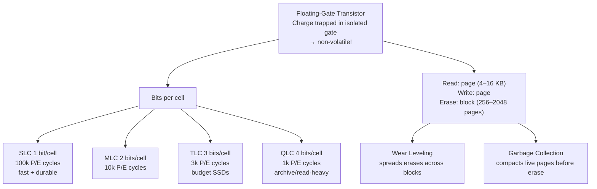

## In simple terms

**Flash memory** is storage that *remembers without power*. Unlike the [RAM](/t/memory) in a computer, which forgets everything the instant it loses power, flash holds onto its data — which is why it's used wherever you need persistence in a small, rugged, solid-state form: USB drives, phone and camera storage, and the [SSDs](/t/ssd) inside modern computers. It stores each bit by trapping electric charge inside a special transistor, and that trapped charge stays put for years.

## The Visual Map



## More detail

Each flash cell is a **floating-gate transistor**: an electrically isolated (floating) gate sits between the control gate and the channel. Electrons can be injected into this floating gate via quantum mechanical tunnelling (Fowler–Nordheim tunnelling) when a high voltage is applied. Once there, the charge cannot leak away — the floating gate is surrounded by insulator — which is what makes flash non-volatile.

Flash has distinctive behaviour that shapes everything built on it:

- **Read in pages, erase in blocks** — you can read or program a small page (typically 4–16 KB), but you can only *erase* in much larger blocks (512 KB–4 MB). Rewriting a single page requires erasing the entire block first, so flash controllers must copy live pages to a new block before erasing the old one. This is **garbage collection**.
- **Limited write endurance** — each cell wears out after a finite number of program/erase (P/E) cycles. The insulating oxide layer gradually degrades with each cycle, causing charge to leak. **Wear leveling** distributes writes evenly across all blocks to maximise SSD lifetime.
- **Bits per cell** — SLC (1 bit) stores two voltage levels. MLC (2), TLC (3), QLC (4) store more voltage levels per cell, packing more capacity at the cost of speed, endurance, and data retention. This trade-off is why flash got cheap enough to replace hard drives.

The dominant type is **NAND flash** (dense, used for storage). **NOR flash** allows random byte-addressable reads (execute-in-place) and is used for firmware chips. Modern NAND is built in 3D — stacking cell layers vertically (**3D NAND**) up to 200+ layers to maintain density scaling now that planar area shrinkage has slowed.

Flash memory is the technology that made the mobile and solid-state era possible. Its falling price per gigabyte (driven by more bits per cell and 3D stacking) let storage become huge, cheap, fast, and pocket-sized — reshaping computers, cameras, cars, and embedded devices.

## Under the Hood

A simplified wear leveling simulation — the core algorithm every SSD firmware implements to avoid burning out specific blocks:

```python
import random

BLOCKS = 10
ERASE_LIMIT = 100

blocks = {"erase_count": [0] * BLOCKS, "data": [None] * BLOCKS}

def write_naive(blocks, value):
    target = 0   # always write to block 0
    blocks["erase_count"][target] += 1
    blocks["data"][target] = value
    return target

def write_leveled(blocks, value):
    target = min(range(BLOCKS), key=lambda i: blocks["erase_count"][i])
    blocks["erase_count"][target] += 1
    blocks["data"][target] = value
    return target

def summary(blocks, label):
    counts = blocks["erase_count"]
    print(f"  {label}: max={max(counts)} min={min(counts)} spread={max(counts)-min(counts)}")
    print(f"    per-block: {counts}")

N = 30
naive_blocks  = {"erase_count": [0]*BLOCKS, "data": [None]*BLOCKS}
leveled_blocks = {"erase_count": [0]*BLOCKS, "data": [None]*BLOCKS}

for i in range(N):
    write_naive(naive_blocks, f"data_{i}")
    write_leveled(leveled_blocks, f"data_{i}")

print(f"After {N} writes to {BLOCKS} blocks:")
summary(naive_blocks,   "Naive (no wear leveling)")
summary(leveled_blocks, "Leveled                 ")
```

## Engineering Trade-offs

**NAND vs. NOR flash:**
- NAND: dense, sequential-read-optimised, page/block granularity — the storage choice (SSDs, USB, phones).
- NOR: byte-addressable random reads, execute-in-place (XIP), but lower density and slower writes — the firmware choice (BIOS chips, microcontroller code storage).

**SLC vs. MLC vs. TLC vs. QLC:**
- More bits per cell = higher capacity per die = lower cost. But voltage levels are closer together, requiring more precise sensing → slower reads/writes, lower endurance, worse data retention.
- Enterprise SSDs typically use TLC (with heavy over-provisioning); consumer drives use TLC/QLC; high-endurance industrial uses SLC or MLC.

**Write amplification:** writing one logical page may require erasing a block and copying many live pages → the SSD writes more physical data than the host requested. Write amplification factor (WAF) of 1 is ideal; 3–5 is common under random write workloads. Over-provisioning (leaving ~7–28% of NAND invisible to the OS) gives the controller free blocks, reducing WAF.

**Data retention vs. endurance:** QLC cells can retain charge for ~1 year when unpowered. SLC retains charge for 10+ years. Long-term cold storage requires SLC or MLC flash (or HDDs).

## Real-world examples

- The storage in every smartphone, microSD card, USB stick, and SSD is NAND flash.
- An [SSD](/t/ssd) is NAND flash chips + a dedicated controller managing wear leveling, garbage collection, and error correction (LDPC).
- 3D NAND by Micron/Samsung/SK Hynix reaches 200+ layer stacks — essentially a skyscraper of memory cells to avoid further shrinking individual cells.

## Common misconceptions

- **"Flash memory is the same as RAM."** Both are "memory," but RAM (DRAM/SRAM) is fast and volatile; flash is slower (for writes especially) and non-volatile. They serve opposite roles.
- **"Flash never fails."** It has no moving parts, but its cells wear out with writes and can lose charge over long unpowered periods — QLC flash is not suited for decades-long cold archival.

## Try it yourself

Model the bits-per-cell trade-off across NAND cell types:

```bash
python3 - <<'EOF'
cells = [
    # (type, bits, pe_cycles, read_ns, write_us)
    ("SLC", 1, 100_000, 25,  200),
    ("MLC", 2,  10_000, 50,  600),
    ("TLC", 3,   3_000, 70, 1500),
    ("QLC", 4,   1_000, 120, 3000),
]

slc_die_gb = 64   # a typical SLC die at a given process node

print(f"{'Type':<6} {'Bits':>5} {'Capacity':>10} {'P/E cycles':>12} {'Read':>8} {'Write':>9}  Cost/GB")
print("-" * 75)
for typ, bits, pe, read_ns, write_us in cells:
    cap_gb = slc_die_gb * bits   # same die area holds more with more bits/cell
    cost_idx = 100 // bits       # SLC = 100 (most expensive per GB)
    print(f"{typ:<6} {bits:>5} {cap_gb:>8} GB {pe:>12,} {read_ns:>7} ns {write_us:>7} us  {cost_idx}")
EOF
```

## Learn next

- [SSD](/t/ssd) — a flash memory array plus a controller; understanding flash explains why SSDs have write endurance limits, garbage collection pauses, and over-provisioning
- [Storage](/t/storage) — the broader category covering how flash, HDD, and tape fit into a storage hierarchy
- [HDD](/t/hdd) — the magnetic alternative to flash: much higher capacity per dollar for sequential workloads, but 1,000× slower random access latency
