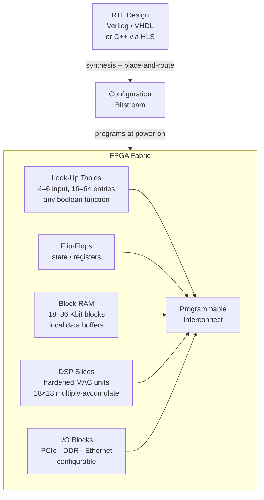

## In simple terms

An FPGA is a "blank" chip that can be wired to implement any digital circuit you design. You describe the circuit in a hardware description language (Verilog or VHDL), and a tool synthesises it into a configuration bitstream that programs the FPGA's millions of tiny switches. The circuit runs at hardware speed — potentially billions of operations per cycle — but remains reprogrammable. FPGAs sit between general-purpose CPUs (flexible, slow per operation) and ASICs (inflexible, fastest) in the performance-flexibility spectrum.

## The Visual Map



## More detail

**Internal structure:**
- **Look-Up Tables (LUTs):** 4–6 bit LUTs implement arbitrary logic functions. A 4-bit LUT has 16 entries, one output — it can implement any 4-input boolean function. Millions of LUTs form the programmable logic fabric.
- **Flip-flops:** state elements (registers) that hold values across clock cycles — the storage of sequential logic.
- **Block RAM (BRAM):** on-chip memory blocks, 18–36 Kbit each, used for data buffering (FIFOs, lookup tables, accumulators).
- **DSP slices:** hardened multiply-accumulate (MAC) blocks for signal processing and ML operations. A Xilinx Ultrascale+ has ~12,000 DSP slices.
- **I/O blocks:** configurable interfaces for different protocols (PCIe, DDR memory, Ethernet, HDMI).
- **Interconnect:** a programmable routing network connecting all blocks. Routing is typically the bottleneck in timing closure.

**Programming FPGAs:**
- **RTL design:** write Verilog/VHDL describing hardware behaviour at the register-transfer level.
- **HLS (High-Level Synthesis):** Xilinx Vitis HLS, Intel OpenCL, Bambu — compile C/C++ or OpenCL to RTL. Lower throughput per clock cycle but dramatically faster development.
- **Synthesis → place & route → bitstream:** tools convert RTL to a gate-level netlist, place components on the FPGA fabric, route interconnects, and generate the configuration bitstream.

**FPGA vs. CPU vs. ASIC:**

| | CPU | FPGA | ASIC |
|---|---|---|---|
| Flexibility | Fully programmable | Reprogrammable | Fixed |
| Performance | Moderate | 10–100× CPU | Highest |
| Development time | Hours | Weeks–months | Years |
| NRE cost | None | None | $1M–$50M |
| Power efficiency | Low | Medium | Highest |

**Use cases:**
- **Networking:** line-rate packet processing (100G+) — routers, firewalls, SmartNICs.
- **Finance:** ultra-low-latency trading (< 1 µs order processing).
- **ML inference:** Microsoft Project Catapult — FPGAs in Azure for BERT/GPT inference, achieving lower latency than GPU at batch size 1.
- **Scientific computing:** genomics (Illumina uses FPGAs for base-calling), seismic processing.
- **ASIC prototyping:** verify ASIC designs on FPGAs before the multi-million dollar tape-out.

FPGAs occupy a unique position: hardware-speed execution with post-fabrication programmability. The rise of RISC-V plus FPGAs has made custom CPU design accessible to research teams.

## Under the Hood

A 4-input LUT is a 16-entry lookup table that implements any 4-variable boolean function. This Python simulation shows how one LUT implements XOR across all four inputs — the same operation that would be synthesised to a single LUT on the FPGA fabric:

```python
# Simulate a 4-input FPGA LUT
def make_lut(truth_table: list) -> dict:
    assert len(truth_table) == 16, "4-input LUT has 2^4 = 16 entries"
    return dict(enumerate(truth_table))

# Implement A XOR B XOR C XOR D (parity of 4 bits)
# truth table: output = 1 when an odd number of inputs are 1
xor4_lut = make_lut([bin(i).count('1') % 2 for i in range(16)])

print("4-input XOR LUT — one entry per input combination (A,B,C,D):")
print(f"  {'Addr':>5}  {'A B C D':>8}  {'Output':>7}")
print("  " + "-" * 28)
for addr, out in xor4_lut.items():
    bits = f"{addr:04b}"
    abcd = " ".join(bits)
    print(f"  {addr:>5}  {abcd:>8}  {out:>7}")
```

The equivalent Verilog that synthesises to exactly this LUT:
```verilog
assign out = a ^ b ^ c ^ d;   // 1 LUT on Xilinx/Intel FPGA
```

A 4-bit ripple-carry adder requires ~8 LUTs + 4 flip-flops; a 32-bit FIR filter might need thousands.

## Engineering Trade-offs

**Why choose FPGA over CPU/GPU:**
- **Deterministic latency:** FPGAs run custom pipelines at wire speed. A network packet parser on an FPGA has deterministic sub-microsecond latency; the same code on a CPU has unpredictable OS scheduling jitter.
- **Custom data paths:** FPGAs implement non-standard bit widths (e.g., 12-bit ADC samples, 27-bit fixed-point DSP) natively, without the overhead of software emulation.
- **Parallelism without OS overhead:** hundreds of pipelined hardware operations execute simultaneously with zero scheduling overhead.

**Why choose GPU or CPU instead:**
- **Productivity:** writing correct, timing-closed RTL takes weeks to months; the same algorithm in CUDA takes hours.
- **Compute intensity:** GPUs have far more raw FLOPS for dense matrix operations (H100: ~3.9 PFLOPS BF16) than an FPGA (Virtex UltraScale+: ~100 TOPS).
- **Ecosystem:** CUDA has enormous tooling, profiling, and library support. FPGA tooling (Vivado, Quartus) is mature but more specialist.

**Timing closure:** achieving the required clock frequency after place-and-route is often the hardest part. A design that simulates correctly may fail to meet timing at 250 MHz — forcing retiming registers, pipelining, or algorithm restructuring.

## Real-world examples

- Microsoft Azure (Project Catapult): FPGAs in every Azure server for Bing ranking and Azure Network (SDN at 40–100G line rate).
- Xilinx FPGAs power 5G radio base stations (beamforming, channel coding at line rate).
- Intel SmartNIC offloads NVMe-oF, RDMA, and TLS from host CPUs in data centres.
- Illumina's genomic sequencing machines use FPGAs for real-time base-calling — converting raw optical signals to ACGT nucleotides.

## Common misconceptions

- **"FPGAs are hard to program."** HLS tools (Vitis, Intel OpenCL) let engineers write C/C++ and get hardware acceleration without RTL skills. RTL design is harder, but not required for many use cases.
- **"FPGAs are always faster than GPUs."** FPGAs have lower latency for certain tasks (streaming, small-batch ML inference), but GPUs win for compute-intensive parallel workloads (large-batch training).

## Try it yourself

Simulate an FPGA LUT and a 4-bit ripple-carry adder using LUT-style lookup tables:

```bash
python3 - <<'EOF'
# 4-input LUT: implements any boolean function of 4 variables
def make_lut(fn):
    return [fn(a, b, c, d)
            for a in range(2) for b in range(2)
            for c in range(2) for d in range(2)]

def lut_eval(lut, a, b, c, d):
    return lut[a*8 + b*4 + c*2 + d]

# LUT for 1-bit full adder SUM = A XOR B XOR Cin
sum_lut = make_lut(lambda a, b, c, d: (a ^ b ^ c))   # d unused
cout_lut = make_lut(lambda a, b, c, d: (a & b) | (b & c) | (a & c))

print("1-bit Full Adder (3 inputs: A, B, Cin):")
print(f"  {'A':>2} {'B':>3} {'Cin':>4}  {'Sum':>4} {'Cout':>5}")
print("  " + "-" * 24)
for a in range(2):
    for b in range(2):
        for cin in range(2):
            s = lut_eval(sum_lut, a, b, cin, 0)
            co = lut_eval(cout_lut, a, b, cin, 0)
            print(f"  {a:>2} {b:>3} {cin:>4}  {s:>4} {co:>5}")
EOF
```

## Learn next

- [ASIC](/t/asic) — the fixed-function end of the spectrum: no reprogramming, maximum efficiency, millions of dollars of NRE; FPGAs are commonly used to prototype ASIC designs before tape-out
- [Systolic array](/t/systolic-array) — the architecture for matrix-multiply acceleration that can be implemented on FPGAs or as fixed ASIC (Google TPU)
- [GPU](/t/gpu) — the high-throughput parallel accelerator; understanding GPUs completes the CPU / FPGA / GPU / ASIC spectrum of hardware options
