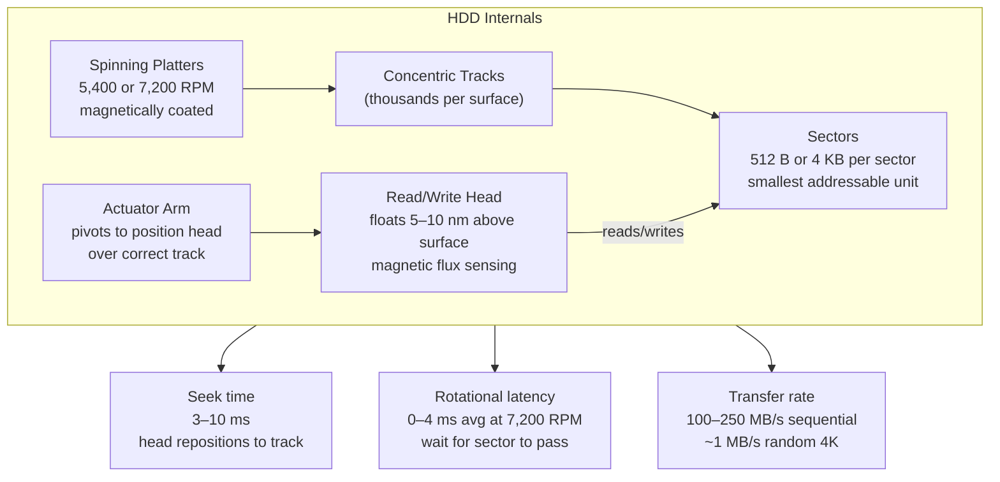

## In simple terms

An **HDD** (hard disk drive) stores data the old-fashioned, mechanical way: on round magnetic **platters** that spin at high speed, with a tiny **read/write head** floating just above the surface on an arm that swings in and out to reach different tracks. It's essentially a record player for data. For decades it was *the* way computers stored files. It's now been overtaken by the [SSD](/t/ssd) for everyday use, but survives because it's still the cheapest way to store huge amounts of data.

## The Visual Map



## More detail

The mechanics define the HDD's strengths and weaknesses:

- **Platters** spin at a fixed rate — commonly 5,400 or 7,200 RPM, with enterprise drives reaching 10,000–15,000 RPM (now largely obsolete).
- **Heads** on a moving **actuator arm** position over the right **track**; data is read as the platter rotates underneath. Modern drives have multiple platters (and one head per surface), stacked on a single spindle.
- **Capacity** comes from packing tracks densely (tracks per inch, TPI) and using multiple platters; modern drives reach 20–30 TB using techniques like SMR (Shingled Magnetic Recording) and HAMR (Heat-Assisted Magnetic Recording).

**Two kinds of delay dominate performance:**
1. **Seek time** — moving the head to the right track: 3–10 ms for consumer drives.
2. **Rotational latency** — waiting for the right sector to spin under the head: 0–8.3 ms at 7,200 RPM (average ~4 ms).
3. **Transfer rate** — once the head is positioned: 100–250 MB/s for sequential data.

Total random 4 KB read latency ≈ seek + rotational latency ≈ 7–14 ms. Compare to NVMe SSD: ~50–100 µs. HDDs are **1,000× slower** for random access.

Because of this, HDDs are decent at **sequential** access (reading a large file laid out contiguously) but terrible at **random** access (jumping around), where the head repositions repeatedly. Software built around HDDs — file systems, databases, OS schedulers — spent decades optimising for sequential access and minimising seeks, assumptions that SSDs changed.

**HDDs survive where cost per terabyte matters:** Cold backup, cloud archival tiers, surveillance storage, and data-centre "warm" object storage. A 20 TB HDD costs ~$300 ($0.015/GB); a 20 TB NVMe SSD costs $2,000+ ($0.10/GB). The 7× cost advantage keeps HDDs in bulk-data roles.

## Under the Hood

Simulating HDD seek + rotational latency to show why random access is so expensive:

```python
import math

RPM = 7200
TRACKS = 10_000

def rotational_latency_ms(current_angle_deg: float, target_angle_deg: float) -> float:
    full_rotation_ms = (60 / RPM) * 1000   # ms for one revolution
    diff = (target_angle_deg - current_angle_deg) % 360
    return (diff / 360) * full_rotation_ms

def seek_time_ms(from_track: int, to_track: int) -> float:
    distance = abs(to_track - from_track)
    return 1.0 + 9.0 * math.sqrt(distance / TRACKS)   # 1ms min, 10ms max

def total_latency(from_track, to_track, angle):
    seek = seek_time_ms(from_track, to_track)
    rot  = rotational_latency_ms(angle, (angle + 137) % 360)   # random sector
    return seek + rot

print("HDD random access latency simulation:")
print(f"{'From':>6} {'To':>6}  {'Seek ms':>8} {'Rot ms':>8} {'Total ms':>9}")
print("-" * 45)
import random
random.seed(42)
for _ in range(8):
    fr = random.randint(0, TRACKS)
    to = random.randint(0, TRACKS)
    angle = random.uniform(0, 360)
    seek = seek_time_ms(fr, to)
    rot  = rotational_latency_ms(angle, (angle + random.uniform(0, 360)) % 360)
    print(f"{fr:>6} {to:>6}  {seek:>8.1f} {rot:>8.1f} {seek+rot:>9.1f}")
```

## Engineering Trade-offs

**Sequential vs. random access:**
- Sequential reads see near-peak transfer rates (100–250 MB/s) because the head stays in place and data streams past.
- Random 4 KB reads: each requires seek + rotation → ~7–14 ms each → ~70–140 IOPS. An SSD does 500,000 IOPS. The gap explains the SSD revolution.

**SMR (Shingled Magnetic Recording):** overlapping write tracks increase density by 15–25%, but rewrites require reading and rewriting entire "bands" — SMR drives have dramatically worse random-write performance and are only suitable for write-once workloads (archiving, cold storage).

**HAMR (Heat-Assisted Magnetic Recording):** uses a laser to briefly heat the platter spot during writing, enabling higher-coercivity media that stores more bits per mm² without spontaneous demagnetisation. Seagate's 30+ TB drives use HAMR.

**Reliability:** HDDs have mean time between failures (MTBF) of 1–2 million hours. In practice, backblaze data shows ~1–4% annual failure rate per drive. Moving parts (bearings, actuator) are the failure point; SSDs fail via write exhaustion.

## Real-world examples

- Cloud provider "cold storage" or backup tiers use racks of high-capacity HDDs where price-per-TB trumps speed.
- An external USB hard drive for cheap bulk backups of photos and video.
- A NAS (network-attached storage) box for home media libraries: 4–8 drives in RAID for redundancy.
- Backblaze publishes annual HDD failure statistics — essential reliability data for the industry.

## Common misconceptions

- **"HDDs are obsolete."** For performance they've lost to SSDs, but for cheap high-capacity bulk storage they remain the most economical choice and are still manufactured in large quantities.
- **"Defragmenting helps every drive."** Defragmentation helps HDDs by reducing head movement for sequential reads. On an SSD it's pointless — there's no head — and causes unnecessary wear.

## Try it yourself

Model the HDD performance cliff: sequential vs. random access at real head-movement physics:

```bash
python3 - <<'EOF'
import math, random

RPM        = 7200
TRACKS     = 10_000
SEQ_RATE   = 180   # MB/s sequential transfer

def seek_ms(a, b):
    return 1.0 + 9.0 * math.sqrt(abs(b - a) / TRACKS)

def rot_ms():
    rev_ms = 60_000 / RPM
    return random.random() * rev_ms   # avg = rev_ms/2

random.seed(0)
N = 200   # number of 4KB random requests

seq_time_ms = (N * 4096) / (SEQ_RATE * 1024 * 1024) * 1000
rand_time_ms = sum(seek_ms(random.randint(0, TRACKS),
                            random.randint(0, TRACKS)) + rot_ms()
                   for _ in range(N))

seq_iops  = N / (seq_time_ms / 1000)
rand_iops = N / (rand_time_ms / 1000)

print(f"{N} x 4KB reads:")
print(f"  Sequential : {seq_time_ms:7.1f} ms  ({seq_iops:>7,.0f} IOPS)")
print(f"  Random     : {rand_time_ms:7.1f} ms  ({rand_iops:>7,.0f} IOPS)")
print(f"  Slowdown   : {rand_time_ms/seq_time_ms:,.0f}x slower for random access")
EOF
```

## Learn next

- [SSD](/t/ssd) — the flash-based successor: no moving parts, 1,000× faster random access, and now the default storage in laptops and servers; understanding HDDs explains what SSDs improved
- [Flash memory](/t/flash-memory) — the underlying technology inside SSDs; NAND flash's page/block write model is why SSDs need garbage collection and wear leveling
- [Motherboard](/t/motherboard) — where HDDs connect via SATA ports; understanding the board's I/O bus shows how storage devices integrate into the overall system
