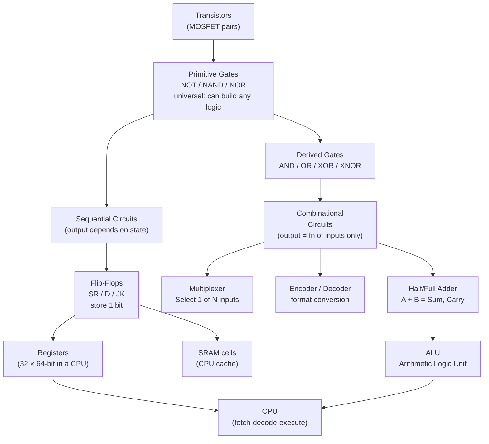

## In simple terms

A logic gate is a tiny circuit — usually made from a handful of transistors — that takes one or two electrical signals as input and produces an output, following a rule like AND, OR, or NOT. These simple rules, chained together in billions of combinations, produce every computation a computer can perform. Every video played, every search result returned, every AI inference done is ultimately millions of logic gates switching on and off in orchestrated patterns.

## The Visual Map



## More detail

The common gates correspond directly to boolean operations:

| Gate | Boolean | Output is 1 when… | CMOS transistors |
|------|---------|-------------------|-----------------|
| NOT  | `¬A`    | input is 0 | 2 (1 PMOS + 1 NMOS) |
| NAND | `¬(A·B)` | NOT of AND | 4 |
| NOR  | `¬(A+B)` | NOT of OR | 4 |
| AND  | `A·B`   | both inputs are 1 | 6 (NAND + NOT) |
| OR   | `A+B`   | either input is 1 | 6 (NOR + NOT) |
| XOR  | `A⊕B`  | inputs differ | 8–12 |

**Why NAND/NOR are fundamental:** NAND and NOR gates are **universal** — any boolean function can be built from NAND gates alone (or NOR gates alone). This matters for manufacturing: a chip fab can standardise on a single gate type and express every logic function.

**From gates to circuits:**
- **Half adder:** XOR(A,B) for the sum bit; AND(A,B) for the carry bit.
- **Full adder:** two half adders + OR for carry; chains to make N-bit adders.
- **Flip-flop:** the storage primitive. A D flip-flop holds one bit that is updated on a clock edge — the basis of CPU registers and SRAM cells.
- **Multiplexer:** uses AND/OR/NOT to select one of N inputs based on a select signal — used pervasively in data paths.

A modern processor contains billions of these primitives organised into ALUs, register files, branch predictors, cache banks, and control units.

## Under the Hood

Implementing a 1-bit full adder entirely from NAND gates — showing that NAND is a universal building block:

```python
def NAND(a: int, b: int) -> int:
    return 1 - (a & b)

def NOT(a: int) -> int:
    return NAND(a, a)

def AND(a: int, b: int) -> int:
    return NOT(NAND(a, b))

def OR(a: int, b: int) -> int:
    return NAND(NOT(a), NOT(b))   # De Morgan's law

def XOR(a: int, b: int) -> int:
    n = NAND(a, b)
    return NAND(NAND(a, n), NAND(n, b))

def half_adder(a: int, b: int) -> tuple:
    return XOR(a, b), AND(a, b)   # (sum, carry)

def full_adder(a: int, b: int, cin: int) -> tuple:
    s1, c1 = half_adder(a, b)
    s2, c2 = half_adder(s1, cin)
    return s2, OR(c1, c2)         # (sum, carry_out)

print("1-bit Full Adder truth table (all from NAND gates):")
print(f"  {'A':>2} {'B':>2} {'Cin':>4}  {'Sum':>4} {'Cout':>5}")
print("  " + "-" * 24)
for a in range(2):
    for b in range(2):
        for cin in range(2):
            s, co = full_adder(a, b, cin)
            print(f"  {a:>2} {b:>2} {cin:>4}  {s:>4} {co:>5}")
```

## Engineering Trade-offs

**Gate delay and propagation:** gates have finite switching time (propagation delay, typically 10–100 ps per gate at modern nodes). A combinational circuit that chains N gates in series has N × delay time as its critical path. The maximum clock frequency is `1 / (longest combinational path)`. Pipelining (inserting flip-flops to break long paths) is the primary technique for increasing clock speed.

**Static vs. dynamic logic:** standard CMOS gates are "static" — both PMOS and NMOS networks are always present, holding the output to a definite value. "Dynamic logic" (precharge + evaluate) uses fewer transistors per gate and is faster, but requires careful clocking and is harder to design reliably. Used in high-speed register files and memory peripherals.

**Fan-out:** each gate's output drives other gates. Driving many inputs (high fan-out) increases capacitance and slows the output. Buffer trees solve this: insert chains of inverting pairs to re-drive signals with increasing drive strength.

## Real-world examples

- A 1970s 7400 NAND chip: 14 pins, 4 NAND gates, ~20 transistors — you could wire them together to build a CPU.
- An Intel Pentium (1993): 3.1 million transistors — all logic gates implementing x86 instruction decode, integer ALUs, FPUs, and cache.
- A modern Apple M4: 28 billion transistors — the same logic primitives, just repeated 10,000× more.

## Common misconceptions

- **"Each gate uses one transistor."** A CMOS NAND gate requires 4 transistors, NOT requires 2, XOR requires 8–12. Even simple logic involves transistor networks.
- **"Logic gates are obsolete."** They exist everywhere; they just live inside larger building blocks (standard cells in chip design, configurable LUTs in FPGAs). Every function you call compiles to gates.

## Try it yourself

Build all 7 gates using only NAND — then verify with truth tables:

```bash
python3 - <<'EOF'
def NAND(a, b): return 1 - (a & b)
def NOT(a):     return NAND(a, a)
def AND(a, b):  return NOT(NAND(a, b))
def OR(a, b):   return NAND(NOT(a), NOT(b))
def NOR(a, b):  return NOT(OR(a, b))
def XOR(a, b):  n = NAND(a,b); return NAND(NAND(a,n), NAND(n,b))
def XNOR(a, b): return NOT(XOR(a, b))

gates = [("NOT",  lambda a,b: NOT(a)),
         ("AND",  AND), ("OR", OR),
         ("NAND", NAND), ("NOR", NOR),
         ("XOR",  XOR),  ("XNOR", XNOR)]

print(f"{'A':>2} {'B':>2}  " + "  ".join(f"{n:>5}" for n, _ in gates))
print("-" * 50)
for a in range(2):
    for b in range(2):
        row = f"{a:>2} {b:>2}  " + "  ".join(f"{fn(a,b):>5}" for _, fn in gates)
        print(row)
EOF
```

## Learn next

- [CPU](/t/cpu) — the assembly of combinational (ALU, decoder) and sequential (registers, pipelines) circuits built from billions of logic gates executing the fetch-decode-execute cycle
- [Bits](/t/bits) — the binary signals (0/1) that flow through gate inputs and outputs; the meaning layer above the voltage-level gate physics
- [DRAM vs SRAM](/t/dram-vs-sram) — the two memory technologies built from logic gate primitives: SRAM is a cross-coupled latch (6 transistors), DRAM stores charge rather than gate state
